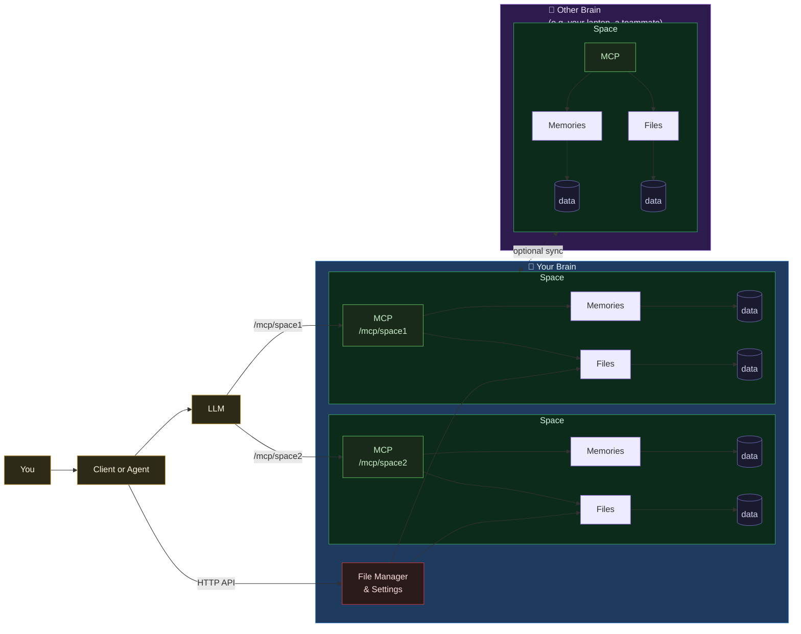
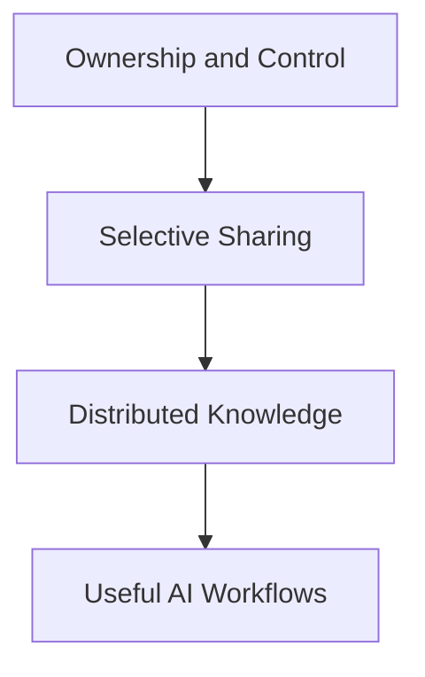
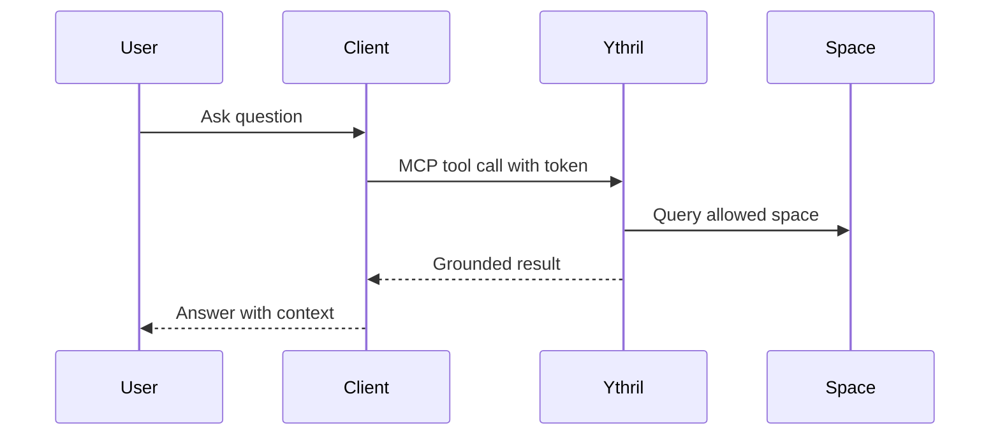
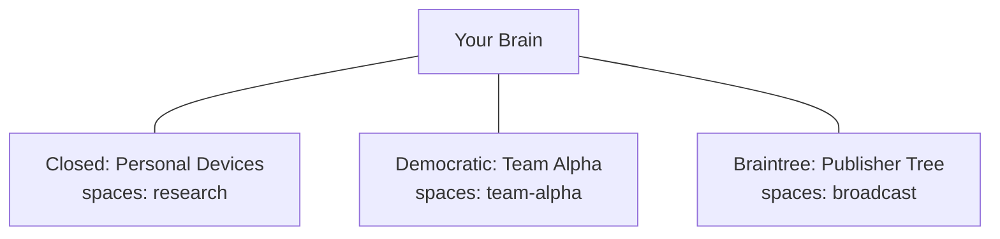

# Ythril

Memory, file, and context infrastructure for MCP-enabled assistants.

## What Is This

Ythril is a sovereign brain and data server for MCP workflows.

Each brain combines three things in one place:
- memory and entity knowledge
- file management inside isolated spaces
- MCP tool access for assistants and clients

It works in single-brain mode for personal use, or in networked mode for shared spaces across trusted members. A common single-person setup is running one brain on your server and another on your laptop — both owned by you, syncing selected spaces so your context, files, and memories follow you across devices. Networking is explicit and policy-driven: each brain decides what spaces to share, with whom, and in which direction. Local data ownership is a physical fact — no network governance can delete data from another member's machine.

Think of it as the operational layer between your data, your models, and your day-to-day workflows.



## Philosophy

- You own and control your data on your own brain.
- You decide what to share, by space, per network.
- Knowledge can be distributed across trusted brains without central lock-in.
- Governance controls membership. What members do with data on their own machines is not — and cannot be — governed.



## Examples

### Example 1: Personal Research Brain

1. Create a brain and a space called `research`.
2. Add notes, docs, and references.
3. Ask your MCP client to answer with citations from that space.

### Example 2: Team Knowledge Brain

1. Create spaces per team or project.
2. Issue tokens scoped to specific spaces.
3. Let assistants query only what each token is allowed to read.



## Installation

### Quick Start with Docker

Requirements:
- Any Docker host (Docker Desktop is one option)

Run:

```bash
docker compose up --build
```

Then open setup in your browser, enter the generated setup code, and complete the initial brain configuration.

## Brain Networks

Ythril supports multiple topologies, from standalone to multi-brain federation patterns.

- Standalone brain
- Braintree tree (parent → child push only; subnodes can be temporarily or permanently re-parented if an intermediate node goes offline)
- Closed/Democratic/Club networks (symmetric sync)
- Scoped space sharing per network

Powerful pattern: one brain can participate in multiple networks at the same time, each with different space scopes and governance.

Example:
- Network A (Closed): sync `research` with your laptop and NAS
- Network B (Democratic): sync `team-alpha` with your team
- Network C (Braintree): receive `broadcast` updates from a parent publisher

For full diagrams and behavior notes, see [docs/network-types.md](docs/network-types.md).



## Security

Ythril is designed for production use. Security controls are applied at every layer.

### Authentication

- All API and MCP endpoints require a Bearer PAT token (`Authorization: Bearer ythril_...`).
- Tokens are bcrypt-hashed and never logged or stored in plaintext.
- Tokens are scoped: a token with `spaces: ["health"]` is rejected on any endpoint targeting a different space — enforced at the routing middleware layer.
- Token creation and setup endpoints are rate-limited to 10 req/min per IP.
- Token `spaces` array is capped at 1000 elements (DoS guard).

### Input validation

- All JSON bodies are validated with Zod before reaching business logic.
- Brain `fact` field is capped at 50,000 characters; `tags` items must all be strings (blocks NoSQL operator injection).
- File paths are sandbox-validated (blocks `../`, URL-encoded traversal, null bytes, absolute paths, Unicode overlong sequences).
- 10 MB body size limit enforced at the HTTP parser layer (express.json); returns 413 on overflow.

### Network and invite security

- The RSA invite handshake (`POST /api/invite/*`) performs a zero-knowledge token exchange: tokens are RSA-4096-OAEP-SHA256 encrypted and never travel in plaintext.
- Each invite handshake session is single-use: replaying `apply` after the first call returns 409.
- Handshake sessions expire after 1 hour; private keys are held in memory only and discarded immediately after `finalize`.
- `handshakeId` lookups use bcrypt comparison for constant-time equivalence.

### Storage quotas

Ythril enforces storage quotas at write time across the file store and brain (memory) store. Quotas are optional: no `storage` key in `config.json` means unlimited storage.

Enable by adding a `storage` block to `config.json`:

```jsonc
{
  "storage": {
    "total": { "softLimitGiB": 150, "hardLimitGiB": 200 },
    "files": { "softLimitGiB": 50,  "hardLimitGiB": 100 },
    "brain": { "softLimitGiB": 5,   "hardLimitGiB": 10  }
  }
}
```

`total` is required to activate quota enforcement. `files` and `brain` are optional sub-limits.

Behavior:
- **Hard limit breached** — write is rejected with HTTP 507 and `{ "storageExceeded": true }` in the response body. MCP tool calls return `isError: true`.
- **Soft limit breached** — write succeeds with HTTP 201 and `{ "storageWarning": true }` in the response body. MCP tool calls succeed and append a `⚠️ Storage warning:` notice to the result text.

Usage is measured on every write: recursive byte-sum of `/data/files/` plus MongoDB `dbStats` for brain storage. There is no background cache — values are always current.

`GET /api/spaces` includes a `storage` field with the current usage and configured limits when quota is enabled:

```jsonc
{
  "spaces": [...],
  "storage": {
    "usageGiB": { "files": 12.4, "brain": 0.8, "total": 13.2 },
    "limits": {
      "total": { "softLimitGiB": 150, "hardLimitGiB": 200 },
      "files": { "softLimitGiB": 50,  "hardLimitGiB": 100 },
      "brain": { "softLimitGiB": 5,   "hardLimitGiB": 10  }
    }
  }
}
```

### Config hot-reload

`POST /api/admin/reload-config` re-reads `config.json` from disk and applies the new configuration without a container restart. Requires a Bearer PAT. This endpoint also corrects file permissions to `0600` if they were modified externally (e.g., via a Windows Docker bind mount).

### Security tests

A dedicated red-team test suite runs against live Docker containers and verifies all security controls. See [`tests/red-team-tests/README.md`](tests/red-team-tests/README.md).

---

## Testing

Ythril has a two-tier integration test suite — no mocking, all tests run against real Docker containers.

### Prerequisites

```sh
docker compose up -d                          # start A (port 3200)
docker compose -f docker-compose.test.yml up -d  # start B (3201) and C (3202)
docker network connect ythril_ythril-test ythril  # connect A to test network
```

Token files must be provisioned at `tests/sync/configs/{a,b,c}/token.txt`.

### Scenario tests

Cover the full API surface: setup gating, file operations, token lifecycle, space management, brain operations, network CRUD, voting rounds, invite key rotation, and the RSA handshake.

```sh
node --test --test-reporter=spec \
  tests/setup.test.js tests/files.test.js tests/auth.test.js \
  tests/spaces.test.js tests/brain.test.js tests/networks.test.js \
  tests/notify.test.js tests/votes.test.js tests/quota.test.js
```

### Red-team tests

Attack simulations against the running containers covering auth bypass, path traversal, space boundary enforcement, MongoDB injection, payload size limits, invite replay, and brute-force token enumeration.

```sh
# All red-team tests (except brute-force)
node --test --test-reporter=spec tests/red-team-tests/auth-bypass.test.js \
  tests/red-team-tests/path-traversal.test.js \
  tests/red-team-tests/space-boundary.test.js \
  tests/red-team-tests/mongodb-injection.test.js \
  tests/red-team-tests/oversized-payload.test.js \
  tests/red-team-tests/invite-replay.test.js

# Brute-force (run separately — exhausts instance B rate limit)
node --test --test-reporter=spec tests/red-team-tests/token-brute-force.test.js
```

### Sync integration tests

Cover multi-instance sync, conflict detection, and all four network governance types.

```sh
node --test --test-reporter=spec \
  tests/sync/conflict.test.js tests/sync/closed-network.test.js \
  tests/sync/braintree.test.js tests/sync/democratic.test.js
```

All tests must pass before merging. A failing red-team test is treated as a security regression.

---

## Contribution

Contributions are welcome.

1. Open an issue for bugs or proposals.
2. Keep changes scoped and testable.
3. Submit a pull request with a short rationale.

Good first contributions:
- Documentation clarifications
- Setup and onboarding improvements
- MCP tool UX and reliability fixes

## License and Contact

Ythril is licensed under AGPL-3.0. See [LICENSE](LICENSE).

Minimal AGPL explanation:
- You can use, modify, and self-host Ythril.
- If you provide Ythril as a network service with your modifications, you must make the modified source available to users of that service under AGPL.
- If you want closed-source SaaS/proprietary deployment, use a commercial license.

Ythril's semantic recall feature depends on `mongot`, a proprietary sidecar bundled
in the `mongodb/mongodb-atlas-local` Docker image. This binary is not distributed by
Ythril and is pulled separately by Docker at deploy time. It does not affect Ythril's
AGPL obligations. See [docs/dependencies.md](docs/dependencies.md) for the full
analysis.

Commercial licensing is available for closed-source SaaS or proprietary deployments.

Contact:
- GitHub issues: open an issue in this repository
- Commercial inquiries: contact repository owner `contact@ythril.net`
