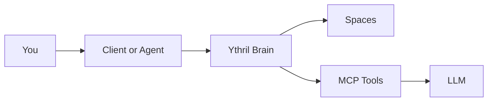
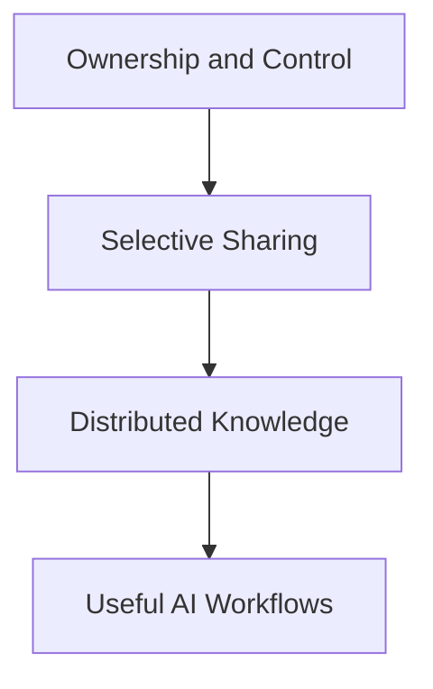
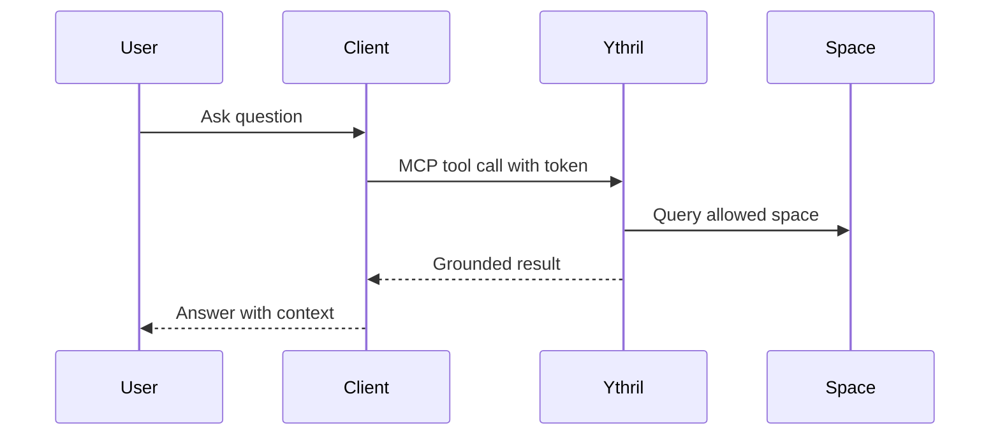
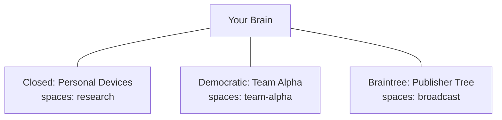

# Ythril

Memory, file, and context infrastructure for MCP-enabled assistants.

## What Is This

Ythril is a sovereign brain and data server for MCP workflows.

Each brain combines three things in one place:
- memory and entity knowledge
- file management inside isolated spaces
- MCP tool access for assistants and clients

It works in single-brain mode for personal use, or in networked mode for shared spaces across trusted members. Networking is explicit and policy-driven: each brain decides what spaces to share, with whom, and in which direction. Local data ownership is a physical fact — no network governance can delete data from another member's machine.

Think of it as the operational layer between your data, your models, and your day-to-day workflows.



## Philosophy

- You own and control your data on your own brain.
- You decide what to share, by space, per network.
- Knowledge can be distributed across trusted brains without central lock-in.
- Governance controls membership. What members do with data on their own machines is not — and cannot be — governed.



## Examples

### Example 1: Personal Research Brain

1. Create a brain and a space called `research`.
2. Add notes, docs, and references.
3. Ask your MCP client to answer with citations from that space.

### Example 2: Team Knowledge Brain

1. Create spaces per team or project.
2. Issue tokens scoped to specific spaces.
3. Let assistants query only what each token is allowed to read.



## Installation

### Quick Start with Docker

Requirements:
- Any Docker host (Docker Desktop is one option)
- A generated setup code shown at first startup

Run:

```bash
docker compose up --build
```

Then open setup in your browser, enter the generated setup code, and complete the initial brain configuration.

## Networks

Ythril supports multiple topologies, from standalone to multi-brain federation patterns.

- Standalone brain
- Braintree tree (parent -> child push only)
- Closed/Democratic/Club networks (symmetric sync)
- Scoped space sharing per network

Powerful pattern: one brain can participate in multiple networks at the same time, each with different space scopes and governance.

Example:
- Network A (Closed): sync `research` with your laptop and NAS
- Network B (Democratic): sync `team-alpha` with your team
- Network C (Braintree): receive `broadcast` updates from a parent publisher

For full diagrams and behavior notes, see [docs/network-types.md](docs/network-types.md).



## Contribution

Contributions are welcome.

1. Open an issue for bugs or proposals.
2. Keep changes scoped and testable.
3. Submit a pull request with a short rationale.

Good first contributions:
- Documentation clarifications
- Setup and onboarding improvements
- MCP tool UX and reliability fixes

## License and Contact

Ythril is licensed under AGPL-3.0. See [LICENSE](LICENSE).

Minimal AGPL explanation:
- You can use, modify, and self-host Ythril.
- If you provide Ythril as a network service with your modifications, you must make the modified source available to users of that service under AGPL.
- If you want closed-source SaaS/proprietary deployment, use a commercial license.

Ythril's semantic recall feature depends on `mongot`, a proprietary sidecar bundled
in the `mongodb/mongodb-atlas-local` Docker image. This binary is not distributed by
Ythril and is pulled separately by Docker at deploy time. It does not affect Ythril's
AGPL obligations. See [docs/dependencies.md](docs/dependencies.md) for the full
analysis.

Commercial licensing is available for closed-source SaaS or proprietary deployments.

Contact:
- GitHub issues: open an issue in this repository
- Commercial inquiries: contact repository owner `contact@ythril.net`
