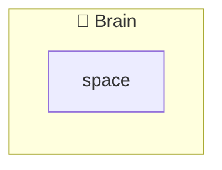
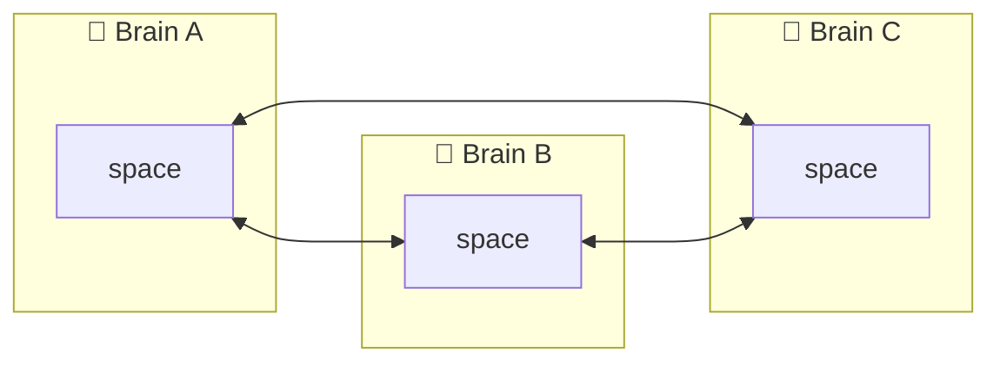
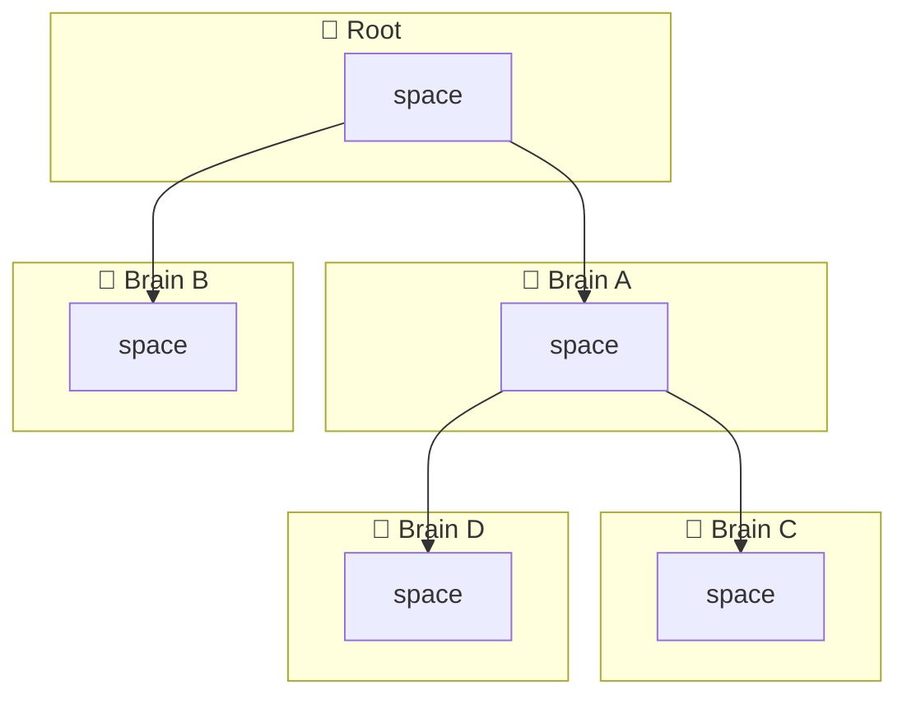

# Ythril

Ythril is a self-hosted brain server that gives MCP-enabled assistants persistent memory, file storage, and entity knowledge — organised into isolated spaces you fully control. Each space exposes its own MCP endpoint so any compatible client (Claude, Cursor, Windsurf, or anything that speaks MCP) can read and write context without a cloud intermediary. Spaces can be synced across multiple brains through policy-driven networks, letting you share selected knowledge with teammates or across your own devices while keeping everything else private. Authentication, input validation, storage quotas, and a zero-knowledge invite handshake are built in from day one. Run it with Docker Compose and you are up in under a minute.

## Getting Started

| Doc | Description |
|-----|-------------|
| [User Guide](docs/userguide.md) | End-user guide — managing your brain through the web UI and connecting MCP clients |
| [Integration Guide](docs/integration-guide.md) | Hosting, configuration, full REST & MCP API reference |

For development setup, testing, and building from source see the [Contribution Guide](docs/contribution-guide.md).

---

## Brain Networks

Brains can form networks to sync selected spaces. Each network type defines its own governance and sync topology. See [Network Types](docs/network-types.md) for the full specification.

**Standalone** — single brain, no sync, full local control.

**Closed / Democratic / Club** — symmetric sync between all members. They differ only in governance: Closed requires unanimous vote, Democratic uses majority vote, Club lets the inviter approve unilaterally.

**Braintree** — push-only from a root brain down to subscribers. Intermediate nodes re-parent automatically if they go offline.

---

## License

Ythril is licensed under [AGPL-3.0](LICENSE). You can use, modify, and self-host it freely. If you provide a modified version as a network service, you must make the source available under AGPL. Commercial licensing is available for closed-source or proprietary deployments — contact `contact@ythril.net`.

## Contributing

Contributions are welcome. Open an issue for bugs or proposals, keep changes scoped and testable, and submit a pull request with a short rationale. See the [Contribution Guide](docs/contribution-guide.md) for dev setup and testing instructions.
