# Ythril Network Types

This document describes how multiple ythril brains interact with each other through networks. A **brain** is one ythril instance. A brain contains one or more **spaces**. Networks connect brains together to sync specific spaces.

---

## Conceptual hierarchy

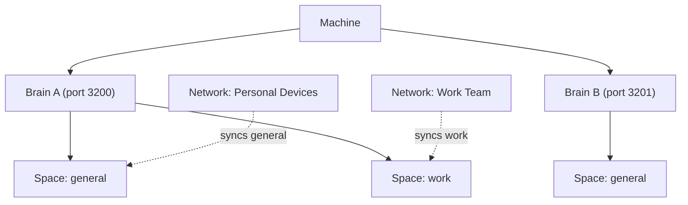

A brain's spaces are isolated from each other. A network is scoped to specific spaces — it syncs only those, leaving all others private.

---

## Network types

| Type | Who approves joins | Who approves removals | Veto |
|------|-------------------|-----------------------|------|
| **Closed** | All members (unanimous) | All members (unanimous) | Implicit — any no = fail |
| **Democratic** | ≥ 50% + zero vetoes | ≥ 50% + zero vetoes | Explicit — any member may veto |
| **Club** | The member who issued the key | The member who proposed removal | None |
| **Braintree** | All ancestors from inviter to root | All ancestors from target to root | Implicit per ancestor |
| ~~**Open**~~ | Automatic | — | None — **excluded from v1; not implemented** |

---

## Closed network

All members must vote yes for any join or removal. A single no blocks it. For a solo member (one device), every action is instant self-approval.

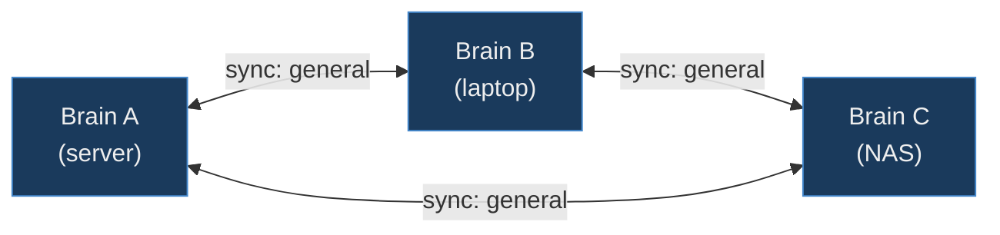

**Join vote — candidate D wants to join:**

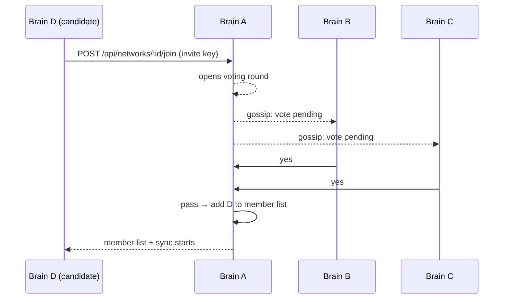

Any member voting **no** → round fails, key consumed, D not added.

---

## Democratic network

Majority (≥50%) is enough — but any single member can cast an explicit **veto** to block the outcome regardless of count. Suited to collaborative groups where one bad actor cannot be autocratically admitted.

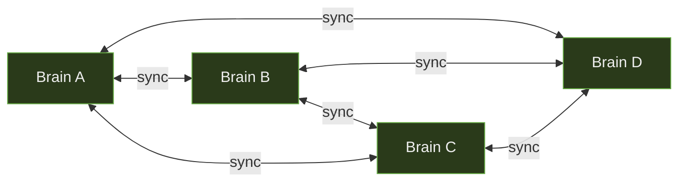

**5-member network, join vote (3 yes, 1 no, 1 veto):**

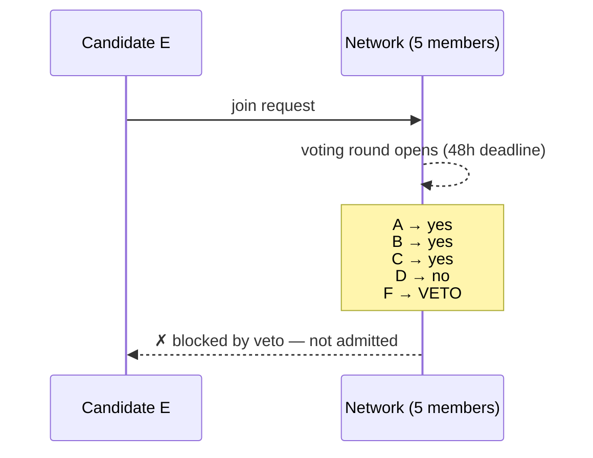

Result: even though 3 of 5 voted yes, the single veto blocks admission.

---

## Club network

The member who issued the invite key is the sole approver for joins. One member can admit or eject anyone unilaterally. No votes needed from others. Intended for small informal groups where a single trusted organiser manages membership.

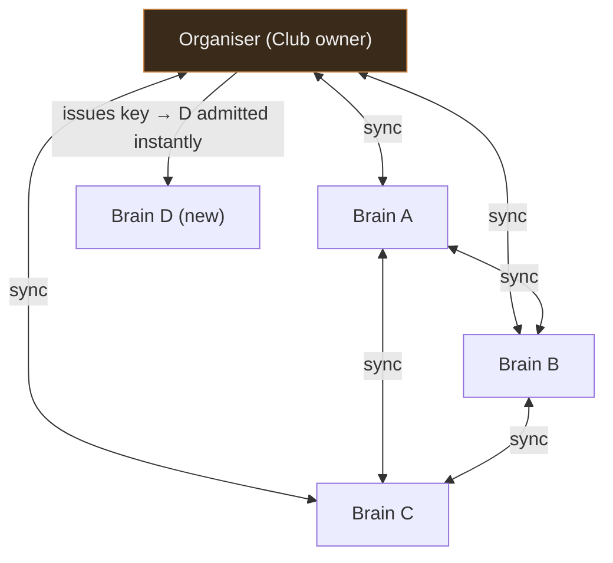

No voting round propagated to A, B, or C — organiser's yes is sufficient.

---

## Braintree network

Members form a directed tree. The founder is the root. Data flows **top-down only** — a parent pushes to its children; no data flows back up. Node A and Node B only share what the Root has already received; they have no direct connection to each other. A new leaf is approved by **all ancestors on the path from the inviting node up to the root**. Leaves may leave at any time and go off-grid; the root has no technical ability to prevent this.

If an intermediate node goes offline, its subtree is partitioned until it returns. The grandparent can issue a **reparent invite** so the grandchild temporarily or permanently moves up one level — see [Braintree: temporary and permanent re-parenting](#braintree-temporary-and-permanent-re-parenting).

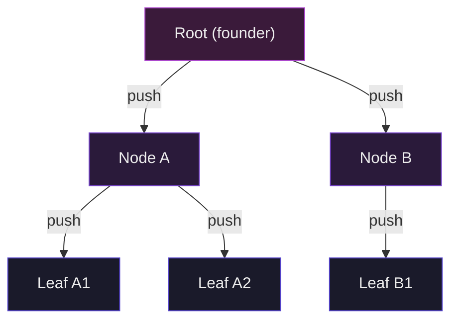

**Joining as a leaf under Node A:**

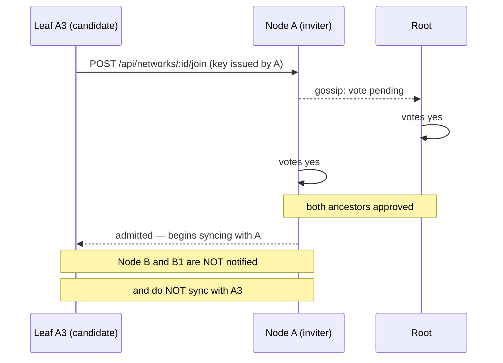

A leaf added under Node A does **not** sync directly with Node B or its subtree — sync only flows along the tree edges.

**Leaf departing and going off-grid:**

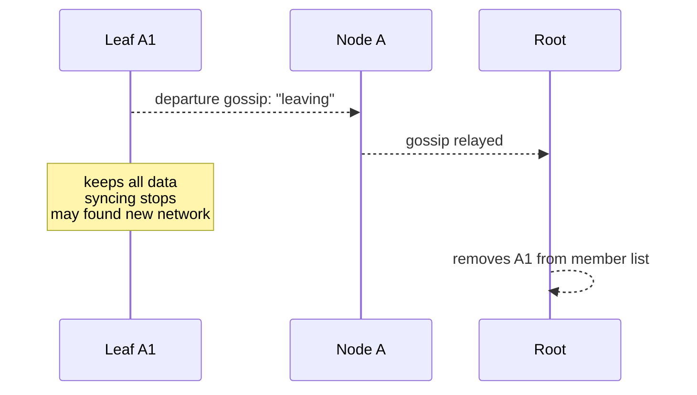

> **If A1 does not voluntarily depart but A goes offline**, Root can instead do a reparent invite to reconnect A1 directly. See [Offline peers and silent departure](#offline-peers-and-silent-departure).

## Offline peers and silent departure

### Temporarily offline (vacation scenario)

A peer that is unreachable for a sync cycle is skipped, and the cycle continues for all other members. The `lastSyncAt` timestamp and the `lastSeqReceived` high-water mark are only advanced on a successful sync — so when the peer comes back online, it picks up exactly where it left off, regardless of how long it was gone. All accumulated changes since the last successful sync are exchanged on the next cycle.

Each outbound connection attempt times out after **10 seconds** — a one-month-offline peer causes a 10 s delay per cycle, not the OS TCP timeout (~75 s).

### Consistently unreachable peers

Each failed sync attempt increments `consecutiveFailures` on the member record. After **10 consecutive failures** a prominent warning is written to the log:

```
PEER UNREACHABLE: 'laptop' in network 'Personal Devices' has failed 10 consecutive
sync cycles. Last success: 2026-02-12T09:14:00Z. Member has NOT been removed —
manual action required.
```

The member is **never auto-removed**. Automatic removal from a network requires going through the same governed process as any other removal (unanimous vote for Closed, majority for Democratic, etc.). Silent pruning would violate the governance contract.

If a peer is confirmed gone forever, remove it manually through the network management UI or `DELETE /api/networks/:id/members/:instanceId`. The removal still goes through the vote round for governed network types.

### Braintree: offline intermediate nodes

In a braintree, data flows strictly along tree edges. If an intermediate node (one with children) becomes unreachable:

- The subtree beneath it is **partitioned** — it stops receiving updates from the root for as long as the intermediate node is down.
- The root and sibling subtrees continue syncing normally among themselves.
- When the intermediate node comes back, it catches up first, then pushes the accumulated changes down to its children on its next cycle.

The partition warning in the log identifies this explicitly:

```
PEER UNREACHABLE: 'Node A' ... NOTE: this node has 2 child(ren) in a braintree
network — its entire subtree is now partitioned from this brain until it comes
back online.
```

There is no automatic re-routing around a failed intermediate node. This is by design — routing around a node would mean data bypasses an ancestor that has governance authority over the subtree. If a braintree node permanently departs, the affected leaves must be re-admitted under a different parent.

### Braintree: temporary and permanent re-parenting

When an intermediate node has been offline long enough to trigger the unreachable warning, its parent can initiate a **reparent invite** — the same RSA handshake used for normal joins, but flagged as a reparent so the grandchild is updated in place rather than added as a new member.

**Flow:**

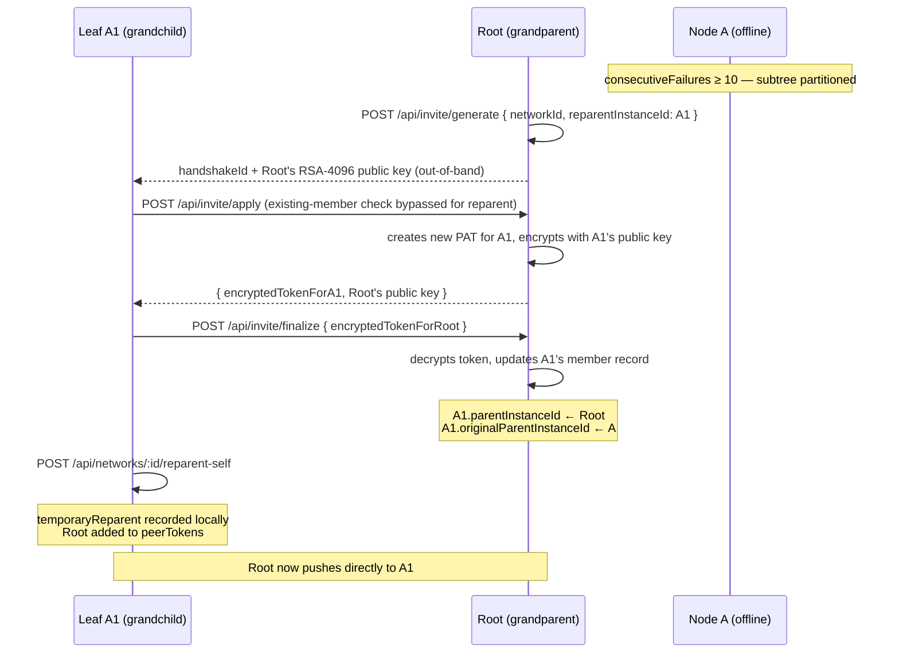

After finalize, Root's engine includes A1 in its regular push cycle. A1 resumes receiving updates immediately. A1's local `reparent-self` call registers the state for UI display and token storage.

**When A comes back online**, the engine logs:

```
REPARENT_REVERT_AVAILABLE: original parent 'Node A' is back online.
'Leaf A1' was temporarily re-parented during the outage.
To restore:       POST /api/networks/:id/members/A1/revert-parent
To make permanent: POST /api/networks/:id/members/A1/adopt
```

Two options from the Root (grandparent) side:

| Action | Endpoint | Effect |
|--------|----------|--------|
| **Revert** | `POST /api/networks/:id/members/:instanceId/revert-parent` | Restores `A1.parentInstanceId = A`, removes Root's direct push token, moves A1 back to A's `children` array |
| **Permanent adoption** | `POST /api/networks/:id/members/:instanceId/adopt` | Clears `originalParentInstanceId` — Root is now A1's permanent parent |

A1's admin should also update A1's local config:  
- After revert: remove Root from `peerTokens`, clear `temporaryReparent`  
- After adopt: just clear `temporaryReparent`  

(A1 calls neither `revert-parent` nor `adopt` — those run on Root. A1 manages only its own `temporaryReparent` state, which is purely for local display.)

**Governance note:** Node A is still a member of the network when it reconnects. Its `children` array will be updated by the revert or adopt action on Root. If A was permanently offline and you want to remove it entirely, go through the normal member removal process.

---

## RSA invite handshake

Network membership exchange uses a zero-knowledge RSA handshake to avoid passing tokens in plaintext. No token ever appears in clear text over the wire or in a QR code.

### Flow

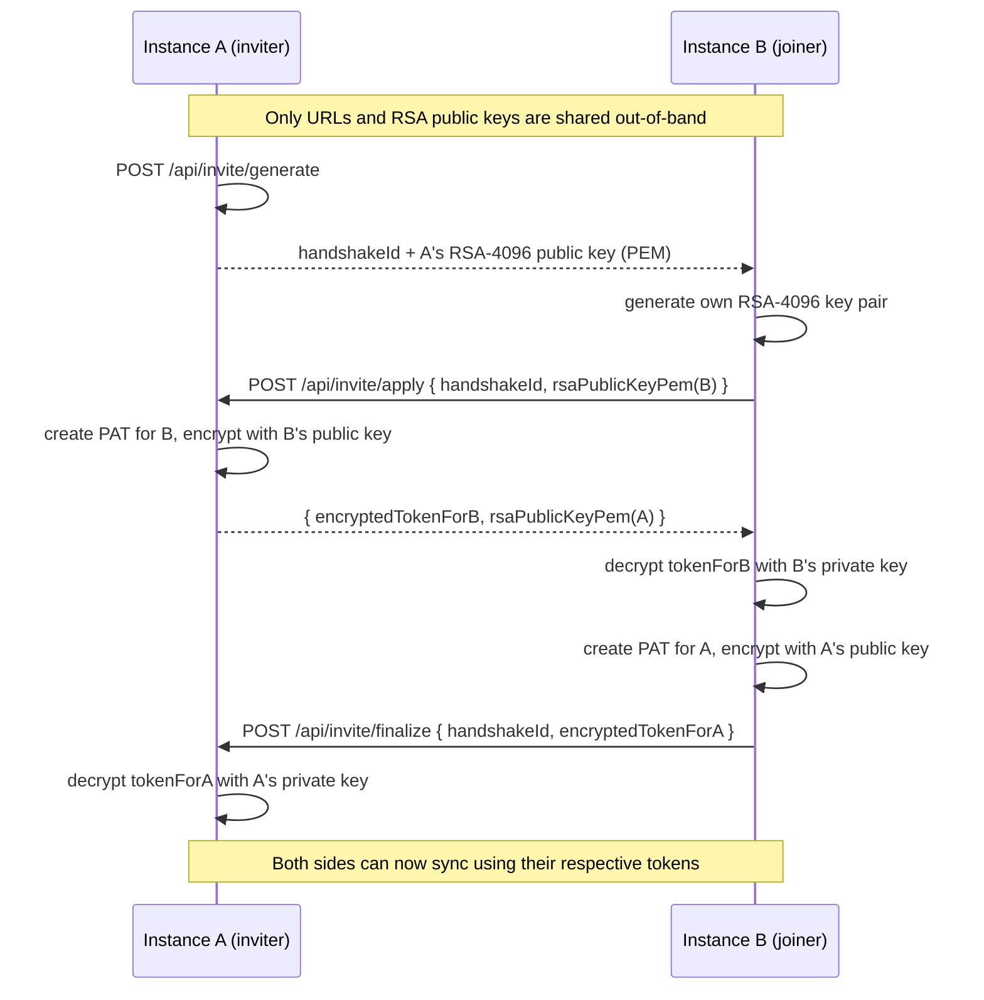

### Security properties

- **RSA-4096-OAEP-SHA256** keys generated ephemerally per session.
- **Private keys** are held in memory only and discarded immediately after `finalize`.
- **Single-use sessions**: replaying `apply` on the same `handshakeId` returns 409.
- **`handshakeId`** is stored as a bcrypt hash — lookup uses constant-time comparison.
- Sessions expire after 1 hour; any attempt on an expired or unknown session returns 401.
- Rate-limited at the auth tier (10 req/min per IP on `apply` and `finalize`).

### Endpoints

| Method | Path | Auth | Purpose |
|--------|------|------|---------|
| `POST` | `/api/invite/generate` | Bearer token | Start a session for a specific network |
| `POST` | `/api/invite/apply` | none (handshakeId is credential) | B submits its RSA public key; receives encrypted token |
| `POST` | `/api/invite/finalize` | none (handshakeId is credential) | B delivers encrypted token for A; session completed |
| `GET` | `/api/invite/status/:handshakeId` | none | Check if a session is still pending or completed |

---

## Topologies that fall out naturally

Any communication pattern reduces to tree structure and multi-network membership. No special config is needed.

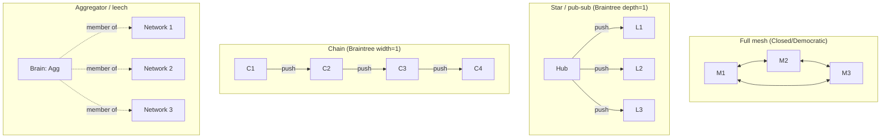

The **aggregator** pattern: a single brain joins multiple separate networks as a leaf. It receives data from all of them; `recall` on the aggregator searches across everything locally. No directional config needed — multi-network membership is sufficient.

### Multi-network participation examples

One brain can join several networks at once, each scoped to different spaces.

1. Personal + Team split
- `research` in a Closed network with your own devices
- `team-alpha` in a Democratic network with coworkers
- Result: personal research stays private to your devices while team knowledge stays team-governed

2. Team + Publisher overlay
- `team-alpha` in a Democratic network
- `broadcast` in a Braintree network where your brain is a leaf
- Result: team collaboration continues while your brain also receives one-way parent updates

3. Three-network aggregator
- `research` from network A
- `project-x` from network B
- `archive` from network C
- Result: one local brain can run global recall across all locally synced spaces without introducing a central broker

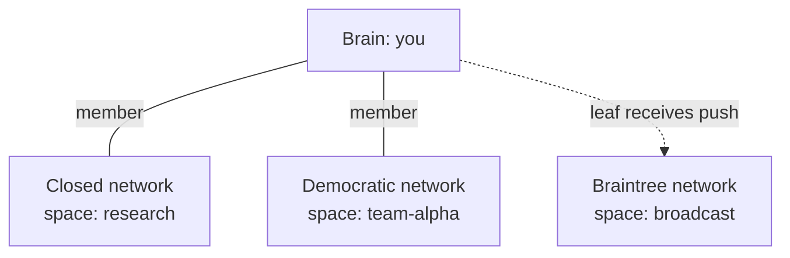

---

## Voting mechanics (all types)

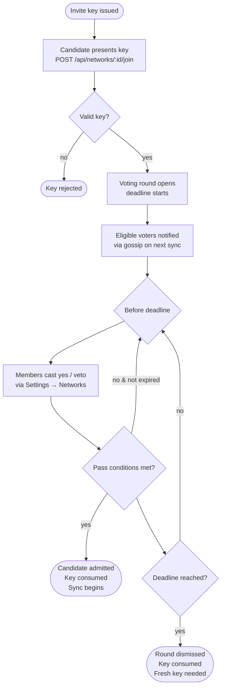

---

## Data sovereignty

Regardless of network type:

- **Any member can leave at any time**, unilaterally, without a vote.
- The leaver **keeps all data** on their own machine. This is physically unavoidable and explicitly accepted by all parties when they join.
- **Force-delete does not exist.** There is no mechanism to delete data from another member's instance. Network membership (who syncs with whom) is governable; what someone does with their local copy is not.
- A departed member may found their own new network from their copy of the data.

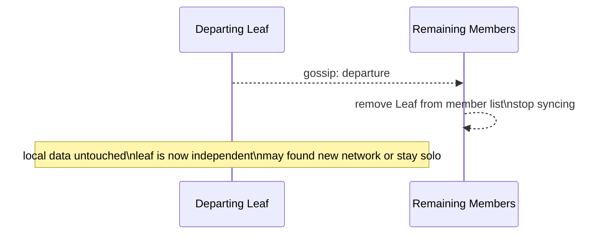
