# ythril Network Types

This document describes how multiple ythril brains interact with each other through networks. A **brain** is one ythril instance. A brain contains one or more **spaces**. Networks connect brains together to sync specific spaces.

---

## Conceptual hierarchy

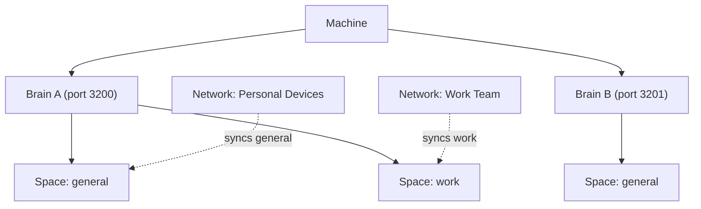

A brain's spaces are isolated from each other. A network is scoped to specific spaces — it syncs only those, leaving all others private.

---

## Network types

| Type | Who approves joins | Who approves removals | Veto |
|------|-------------------|-----------------------|------|
| **Closed** | All members (unanimous) | All members (unanimous) | Implicit — any no = fail |
| **Democratic** | ≥ 50% + zero vetoes | ≥ 50% + zero vetoes | Explicit — any member may veto |
| **Club** | The member who issued the key | The member who proposed removal | None |
| **Braintree** | All ancestors from inviter to root | All ancestors from target to root | Implicit per ancestor |
| **Open** | Automatic | — | None |

> **Open** networks are excluded from v1 — included here for completeness only.

---

## Closed network

All members must vote yes for any join or removal. A single no blocks it. For a solo member (one device), every action is instant self-approval.

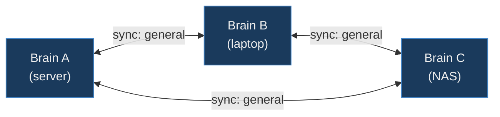

**Join vote — candidate D wants to join:**

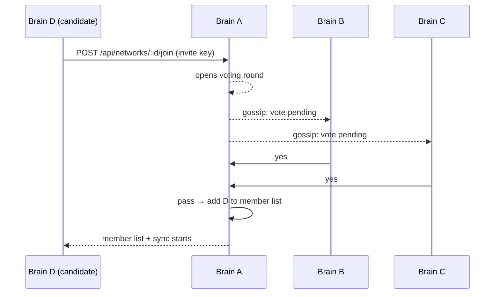

Any member voting **no** → round fails, key consumed, D not added.

---

## Democratic network

Majority (≥50%) is enough — but any single member can cast an explicit **veto** to block the outcome regardless of count. Suited to collaborative groups where one bad actor cannot be autocratically admitted.

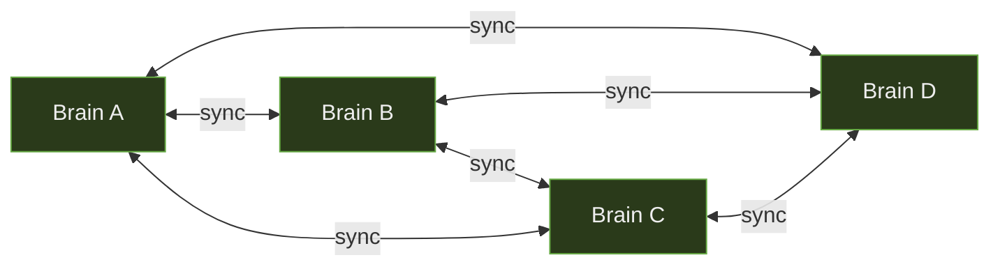

**5-member network, join vote (3 yes, 1 no, 1 veto):**

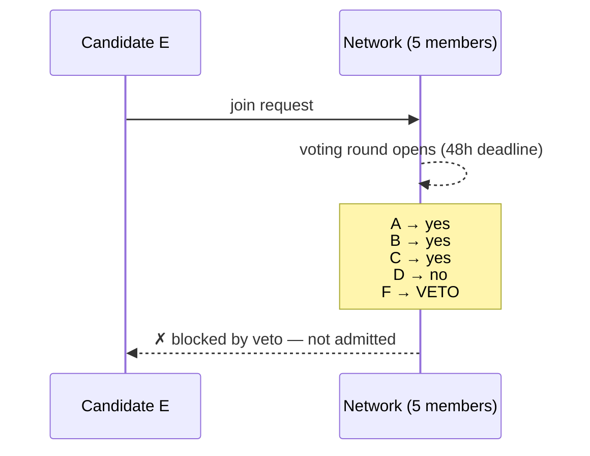

Result: even though 3 of 5 voted yes, the single veto blocks admission.

---

## Club network

The member who issued the invite key is the sole approver for joins. One member can admit or eject anyone unilaterally. No votes needed from others. Intended for small informal groups where a single trusted organiser manages membership.

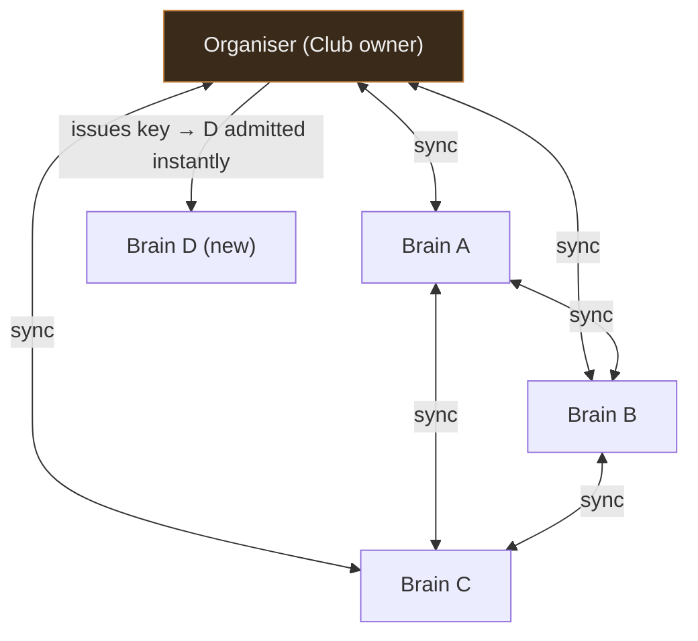

No voting round propagated to A, B, or C — organiser's yes is sufficient.

---

## Braintree network

Members form a directed tree. The founder is the root. Data flows **top-down only** — a parent pushes to its children; no data flows back up. Node A and Node B only share what the Root has already received; they have no direct connection to each other. A new leaf is approved by **all ancestors on the path from the inviting node up to the root**. Leaves may leave at any time and go off-grid; the root has no technical ability to prevent this.

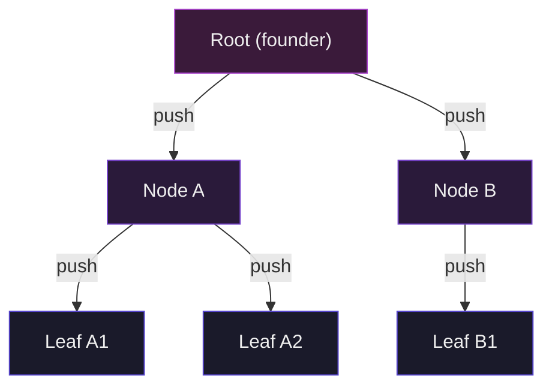

**Joining as a leaf under Node A:**

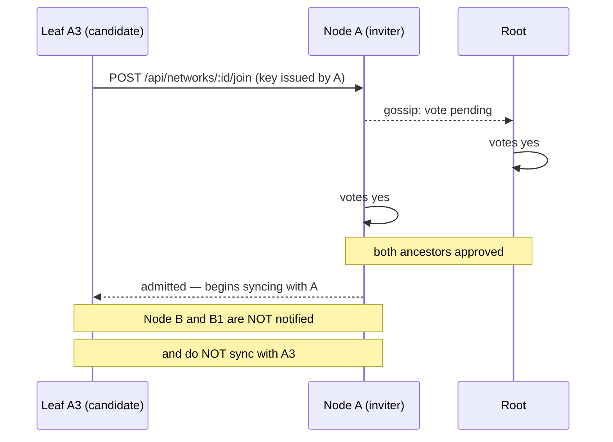

A leaf added under Node A does **not** sync directly with Node B or its subtree — sync only flows along the tree edges.

**Leaf departing and going off-grid:**

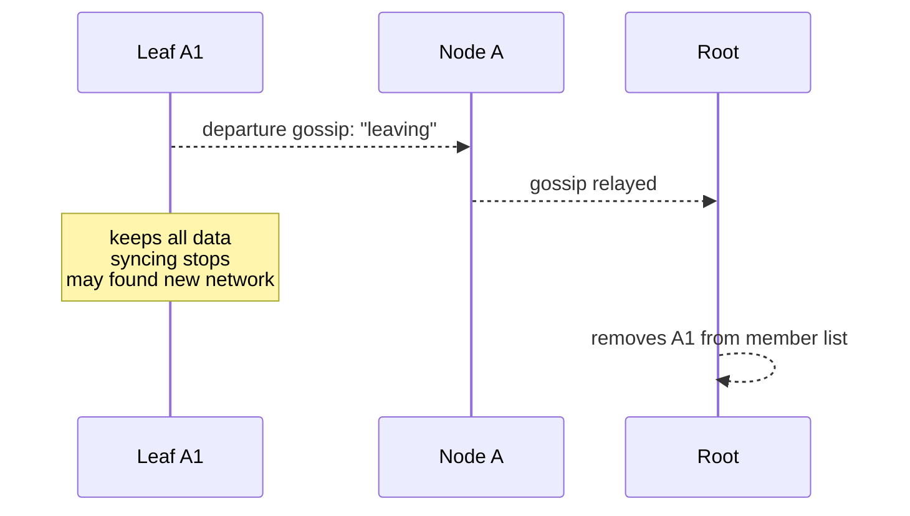

---

## Topologies that fall out naturally

Any communication pattern reduces to tree structure and multi-network membership. No special config is needed.

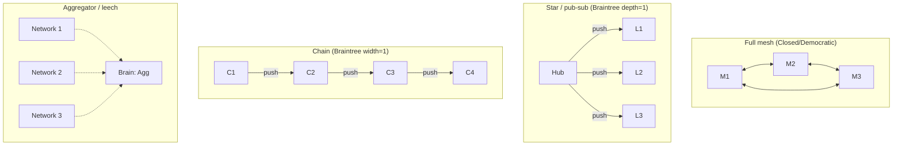

The **aggregator** pattern: a single brain joins multiple separate networks as a leaf. It receives data from all of them; `recall` on the aggregator searches across everything locally. No directional config needed — multi-network membership is sufficient.

---

## Voting mechanics (all types)

---

## Data sovereignty

Regardless of network type:

- **Any member can leave at any time**, unilaterally, without a vote.
- The leaver **keeps all data** on their own machine. This is physically unavoidable and explicitly accepted by all parties when they join.
- **Force-delete does not exist.** There is no mechanism to delete data from another member's instance. Network membership (who syncs with whom) is governable; what someone does with their local copy is not.
- A departed member may found their own new network from their copy of the data.

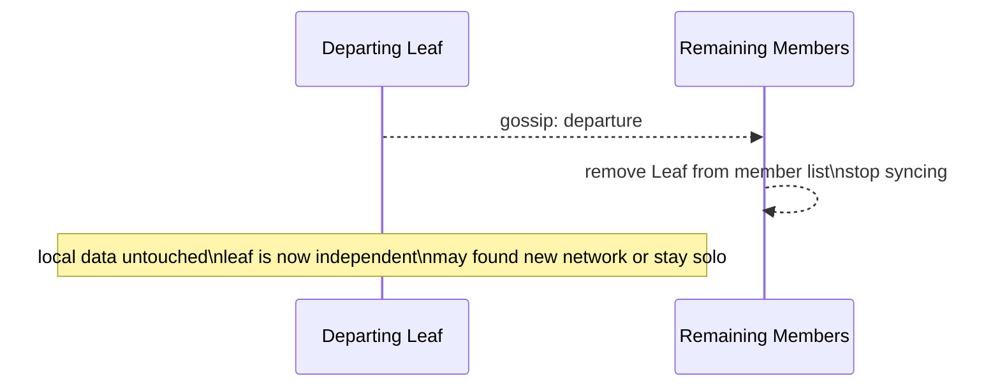
