# Ythril — Use Case Examples

Practical scenarios showing how Ythril spaces and networks solve real knowledge management challenges.

---

## 1. Personal Multi-Device Sync

**Use Case:** Keep your personal brain in sync across laptop, NAS, and home server.

**Network Topology:**

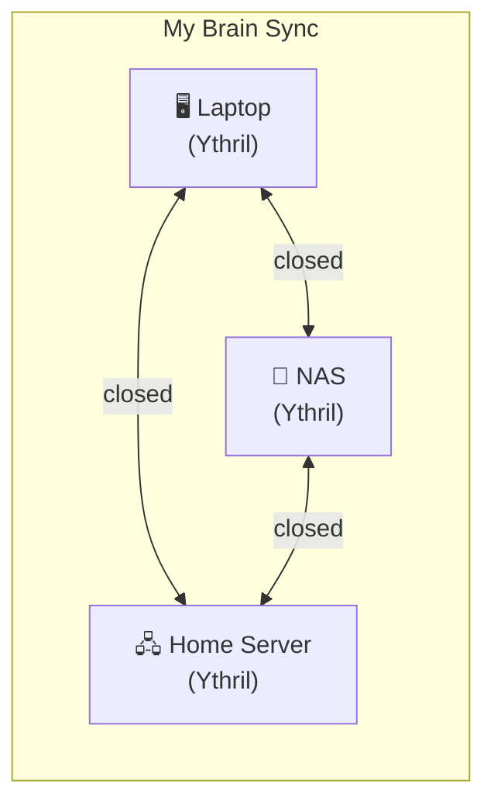
```mermaid
graph LR
    subgraph "My Brain Sync"
        Laptop["🖥️ Laptop<br/>(Ythril)"]
        NAS["💾 NAS<br/>(Ythril)"]
        Server["🖧 Home Server<br/>(Ythril)"]
    end
    Laptop <-->|closed| NAS
    Laptop <-->|closed| Server
    NAS <-->|closed| Server
```

**Source:** Every device — notes, bookmarks, research captured on whichever device you're using.
**Consumers:** You, on every other device.

> A **closed** network with a single member auto-approves instantly. Add your second device, approve once from the first, and all future sync is automatic. Memories, entities, files, and chrono entries stay consistent everywhere.

---

## 2. Engineering Team Knowledge Base

**Use Case:** Small engineering team shares architecture decisions, runbooks, and incident learnings.

**Network Topology:**

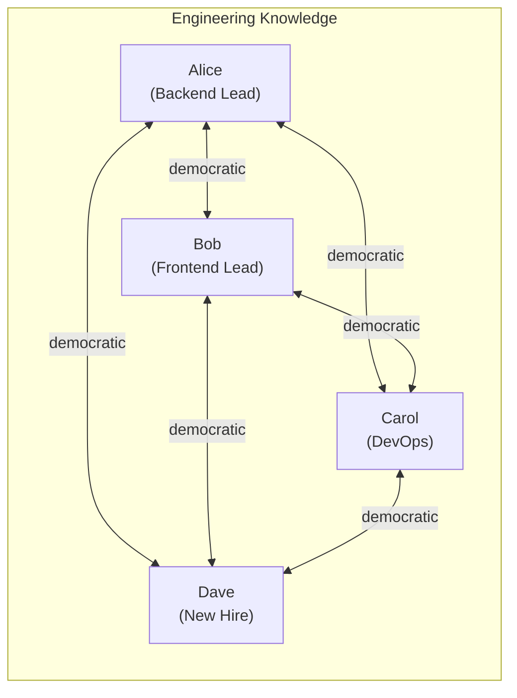
```mermaid
graph LR
    subgraph "Engineering Knowledge"
        Alice["Alice<br/>(Backend Lead)"]
        Bob["Bob<br/>(Frontend Lead)"]
        Carol["Carol<br/>(DevOps)"]
        Dave["Dave<br/>(New Hire)"]
    end
    Alice <-->|democratic| Bob
    Alice <-->|democratic| Carol
    Alice <-->|democratic| Dave
    Bob <-->|democratic| Carol
    Bob <-->|democratic| Dave
    Carol <-->|democratic| Dave
```

**Source:** All team members contribute — ADRs, post-mortems, how-to guides, dependency notes.
**Consumers:** All team members equally.

> **Democratic** governance means a new joiner (like Dave) needs majority approval. Any member can veto a problematic join. The full-mesh topology ensures everyone has the complete picture — no single point of failure.

**Additional benefits:**
- Conflict resolution via fork-on-concurrent-edit keeps both versions of contested docs.
- The knowledge graph (entities + edges) maps relationships between services, teams, and incidents across everyone's contributions.

---

## 3. Company Policy Distribution

**Use Case:** Corporate HQ publishes compliance policies, security guidelines, and onboarding material to regional offices.

**Network Topology:**

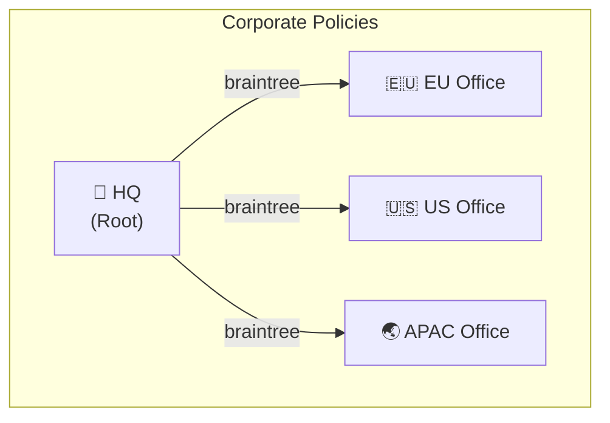
```mermaid
graph TD
    subgraph "Corporate Policies"
        HQ["🏢 HQ<br/>(Root)"]
        EU["🇪🇺 EU Office"]
        US["🇺🇸 US Office"]
        APAC["🌏 APAC Office"]
    end
    HQ -->|braintree| EU
    HQ -->|braintree| US
    HQ -->|braintree| APAC
```

**Source:** HQ — compliance, legal, HR, and security teams author policies centrally.
**Consumers:** Regional offices receive updates automatically.

> A **braintree** network pushes content top-down. Regional offices always have the latest policies without being able to modify the authoritative source. One-directional flow guarantees consistency.

**Additional benefits:**
- Chrono entries for policy effective dates and compliance deadlines sync alongside the documents.
- Files (PDF policies, signed documents) distribute through the same channel.

---

## 4. Multi-Tier R&D Knowledge Cascade

**Use Case:** Research lab publishes findings to product teams, who adapt and cascade relevant knowledge to field engineers.

**Network Topology:**

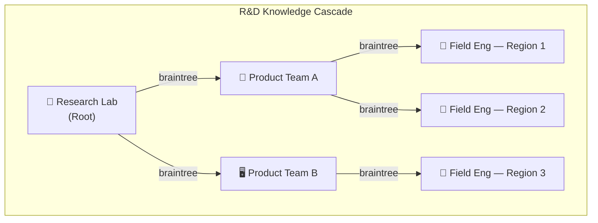
```mermaid
graph TD
    subgraph "R&D Knowledge Cascade"
        Lab["🔬 Research Lab<br/>(Root)"]
        ProductA["📱 Product Team A"]
        ProductB["🖥️ Product Team B"]
        FieldA1["🔧 Field Eng — Region 1"]
        FieldA2["🔧 Field Eng — Region 2"]
        FieldB1["🔧 Field Eng — Region 3"]
    end
    Lab -->|braintree| ProductA
    Lab -->|braintree| ProductB
    ProductA -->|braintree| FieldA1
    ProductA -->|braintree| FieldA2
    ProductB -->|braintree| FieldB1
```

**Source:** Research lab produces experimental findings, material properties, algorithm innovations.
**Consumers:** Product teams curate for their domain; field engineers receive actionable knowledge.

> Braintree's multi-level hierarchy relays content through intermediate nodes. Product teams receive raw research from the lab and their filtered knowledge cascades further down. If Product Team A goes offline, the lab can reparent field engineers temporarily to maintain the chain.

**Additional benefits:**
- Entity types (`material`, `algorithm`, `finding`) with edges (`validated_by`, `supersedes`) create a structured research graph that flows downstream intact.
- Each tier adds their own memories to their local spaces — only the networked space syncs.

---

## 5. Open Source Project — Maintainer Group

**Use Case:** An open source maintainer invites core contributors to a shared knowledge base for architecture context, release plans, and triage notes.

**Network Topology:**

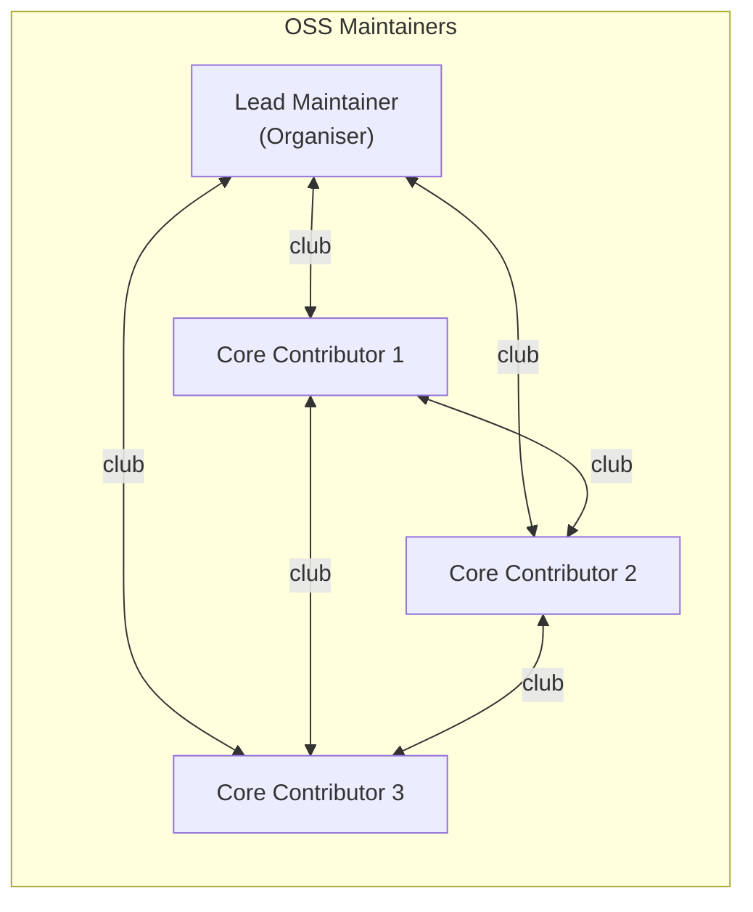
```mermaid
graph LR
    subgraph "OSS Maintainers"
        Lead["Lead Maintainer<br/>(Organiser)"]
        Core1["Core Contributor 1"]
        Core2["Core Contributor 2"]
        Core3["Core Contributor 3"]
    end
    Lead <-->|club| Core1
    Lead <-->|club| Core2
    Lead <-->|club| Core3
    Core1 <-->|club| Core2
    Core1 <-->|club| Core3
    Core2 <-->|club| Core3
```

**Source:** All members contribute — the lead maintainer controls membership.
**Consumers:** All core contributors.

> **Club** governance lets the lead maintainer issue invite keys and approve joins unilaterally — no vote rounds needed. Fast onboarding when a new contributor earns trust, immediate removal if someone steps back.

**Additional benefits:**
- Release milestones as chrono entries (kind: `milestone`, `deadline`) keep the team aligned on timelines.
- Files sync design docs and diagrams alongside the knowledge graph.

---

## 6. Consultant ↔ Client Knowledge Handoff

**Use Case:** An external consultant syncs project deliverables and findings to a client's internal Ythril instance.

**Network Topology:**

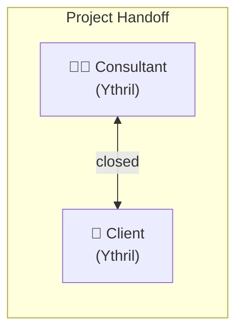
```mermaid
graph LR
    subgraph "Project Handoff"
        Consultant["🧑‍💼 Consultant<br/>(Ythril)"]
        Client["🏢 Client<br/>(Ythril)"]
    end
    Consultant <-->|closed| Client
```

**Source:** Consultant — research findings, recommendations, architecture reviews, deliverable files.
**Consumers:** Client's internal team.

> A **closed** two-member network requires both parties to approve the link. Once established, deliverables sync bidirectionally — the client can push questions and context back. When the engagement ends, either party leaves the network and sync stops cleanly.

**Additional benefits:**
- Space scoping means only the agreed-upon project space is shared — the consultant's other clients and the company's internal spaces remain private.
- Read-only tokens let the client grant auditors access to the received knowledge without risking edits.

---

## 7. Cross-Department Knowledge Sharing (Multiple Networks)

**Use Case:** The security team shares threat intel with both engineering and operations — but engineering and ops don't share directly with each other.

**Network Topology:**

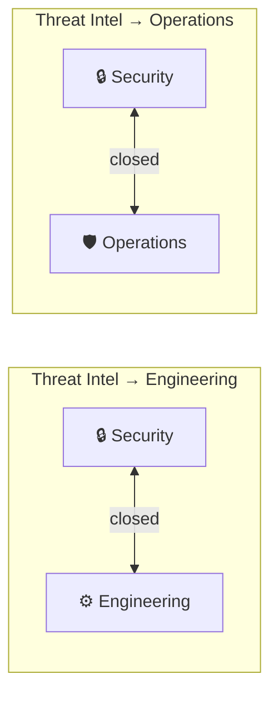
```mermaid
graph LR
    subgraph "Threat Intel → Engineering"
        SecEng["🔒 Security"]
        Eng["⚙️ Engineering"]
    end
    subgraph "Threat Intel → Operations"
        SecOps["🔒 Security"]
        Ops["🛡️ Operations"]
    end
    SecEng <-->|closed| Eng
    SecOps <-->|closed| Ops
```

**Source:** Security team — CVE analysis, threat assessments, remediation playbooks.
**Consumers:** Engineering receives vulnerability details for code fixes; Operations receives incident response procedures.

> The same security space is added to **two separate networks**. Each network is a closed pair. Engineering and Operations never sync with each other, but both stay current with security's output. The security team writes once — both consumers receive.

**Additional benefits:**
- Space-scoped tokens can limit engineering's access to code-relevant findings and ops' access to infrastructure-relevant findings via proxy spaces.

---

## 8. Federated AI Training Dataset Curation

**Use Case:** Multiple teams collaboratively curate training data, evaluation sets, and model benchmarks for shared AI initiatives.

**Network Topology:**

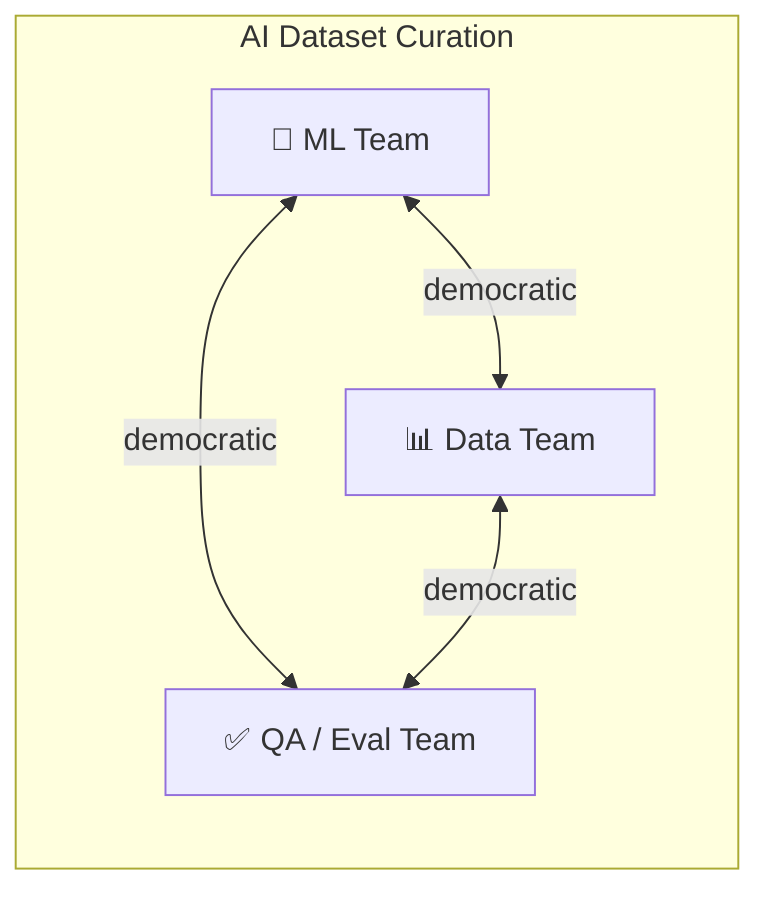
```mermaid
graph LR
    subgraph "AI Dataset Curation"
        ML["🤖 ML Team"]
        Data["📊 Data Team"]
        QA["✅ QA / Eval Team"]
    end
    ML <-->|democratic| Data
    ML <-->|democratic| QA
    Data <-->|democratic| QA
```

**Source:** Data team curates raw datasets; ML team adds model configs and benchmark results; QA team adds evaluation criteria and test cases.
**Consumers:** All three teams need the complete picture.

> **Democratic** full-mesh ensures all three teams stay aligned. The knowledge graph tracks which datasets (`entity: dataset`) were used in which experiments (`edge: trained_on`), with chrono entries marking evaluation milestones. Memory fork-on-conflict preserves both versions when two teams annotate the same data point differently.

**Additional benefits:**
- Files sync model configs, evaluation scripts, and small dataset samples.
- MCP tool access lets LLM clients query the shared brain for dataset lineage and benchmark history.

---

## 9. LLM With Persistent Memory Across Conversations

**Use Case:** Give your AI assistant a real long-term memory that survives context windows, sessions, and even model switches.

**Network Topology:**

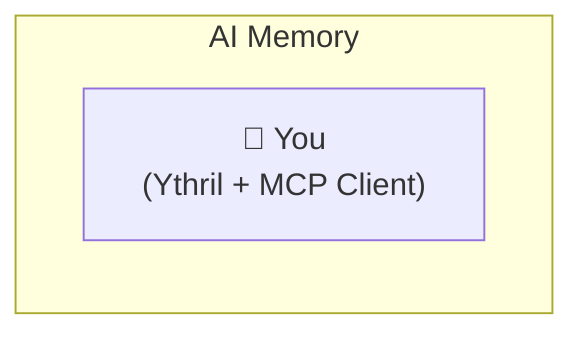
```mermaid
graph LR
    subgraph "AI Memory"
        You["🧑 You<br/>(Ythril + MCP Client)"]
    end
```

**Source:** Every conversation — your LLM calls `remember` to store decisions, preferences, project context, and learnings. It calls `upsert_entity` and `upsert_edge` to build a structured knowledge graph as it learns.
**Consumers:** The same LLM (or any future LLM) in every future conversation.

> This is the door-opener. Connect any MCP-compatible LLM client to Ythril and it gains: `recall` for semantic memory search, `query` for structured retrieval, `list_chrono` for time-awareness, and `read_file`/`write_file` for document access. **Switch from Claude to GPT to Llama — the memory stays.** The brain belongs to you, not the model provider. No vendor lock-in on your own knowledge.

**Wow factor:**
- The LLM builds a knowledge graph *about you* over time — entities for your projects, edges for relationships, chrono entries for deadlines — and any future conversation can traverse it.
- `recall_global` lets the LLM search across *all* your spaces at once: "What do I know about Kubernetes across my work KB, personal notes, and homelab docs?"
- `create_chrono(kind: "prediction", confidence: 0.7)` → the LLM can track its own predictions and score itself over time.

---

## 10. On-Call Runbook That Learns From Incidents

**Use Case:** Incident response runbooks that automatically enrich themselves with every post-mortem.

**Network Topology:**

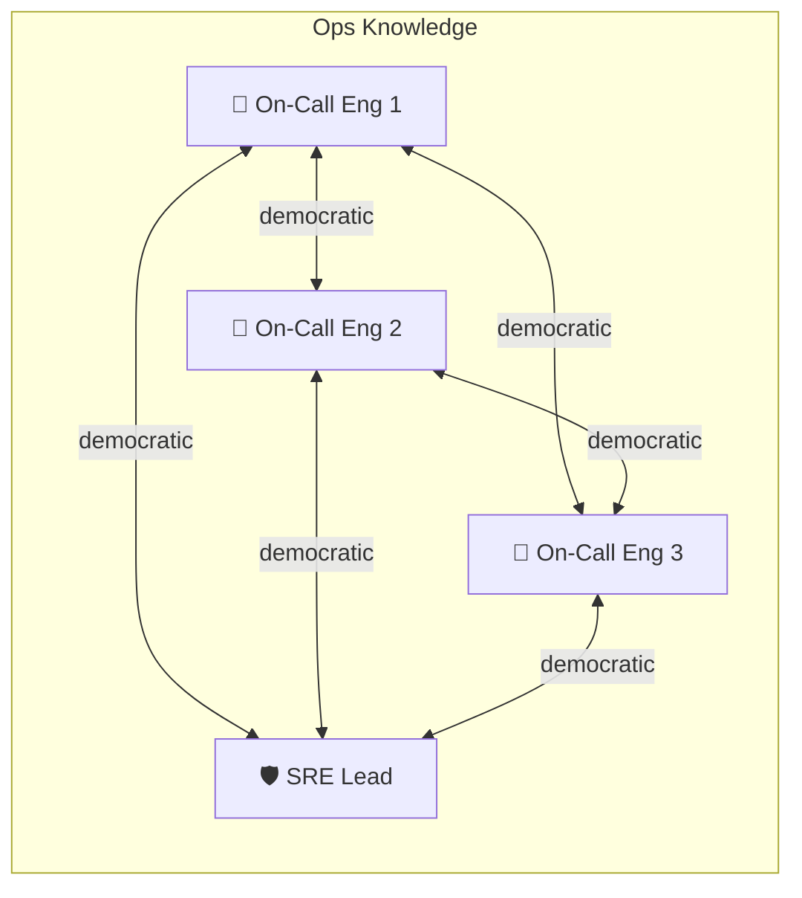
```mermaid
graph LR
    subgraph "Ops Knowledge"
        OnCall1["🚨 On-Call Eng 1"]
        OnCall2["🚨 On-Call Eng 2"]
        OnCall3["🚨 On-Call Eng 3"]
        SRE["🛡️ SRE Lead"]
    end
    OnCall1 <-->|democratic| OnCall2
    OnCall1 <-->|democratic| OnCall3
    OnCall1 <-->|democratic| SRE
    OnCall2 <-->|democratic| OnCall3
    OnCall2 <-->|democratic| SRE
    OnCall3 <-->|democratic| SRE
```

**Source:** Every on-call engineer documents incidents via their LLM client → `remember("At 3am, payment-service OOMed due to unbounded cache. Fix: set maxItems=10000", entities: ["payment-service", "OOM"], tags: ["incident", "cache"])`.
**Consumers:** The next person on-call. Their LLM runs `recall("payment-service is down")` and gets back every past incident contextually ranked.

**Wow factor:**
- The knowledge graph connects **services → failure modes → fixes**: `upsert_edge("payment-service", "OOM", "fails_with")`, `upsert_edge("OOM", "maxItems=10000", "fixed_by")`. Next incident, the LLM walks the graph: "What has fixed OOM before?" — instant answer without digging through a wiki.
- Chrono entries with `kind: "event"` timestamp every incident. `query(chrono, {entityIds: "payment-service", kind: "event"})` → "payment-service has had 4 incidents this quarter" — pattern detection for free.
- This syncs across the team. Engineer 1's 3am fix is in Engineer 2's brain by morning.

---

## 11. Legal / Compliance Audit Trail With Temporal Proof

**Use Case:** Track regulatory deadlines, policy changes, and compliance evidence with full temporal awareness.

**Network Topology:**

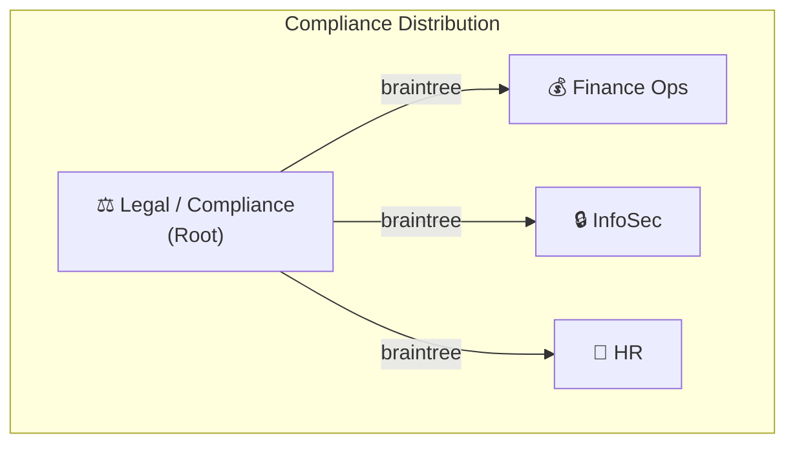
```mermaid
graph TD
    subgraph "Compliance Distribution"
        Legal["⚖️ Legal / Compliance<br/>(Root)"]
        FinOps["💰 Finance Ops"]
        InfoSec["🔒 InfoSec"]
        HR["👥 HR"]
    end
    Legal -->|braintree| FinOps
    Legal -->|braintree| InfoSec
    Legal -->|braintree| HR
```

**Source:** Legal team creates chrono entries for every regulatory deadline and milestone.
**Consumers:** Department heads receive deadline-aware knowledge that their LLM can query.

**Wow factor:**
- `list_chrono({status: "overdue"})` — instant visibility into missed obligations across the org. No spreadsheet hunting.
- `create_chrono({kind: "deadline", title: "DORA ICT risk assessment due", startsAt: "2026-06-30", entityIds: ["DORA", "ICT-risk"]})` → departments' LLMs can ask "What compliance deadlines do we have this quarter?" and get structured answers, not just documents.
- Braintree pushes mean the legal team publishes once and all departments receive. Departments **cannot** alter the authoritative deadline — temporal integrity by architecture.
- `query(chrono, {kind: "prediction", confidence: {$gte: 0.5}})` → the legal team can even log risk predictions ("60% chance of regulatory change in Q3") and track them.

---

## 12. Multi-Tenant SaaS Knowledge Isolation With MCP

**Use Case:** SaaS platform gives each customer their own Ythril space — customers' LLM clients access only their silo, support agents see all.

**Network Topology:**

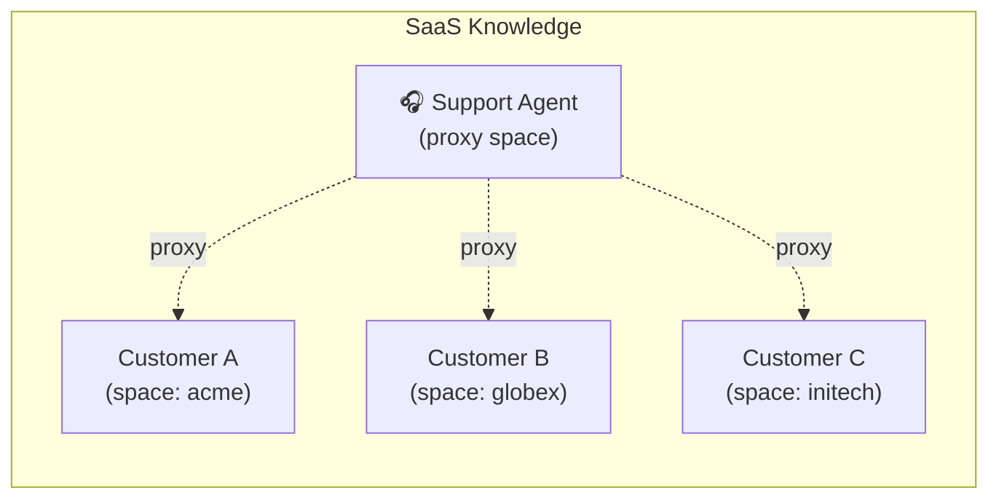
```mermaid
graph LR
    subgraph "SaaS Knowledge"
        Support["🎧 Support Agent<br/>(proxy space)"]
        CustA["Customer A<br/>(space: acme)"]
        CustB["Customer B<br/>(space: globex)"]
        CustC["Customer C<br/>(space: initech)"]
    end
    Support -.->|proxy| CustA
    Support -.->|proxy| CustB
    Support -.->|proxy| CustC
```

**Source:** Each customer's LLM writes to their own space via space-scoped tokens. Support agents use a proxy space.
**Consumers:** Customers see only their data. Support agents search across all customers.

**Wow factor:**
- One Ythril instance, N customers, full isolation via spaces + space-scoped tokens. No separate databases, no tenant ID middleware hell.
- Customer gives their MCP client a space-scoped token → the LLM can `remember`, `recall`, `write_file` only within their silo. Zero chance of cross-tenant leakage — it's token-enforced at the API layer, not application-logic.
- Support agent connects with a proxy space → `recall_global("connection timeout")` → finds matching incidents across ALL customers, ranked by relevance. "This looks like the same issue Customer B had last week."
- Read-only tokens for customer-facing dashboards — they can query their knowledge but not accidentally corrupt it.

---

## 13. Personal CRM — Your LLM Remembers Every Person You Meet

**Use Case:** Never forget context about a person — your LLM builds and maintains a relationship graph.

**Network Topology:**

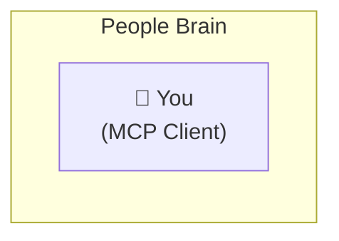
```mermaid
graph LR
    subgraph "People Brain"
        You["🧑 You<br/>(MCP Client)"]
    end
```

**Source:** After every meeting, call, or event: `remember("Met Sarah Chen at KubeCon. She's VP of Platform at Acme Corp. Interested in our sync protocol. Follows up in June.", entities: ["Sarah Chen", "Acme Corp", "KubeCon"], tags: ["contact", "follow-up"])`.
**Consumers:** Future you, before the next meeting with Sarah.

**Wow factor:**
- `recall("Sarah Chen")` → every interaction, semantically ranked. Not a flat contact list — full conversational context.
- `upsert_entity("Sarah Chen", "person", ["contact"], {company: "Acme Corp", role: "VP Platform"})` → structured data queryable with `query(entities, {properties.company: "Acme Corp"})` — "Who do I know at Acme Corp?"
- `upsert_edge("Sarah Chen", "Acme Corp", "works_at")` + `upsert_edge("Sarah Chen", "KubeCon 2026", "met_at")` → graph traversal: "Who did I meet at KubeCon?" → follow edges → full context per person.
- `create_chrono({kind: "deadline", title: "Follow up with Sarah Chen re: sync protocol", startsAt: "2026-06-01", entityIds: ["Sarah Chen"]})` → `list_chrono({status: "upcoming"})` → your LLM reminds you before the deadline.
- Sync this space to your phone (closed network) and you have full context before every meeting, offline.

---

## 14. Competitive Intelligence With Source Tracking

**Use Case:** Sales and product teams collaboratively track competitor moves with full attribution and temporal awareness.

**Network Topology:**

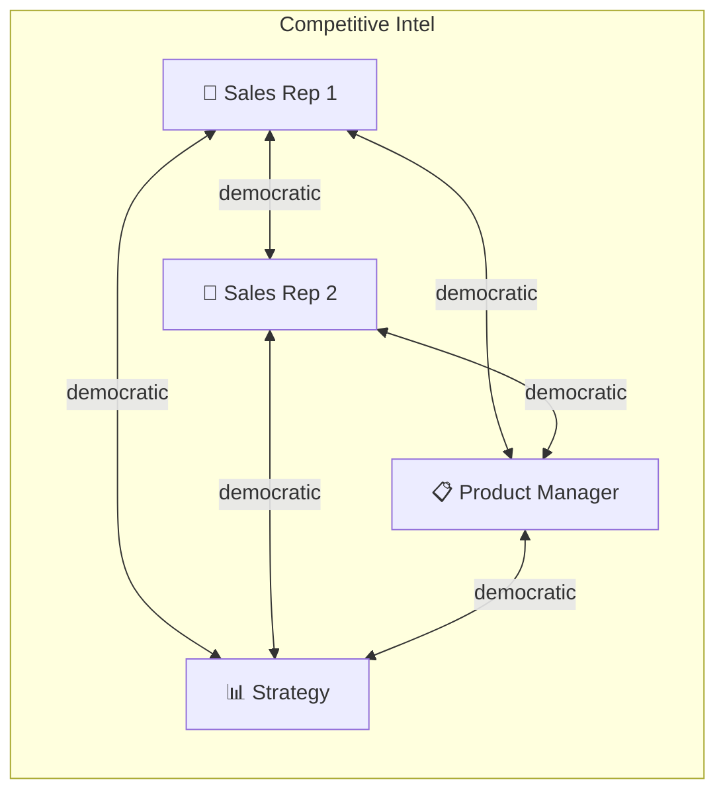
```mermaid
graph LR
    subgraph "Competitive Intel"
        Sales1["💼 Sales Rep 1"]
        Sales2["💼 Sales Rep 2"]
        PM["📋 Product Manager"]
        Strategy["📊 Strategy"]
    end
    Sales1 <-->|democratic| Sales2
    Sales1 <-->|democratic| PM
    Sales1 <-->|democratic| Strategy
    Sales2 <-->|democratic| PM
    Sales2 <-->|democratic| Strategy
    PM <-->|democratic| Strategy
```

**Source:** Sales reps input field intel from calls and demos. PM adds product comparisons. Strategy adds market analysis.
**Consumers:** Everyone — but each role queries differently.

**Wow factor:**
- Sales rep after a call: `remember("Acme Corp switched from Competitor X to Competitor Y because of pricing. Deal was $50k ARR.", entities: ["Acme Corp", "Competitor X", "Competitor Y"], tags: ["churn", "pricing"])`.
- Product manager asks: `recall("Why are customers leaving Competitor X?")` → semantic search surfaces every relevant sales field note — no CRM required.
- `query(edges, {to: "Competitor X", label: "churned_from"})` → structured view: who left Competitor X and why.
- `create_chrono({kind: "event", title: "Competitor Y launched enterprise tier", startsAt: "2026-03-15", entityIds: ["Competitor Y"]})` → strategy team later queries: `query(chrono, {entityIds: "Competitor Y"})` → full competitor timeline. Fork-on-conflict preserves conflicting intelligence from different sources.

---

## 15. Dev Environment Bootstrap — New Hire Onboarding in Minutes

**Use Case:** New developer connects their IDE's LLM to the team brain and immediately has full project context.

**Network Topology:**

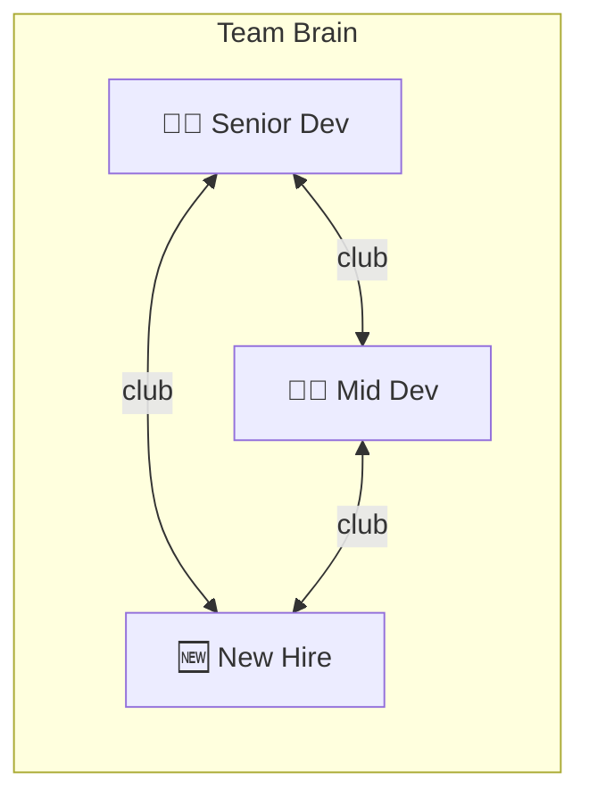
```mermaid
graph LR
    subgraph "Team Brain"
        Senior["👩‍💻 Senior Dev"]
        Mid["🧑‍💻 Mid Dev"]
        NewHire["🆕 New Hire"]
    end
    Senior <-->|club| Mid
    Senior <-->|club| NewHire
    Mid <-->|club| NewHire
```

**Source:** Months of accumulated team knowledge — architecture decisions, "why did we choose X", gotchas, deploy procedures, service relationships.
**Consumers:** The new hire's LLM client, from minute one.

**Wow factor:**
- New hire connects MCP client to Ythril → club organiser approves → full sync completes in seconds.
- New hire's LLM: `recall("how does authentication work in this project")` → gets back ADRs, implementation notes, gotchas, all semantically ranked. No "go read the wiki" that's 6 months stale.
- `query(edges, {label: "depends_on"})` → complete service dependency map. `query(entities, {type: "service"})` → all services with their properties (port, repo, team owner).
- Files sync too — deploy scripts, config templates, architecture diagrams land on the new hire's instance.
- The new hire's questions and learnings (`remember("Gotcha: auth service needs Redis running locally...")`) flow back to the team — onboarding friction improves the knowledge base for the next hire.

---

## 16. Research Paper Writing With Citation Graph

**Use Case:** Researcher builds a structured knowledge graph of papers, findings, and arguments — then uses LLM to draft with full citation awareness.

**Network Topology:**

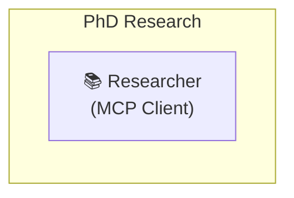
```mermaid
graph LR
    subgraph "PhD Research"
        Researcher["📚 Researcher<br/>(MCP Client)"]
    end
```

**Source:** Every paper read, every experiment result, every argument strand.
**Consumers:** The researcher's LLM when drafting, reviewing, or exploring connections.

**Wow factor:**
- Read a paper → `remember("Smith et al. 2025 show that transformer attention degrades above 128k context. Tested on 3 benchmarks.", entities: ["Smith2025", "transformer-attention", "context-window"], tags: ["paper", "limitation"])` + `upsert_edge("Smith2025", "transformer-attention", "studies")` + `upsert_edge("Smith2025", "Jones2024", "contradicts")`.
- Writing a paragraph → `recall("evidence for context window limitations")` → semantically ranked citations with full notes. Ask the LLM: "What papers support this claim?" — it walks the graph for `contradicts`, `supports`, `extends` edges.
- `query(edges, {label: "contradicts"})` → instant map of all contradictions in your literature. `query(entities, {type: "paper", tags: {$in: ["unread"]}})` → reading backlog.
- `create_chrono({kind: "deadline", title: "Submit to NeurIPS", startsAt: "2026-05-15"})` → time-aware research planning.
- Sync to a co-author via closed network → both researchers' graphs merge. Fork-on-conflict handles disagreements on interpretation — both views preserved.

---

## 17. M&A Due Diligence — Multi-Space Deal Rooms With Proxy Oversight

**Use Case:** Each acquisition target gets its own space. A proxy space gives the deal team a single pane of glass across all active deals — without merging any data.

**Network Topology:**

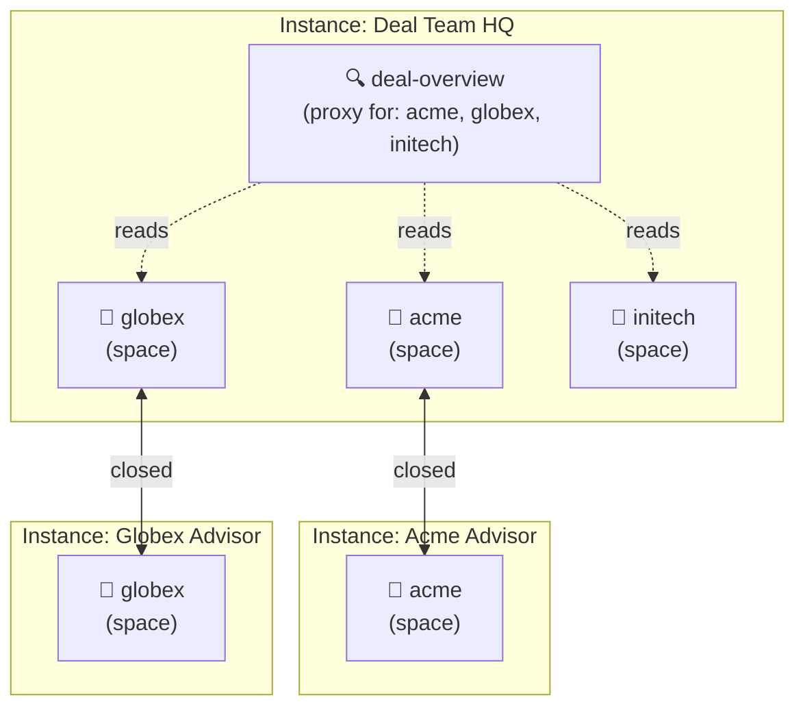
```mermaid
graph TD
    subgraph "Instance: Deal Team HQ"
        Proxy["🔍 deal-overview<br/>(proxy for: acme, globex, initech)"]
        Acme["📁 acme<br/>(space)"]
        Globex["📁 globex<br/>(space)"]
        Initech["📁 initech<br/>(space)"]
    end

    subgraph "Instance: Acme Advisor"
        AcmeExt["📁 acme<br/>(space)"]
    end
    subgraph "Instance: Globex Advisor"
        GlobexExt["📁 globex<br/>(space)"]
    end

    Acme <-->|closed| AcmeExt
    Globex <-->|closed| GlobexExt
    Proxy -.->|reads| Acme
    Proxy -.->|reads| Globex
    Proxy -.->|reads| Initech
```

**Source:** Each deal team writes due diligence findings, risks, and documents into their target's space. External advisors sync into the same space via closed networks.
**Consumers:** The M&A lead connects their LLM to the `deal-overview` proxy space.

**Wow factor:**
- `recall("antitrust risk")` on the proxy → semantic search fans out across all three deal spaces in parallel, returns ranked results with `spaceId` attribution. One query, three deals, zero data mixing.
- Each space syncs with its own closed network — Acme's advisor sees only Acme's space, Globex's advisor sees only Globex. The proxy never syncs externally — it's a local read-only aggregation layer.
- `query(entities, {type: "risk"})` on the proxy → entities from all three deals. `query(edges, {label: "mitigated_by"})` → which risks have mitigation plans across all targets.
- Write operations on the proxy require `?targetSpace=acme` — the proxy enforces explicit targeting. No accidental cross-contamination between deal rooms.
- Kill a deal? Remove the space from `proxyFor`. The data stays isolated in its own space, the proxy just stops including it.

---

## 18. Global Engineering Org — Same Space in Multiple Networks

**Use Case:** A platform team's space participates in both a democratic team network AND a top-down braintree from the CTO — different governance, same knowledge.

**Network Topology:**

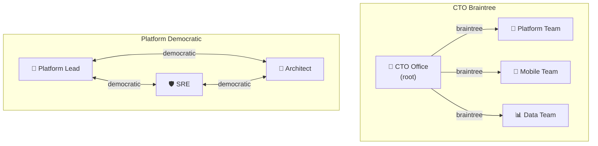
```mermaid
graph TD
    subgraph "CTO Braintree"
        CTO["🏢 CTO Office<br/>(root)"]
        Platform["🔧 Platform Team"]
        Mobile["📱 Mobile Team"]
        Data["📊 Data Team"]
    end

    subgraph "Platform Democratic"
        PlatLead["🔧 Platform Lead"]
        PlatSRE["🛡️ SRE"]
        PlatArch["📐 Architect"]
    end

    CTO -->|braintree| Platform
    CTO -->|braintree| Mobile
    CTO -->|braintree| Data
    PlatLead <-->|democratic| PlatSRE
    PlatLead <-->|democratic| PlatArch
    PlatSRE <-->|democratic| PlatArch
```

**Source:** The Platform Team's `platform` space is in two networks simultaneously:
1. **Braintree** — CTO pushes org-wide standards, architecture mandates, and compliance policies downward. Platform team receives but cannot push up.
2. **Democratic** — Platform lead, SRE, and architect collaborate as equals. ADRs, runbooks, and incident learnings sync bidirectionally with majority+veto governance.

**Consumers:** The platform team's LLM sees everything — both the top-down mandates and the team's own collaborative knowledge — in one unified `recall`.

**Wow factor:**
- The CTO publishes `remember("All services must implement mTLS by Q3 2026", tags: ["mandate", "security"])` → braintree pushes it to Platform, Mobile, and Data. The platform team's space now contains it alongside their own ADRs and runbooks.
- Platform SRE writes `remember("mTLS rollout blocked by legacy proxy — need sidecar approach", entities: ["mTLS", "legacy-proxy"], tags: ["blocker"])` → democratic sync shares it with the architect and lead. The CTO's braintree does **not** pull this up (push-only direction). Operational detail stays at the team level.
- `recall("mTLS")` on the platform instance → returns both the CTO mandate AND the team-level blocker, ranked by relevance. Full picture without crossing governance boundaries.
- The same space, two different sync cadences: braintree might sync hourly (policy pushes), democratic every 5 minutes (fast team collaboration). Each network has its own schedule.

---

## 19. Consulting Firm — Client Spaces, Internal Space, Proxy Dashboard

**Use Case:** Consultants maintain separate spaces per client (strict isolation), an internal knowledge base, and a proxy space that lets partners search across everything.

**Network Topology:**

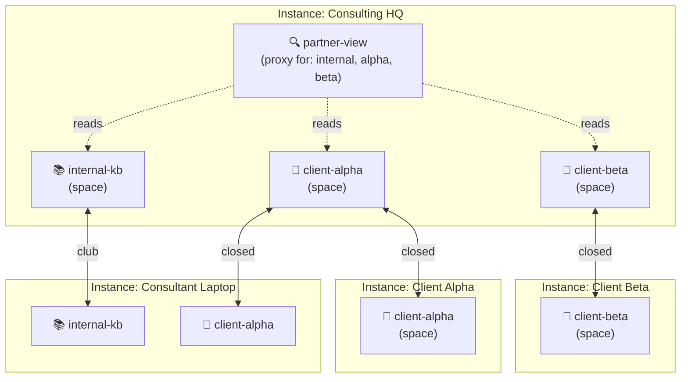
```mermaid
graph TD
    subgraph "Instance: Consulting HQ"
        Internal["📚 internal-kb<br/>(space)"]
        ClientA["📁 client-alpha<br/>(space)"]
        ClientB["📁 client-beta<br/>(space)"]
        Dashboard["🔍 partner-view<br/>(proxy for: internal, alpha, beta)"]
    end

    subgraph "Instance: Client Alpha"
        AlphaExt["📁 client-alpha<br/>(space)"]
    end
    subgraph "Instance: Client Beta"
        BetaExt["📁 client-beta<br/>(space)"]
    end

    subgraph "Instance: Consultant Laptop"
        ConsInt["📚 internal-kb"]
        ConsAlpha["📁 client-alpha"]
    end

    ClientA <-->|closed| AlphaExt
    ClientB <-->|closed| BetaExt
    Internal <-->|club| ConsInt
    ClientA <-->|closed| ConsAlpha
    Dashboard -.->|reads| Internal
    Dashboard -.->|reads| ClientA
    Dashboard -.->|reads| ClientB
```

**Source:**
- `internal-kb` (club network): Templates, methodologies, lessons learned. All consultants sync.
- `client-alpha`, `client-beta` (closed networks each): Client-specific findings, deliverables, files. Each client syncs only their own space.
- `partner-view` (proxy, local only): Aggregates all three spaces. Never syncs externally.

**Consumers:** Partners and practice leads connect their LLM to `partner-view`.

**Wow factor:**
- Partner asks: `recall("cloud migration cost overrun")` on the proxy → gets results from internal templates AND both client engagements, ranked by relevance, with `spaceId` showing which client each result came from.
- Consultant on-site with Client Alpha has two spaces syncing to their laptop: `internal-kb` (club) and `client-alpha` (closed). Their LLM uses `recall_global` to search both. They get the firm's methodology templates alongside Alpha-specific context in one query.
- Client Alpha's external instance syncs only `client-alpha` — they never see `internal-kb` or `client-beta`. Token-scoped, network-scoped, zero crossover.
- `query(entities, {type: "deliverable", properties.status: "overdue"})` on the proxy → overdue deliverables across all clients. `list_chrono({status: "upcoming", kind: "deadline"})` → upcoming deadlines across all engagements.
- New client onboarded? Create space, create closed network, add to `proxyFor` on `partner-view`. The proxy starts including it immediately — no data migration, no restructuring.

---

## 20. Hospital Network — Departmental Spaces With Hierarchical Distribution and Cross-Department Search

**Use Case:** Each hospital department has its own space. Medical director pushes protocols top-down via braintree. Department heads collaborate via democratic network. A proxy space enables cross-department clinical search.

**Network Topology:**

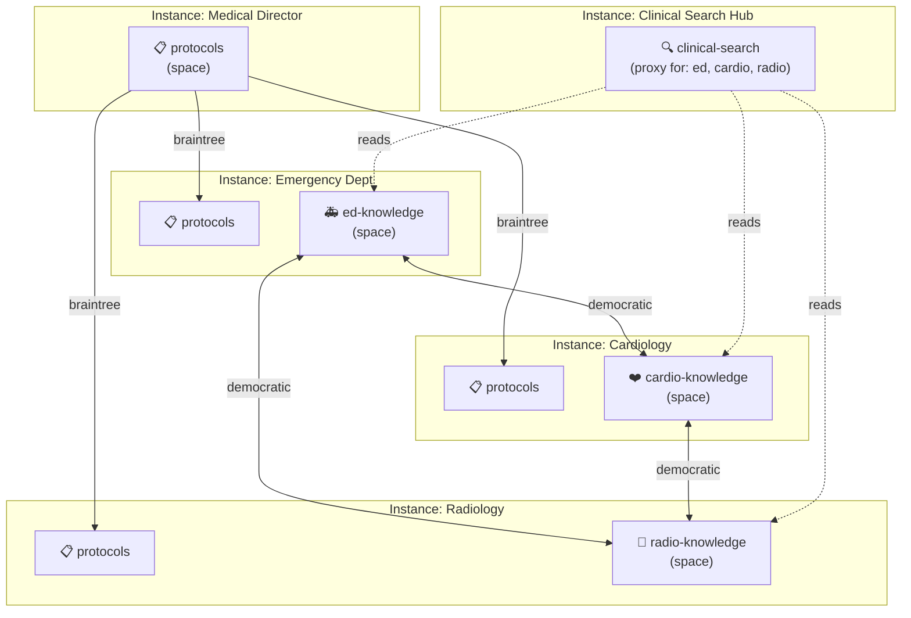
```mermaid
graph TD
    subgraph "Instance: Medical Director"
        Protocols["📋 protocols<br/>(space)"]
    end

    subgraph "Instance: Emergency Dept"
        EDProtocols["📋 protocols"]
        EDKnowledge["🚑 ed-knowledge<br/>(space)"]
    end
    subgraph "Instance: Cardiology"
        CardProtocols["📋 protocols"]
        CardKnowledge["❤️ cardio-knowledge<br/>(space)"]
    end
    subgraph "Instance: Radiology"
        RadProtocols["📋 protocols"]
        RadKnowledge["🔬 radio-knowledge<br/>(space)"]
    end

    subgraph "Instance: Clinical Search Hub"
        ClinProxy["🔍 clinical-search<br/>(proxy for: ed, cardio, radio)"]
    end

    Protocols -->|braintree| EDProtocols
    Protocols -->|braintree| CardProtocols
    Protocols -->|braintree| RadProtocols
    EDKnowledge <-->|democratic| CardKnowledge
    EDKnowledge <-->|democratic| RadKnowledge
    CardKnowledge <-->|democratic| RadKnowledge
    ClinProxy -.->|reads| EDKnowledge
    ClinProxy -.->|reads| CardKnowledge
    ClinProxy -.->|reads| RadKnowledge
```

**Three networks, three patterns, one hospital:**

1. **`protocols` braintree** — Medical director pushes updated clinical protocols. Departments receive but cannot modify the authoritative source. `create_chrono({kind: "milestone", title: "Sepsis protocol v3 effective", startsAt: "2026-04-01"})` → every department's LLM knows when the new protocol takes effect.

2. **`knowledge` democratic** — Department heads share clinical learnings peer-to-peer. ED learns that a specific drug interaction is common → `remember(...)` → cardiology and radiology receive it on next sync. Majority+veto governance prevents a single department from pushing contested clinical claims.

3. **`clinical-search` proxy** — On a dedicated search instance. `recall("drug interaction with warfarin in elderly patients")` → searches ED, cardiology, and radiology knowledge spaces in parallel. Results come back with `spaceId` attribution — the clinician sees which department reported each finding.

**Wow factor:**
- Each department runs its own Ythril instance with two spaces: `protocols` (receive-only from braintree) and their own knowledge space (democratic peer-to-peer). Two different governance models on the same instance, zero conflict.
- The proxy search hub has read-only tokens — it can query but never write. Even if compromised, clinical data integrity is preserved.
- `query(entities, {type: "drug"})` on the proxy → every drug entity across all departments. `query(edges, {from: "warfarin", label: "interacts_with"})` → cross-department interaction graph built from real clinical observations.
- A new department joins? Add their knowledge space to the proxy's `proxyFor` and add them to the democratic network. Two config changes, instant integration.
- Protocols push is one-way and authoritative. Knowledge sharing is peer-to-peer and democratic. Clinical search is read-only and aggregated. Three completely different trust models, cleanly separated by network type.

---

## 21. Multi-Account Portfolio Intelligence — Personal Finance Without a Cloud

**Use Case:** Track investments, spending patterns, and financial decisions across multiple brokerage/bank accounts — your LLM becomes a personal CFO that never sends your data to anyone.

**Network Topology:**

```mermaid
graph LR
    subgraph "Your Ythril Instance"
        Proxy["🔍 finance-overview<br/>(proxy for: trading, savings, property)"]
        Trading["📈 trading<br/>(space)"]
        Savings["🏦 savings<br/>(space)"]
        Property["🏠 property<br/>(space)"]
    end
    subgraph "Laptop"
        TradingL["📈 trading"]
        SavingsL["🏦 savings"]
    end
    Trading <-->|closed| TradingL
    Savings <-->|closed| SavingsL
    Proxy -.->|reads| Trading
    Proxy -.->|reads| Savings
    Proxy -.->|reads| Property
```

**Source:** You log financial events through your LLM: trades, dividends, property expenses, savings milestones. Each account type stays in its own space.
**Consumers:** Your LLM connected to `finance-overview` proxy.

**Wow factor:**
- `remember("Sold 50 NVDA at $180, bought 100 AMD at $165. Thesis: AMD catching up on inference chips.", entities: ["NVDA", "AMD"], tags: ["trade", "semiconductor"])` into `trading` space.
- `remember("Roof repair $12k on rental property. Insurance claim filed ref #4821.", entities: ["rental-oak-st", "insurance"], tags: ["expense", "maintenance"])` into `property` space.
- `recall("semiconductor exposure")` on the proxy → pulls trade history from `trading`, any related notes from `savings` (maybe a semiconductor ETF in your 401k), all ranked by relevance with `spaceId` attribution.
- `query(entities, {type: "stock"})` on the proxy → every position across all accounts. `query(edges, {label: "thesis_for"})` → your investment thesis graph. "Why did I buy AMD again?" — instant recall.
- `create_chrono({kind: "event", title: "NVDA earnings Q1 2026", startsAt: "2026-05-28", entityIds: ["NVDA"]})` → `list_chrono({status: "upcoming"})` → your LLM reminds you of catalysts tied to positions you actually hold.
- `create_chrono({kind: "prediction", title: "AMD will outperform NVDA in inference workloads by Q4", confidence: 0.6, entityIds: ["AMD", "NVDA"]})` → track your own predictions. `query(chrono, {kind: "prediction", status: "expired"})` → "How good were my calls?"
- Everything stays on your hardware. Your brokerage data, trade theses, and spending patterns never touch a third-party API. Closed network sync to your laptop = offline access.

---

## 22. Market Analysis Desk — Analysts + Feeds + Broker Overlay

**Use Case:** Trading desk where multiple analysts contribute research, market data gets ingested as memories, and a proxy space gives the desk head a unified view.

**Network Topology:**

```mermaid
graph TD
    subgraph "Instance: Desk Head"
        Overview["🔍 desk-overview<br/>(proxy for: macro, equities, fx)"]
        Macro["🌍 macro<br/>(space)"]
        Equities["📈 equities<br/>(space)"]
        FX["💱 fx<br/>(space)"]
    end
    subgraph "Instance: Macro Analyst"
        MacroA["🌍 macro"]
    end
    subgraph "Instance: Equity Analyst"
        EquitiesA["📈 equities"]
    end
    subgraph "Instance: FX Analyst"
        FXA["💱 fx"]
    end

    Macro <-->|democratic| MacroA
    Equities <-->|democratic| EquitiesA
    FX <-->|democratic| FXA
```

**Source:** Each analyst writes into their domain space. The desk head's proxy reads across all three.
**Consumers:** Desk head's LLM queries the proxy; individual analysts query their own space.

**Wow factor:**
- FX analyst: `remember("EUR/USD broke 1.12 support on weak PMI. Next support at 1.095. ECB likely dovish June.", entities: ["EUR/USD", "ECB"], tags: ["technical", "macro"])`. Macro analyst: `remember("US PMI miss — manufacturing at 48.2, services at 51.1. Dollar weakening thesis intact.", entities: ["US-PMI", "USD"], tags: ["data", "leading-indicator"])`.
- Desk head on the proxy: `recall("dollar weakening")` → gets the FX technical AND the macro data backing it, cross-correlated by semantic relevance. Two analysts, two spaces, one coherent picture.
- `upsert_edge("EUR/USD", "ECB", "driven_by")` + `upsert_edge("ECB", "US-PMI", "reacts_to")` → the knowledge graph connects the causal chain across desks. `query(edges, {from: "ECB"})` → every factor the team has linked to ECB decisions.
- `create_chrono({kind: "prediction", title: "EUR/USD hits 1.15 by August", confidence: 0.65, entityIds: ["EUR/USD"]})` → desk tracks analyst predictions over time. `query(chrono, {kind: "prediction", entityIds: "EUR/USD"})` → full prediction history with confidence scores.
- Each desk is its own democratic network — analyst departure doesn't nuke the knowledge base. New analyst joins, syncs, instant full context.

---

## 23. Intelligence Collection — Compartmented Sources With Fusion Proxy

**Use Case:** Each intelligence source/method gets its own compartmented space. A fusion proxy lets analysts search across compartments they're cleared for — without merging databases.

**Network Topology:**

```mermaid
graph TD
    subgraph "Instance: Fusion Center"
        Fusion["🔍 fusion<br/>(proxy for: osint, humint, sigint)"]
        OSINT["🌐 osint<br/>(space)"]
        HUMINT["🕵️ humint<br/>(space)"]
        SIGINT["📡 sigint<br/>(space)"]
    end
    subgraph "Instance: OSINT Team"
        OSINText["🌐 osint"]
    end
    subgraph "Instance: Field Office"
        HUMINText["🕵️ humint"]
    end
    subgraph "Instance: SIGINT Station"
        SIGINText["📡 sigint"]
    end

    OSINT <-->|club| OSINText
    HUMINT <-->|closed| HUMINText
    SIGINT <-->|closed| SIGINText
    Fusion -.->|reads| OSINT
    Fusion -.->|reads| HUMINT
    Fusion -.->|reads| SIGINT
```

**Source:** Each collection discipline writes to its own space via its own network type — OSINT uses club (easy to add new open-source researchers), HUMINT and SIGINT use closed (strict need-to-know).
**Consumers:** Fusion analysts connect to the proxy. Compartment analysts see only their space.

**Wow factor:**
- HUMINT: `remember("Source JADE reports facility X expanded production capacity — 3 new buildings observed.", entities: ["facility-X", "JADE"], tags: ["humint", "production"])`. SIGINT: `remember("Intercept confirms increased shipments from facility X to port Y.", entities: ["facility-X", "port-Y"], tags: ["sigint", "logistics"])`. OSINT: `remember("Satellite imagery shows construction at facility X coordinates 34.05N 118.25W.", entities: ["facility-X"], tags: ["osint", "imagery"])`.
- Fusion analyst: `recall("facility X activity")` on the proxy → all three sources, correlated by semantic similarity, attributed by `spaceId` (source discipline). The analyst sees HUMINT, SIGINT, and OSINT concur — without any single source team seeing the other disciplines.
- `query(entities, {name: "facility-X"})` on the proxy → entity exists in all three spaces. `query(edges, {from: "facility-X"})` → relationships mapped by each discipline independently.
- Different `proxyFor` lists per clearance level: one proxy for all-source, another for OSINT+HUMINT only. Token-scoped access — the proxy itself enforces the compartmentation.
- Each closed network syncs independently. SIGINT station goes dark? OSINT and HUMINT continue unaffected. No single point of failure.

---

## 24. Family Knowledge Hub — Shared Household, Personal Privacy

**Use Case:** Family members share a household space (recipes, maintenance schedules, family events) while each person keeps a private space that never syncs.

**Network Topology:**

```mermaid
graph LR
    subgraph "Instance: Home Server"
        Household["🏠 household<br/>(space)"]
        Kids["📚 kids-school<br/>(space)"]
    end
    subgraph "Instance: Parent A Phone"
        HouseholdA["🏠 household"]
        PrivateA["🔒 private-a<br/>(local only)"]
    end
    subgraph "Instance: Parent B Phone"
        HouseholdB["🏠 household"]
        PrivateB["🔒 private-b<br/>(local only)"]
    end
    subgraph "Instance: Kid Tablet"
        HouseholdK["🏠 household"]
        KidsK["📚 kids-school"]
    end

    Household <-->|democratic| HouseholdA
    Household <-->|democratic| HouseholdB
    Household <-->|democratic| HouseholdK
    Kids <-->|closed| KidsK
```

**Source:** Everyone writes to `household` — recipes, DIY notes, vet appointments, family events. Parents write to their private spaces. Kids write school stuff to `kids-school`.
**Consumers:** Everyone's LLM queries their own instance. Shared knowledge syncs; private stays private.

**Wow factor:**
- Parent A: `remember("Boiler annual service due in October. Last serviced by PlumbCo, invoice #8812.", entities: ["boiler", "PlumbCo"], tags: ["maintenance"])` → syncs to everyone. Next year, any family member's LLM: `recall("boiler service")` → full history.
- `create_chrono({kind: "deadline", title: "Kid soccer tournament registration closes", startsAt: "2026-04-15", entityIds: ["soccer"]})` → `list_chrono({status: "upcoming"})` → the household LLM surfaces it to whoever asks.
- `upsert_entity("family-van", "vehicle", ["maintenance"], {mileage: 82000, nextService: "85000km"})` → `query(entities, {type: "vehicle"})` → "When is the van due for service?" Structured, not buried in a note.
- Parent A's `private-a` space is **not in any network** — it never leaves the phone. Medical notes, financial planning, personal journal — truly private. The LLM on that phone can still `recall_global` across both `household` and `private-a` locally.
- Kid's tablet has a space-scoped token for `household` (read/write) and `kids-school` (read/write). No access to parent private spaces — not by policy, by architecture.
- Democratic governance on `household` means the kid's tablet has equal vote weight. Conflict? Fork-on-conflict preserves both versions — no silent data loss.

---

## 25. Smart Home — Device Logs, Automations, and Energy Intelligence

**Use Case:** Your home automation system, energy data, and device maintenance history — all in Ythril spaces. Your LLM can answer "Why was the house cold last Tuesday?" by correlating across spaces.

**Network Topology:**

```mermaid
graph TD
    subgraph "Instance: Home Server"
        Energy["⚡ energy<br/>(space)"]
        Devices["🔧 devices<br/>(space)"]
        Automations["🤖 automations<br/>(space)"]
        SmartProxy["🔍 home-brain<br/>(proxy for: energy, devices, automations)"]
    end
    subgraph "Instance: Phone"
        EnergyP["⚡ energy"]
        DevicesP["🔧 devices"]
    end
    Energy <-->|closed| EnergyP
    Devices <-->|closed| DevicesP
    SmartProxy -.->|reads| Energy
    SmartProxy -.->|reads| Devices
    SmartProxy -.->|reads| Automations
```

**Source:**
- `energy`: Solar production, grid consumption, battery state, tariff history. Ingested via scripts or manually.
- `devices`: Device inventory, firmware versions, maintenance dates, failure history.
- `automations`: Home Assistant rules, automations rationale, "why I set this up" context.

**Consumers:** Your LLM connected to `home-brain` proxy. Phone syncs energy and devices for on-the-go queries.

**Wow factor:**
- `remember("HVAC compressor failed 2026-03-15. Error code E-48. Tech replaced capacitor, $180.", entities: ["hvac-main", "E-48"], tags: ["failure", "repair"])` in `devices`. `remember("Energy spike 2026-03-14: 38 kWh consumed (vs 22 kWh avg). HVAC ran continuously.", entities: ["hvac-main"], tags: ["anomaly", "consumption"])` in `energy`.
- `recall("why was energy high last week")` on the proxy → correlates the energy anomaly with the HVAC failure across two different spaces. Your LLM connects the dots: "The HVAC compressor was failing, causing it to run continuously the day before it died."
- `upsert_entity("hvac-main", "device", ["climate"], {model: "Daikin RXB35", installed: "2022-06", warrantyEnd: "2027-06"})` → `query(entities, {type: "device", properties.warrantyEnd: {$lte: "2026-12"}})` → "Which devices have warranties expiring this year?"
- `create_chrono({kind: "event", title: "Solar panels cleaned", startsAt: "2026-03-20", entityIds: ["solar-array"]})` + production data in `energy` space → correlate cleaning dates with production improvements over time.
- `remember("Set automation: if solar production > 4kW and battery > 80%, start dishwasher. Reason: minimize grid draw during peak tariff.", tags: ["automation", "solar", "tariff"])` in `automations` → six months later, `recall("why does the dishwasher run midday")` → instant answer with the original reasoning.
- `query(edges, {label: "controls"})` → which automations control which devices. `query(edges, {from: "hvac-main"})` → everything linked to the HVAC: energy readings, failure history, automations, warranty info — across all three spaces via the proxy.
- Phone sync means you can check energy production and device status from anywhere. Closed network = your smart home data never touches a cloud.

---

## 26. Dev Project Brain — Per-Dependency Documentation Spaces

**Use Case:** Each library/framework you use gets its own space with ingested docs, examples, and gotchas. A proxy space gives your coding LLM instant cross-library search — like a local, semantic, always-up-to-date devdocs.io.

**Network Topology:**

```mermaid
graph TD
    subgraph "Instance: Dev Workstation"
        Project["🛠️ my-project<br/>(space — ADRs, notes, bugs)"]
        React["📦 react-docs<br/>(space)"]
        Prisma["📦 prisma-docs<br/>(space)"]
        Tailwind["📦 tailwind-docs<br/>(space)"]
        DevProxy["🔍 fullstack-brain<br/>(proxy for: project, react, prisma, tailwind)"]
    end
    subgraph "Instance: Team Lead"
        ProjectT["🛠️ my-project"]
    end

    Project <-->|democratic| ProjectT
    DevProxy -.->|reads| Project
    DevProxy -.->|reads| React
    DevProxy -.->|reads| Prisma
    DevProxy -.->|reads| Tailwind
```

**Source:**
- `my-project` (democratic network): Your team's ADRs, architecture notes, bug postmortems, gotchas. Syncs with the team.
- `react-docs`, `prisma-docs`, `tailwind-docs` (no network — local only): Ingested library documentation. Populate via `write_file` for markdown pages, `remember` for key concepts and patterns, `upsert_entity` + `upsert_edge` for API relationships.

**Consumers:** Your IDE's LLM connects to `fullstack-brain` proxy.

**Wow factor:**
- Ingest React docs into `react-docs`: `remember("useEffect cleanup runs before re-execution and on unmount. Return a function from the effect callback.", entities: ["useEffect"], tags: ["hooks", "lifecycle"])`. Do the same for Prisma: `remember("Prisma $transaction sequential mode runs queries in order; interactive mode gives you a tx client.", entities: ["$transaction"], tags: ["orm", "transactions"])`.
- You're coding and ask: `recall("how to handle cleanup in effects")` on the proxy → React docs hit. `recall("nested writes with transactions")` → Prisma docs hit. **Your LLM gets library-specific answers without hallucinating** — the docs are right there in the brain, semantically indexed.
- `upsert_entity("useEffect", "hook", ["react"], {since: "16.8"})` + `upsert_edge("useEffect", "useState", "commonly_used_with")` → build a relationship graph of the API surface. `query(edges, {from: "useEffect"})` → "What's commonly used with useEffect?"
- `remember("Gotcha: Prisma $transaction has a 5s default timeout. Hit this in the bulk import job — set timeout: 30000.", entities: ["$transaction"], tags: ["gotcha", "timeout"])` in `my-project` → next time anyone on the team hits a transaction timeout, `recall("prisma transaction timeout")` returns the gotcha from your project space AND the official docs from `prisma-docs`.
- Swap projects? Create a new proxy with different `proxyFor`: `["new-project", "vue-docs", "drizzle-docs", "tailwind-docs"]`. Reuse `tailwind-docs` across both — it's just a space reference.
- Version upgrade? Wipe `react-docs` space, re-ingest React 20 docs. Project notes with your real-world gotchas in `my-project` stay untouched — they're in a separate space.
- `write_file` for full markdown pages (migration guides, changelog summaries), `remember` for atomic facts, `upsert_entity`/`upsert_edge` for API structure. Three ingestion modes, one unified brain.
- Library docs never sync anywhere — they're local-only spaces. Your project notes sync with the team. Different lifecycle, different governance, same proxy.

---

## 27. Public Documentation Hub — Zero-Friction Knowledge Distribution

**Use Case:** An open source project, standards body, or company publishes reference documentation, API specs, and best practices. Anyone interested subscribes — no invite approval needed.

**Network Topology:**

```mermaid
graph TD
    subgraph "Public Docs Distribution"
        Publisher["📚 Publisher<br/>(Documentation Team)"]
        Sub1["👤 Subscriber 1"]
        Sub2["👤 Subscriber 2"]
        Sub3["👤 Subscriber 3"]
        SubN["👤 Subscriber N"]
    end
    Publisher -->|pubsub| Sub1
    Publisher -->|pubsub| Sub2
    Publisher -->|pubsub| Sub3
    Publisher -->|pubsub| SubN
```

**Source:** The documentation team authors API references, migration guides, architecture overviews, and changelogs into a dedicated space.
**Consumers:** Any developer or team who subscribes. They receive updates automatically — no approval step.

> A **pub/sub** network eliminates the invite-accept friction entirely. The publisher generates an invite link or key, shares it publicly (README, website, Slack channel), and anyone who applies is auto-accepted as a subscriber. Subscribers pull content; the publisher pushes updates. Subscribers **cannot** modify the published content — data flows one way.

**Wow factor:**
- Publisher writes: `remember("Breaking change in v3: auth middleware now requires explicit scope parameter", entities: ["auth-middleware", "v3"], tags: ["breaking", "migration"])` → every subscriber's LLM has it on next sync. No "check the changelog" — it's in their brain, semantically searchable.
- `write_file("migration-guide-v3.md", ...)` → full migration doc lands on every subscriber's instance automatically.
- Subscribers run `recall("how does auth work in v3")` locally — zero API calls to the publisher, fully offline once synced.
- Publisher removes a subscriber? Unilateral — no vote round, instant effect. Subscriber leaves? Just as instant.
- Same space can participate in a pub/sub network for public distribution AND a democratic network for the internal authoring team — different governance, same content.
- Scale to hundreds of subscribers without governance overhead. No vote rounds, no approval queues, no bottlenecks.

---

## Entity Merge — Deduplication & Aggregation

**Use Case:** An MCP agent discovers two entities representing the same real-world concept (e.g. two "Docker" entities created by different team members) and consolidates them into a single authoritative entity.

**Workflow:**

1. **Discover duplicates** — agent uses `find_similar` to find high-similarity entities:
   ```json
   { "entryId": "<docker-entity-1-uuid>", "entryType": "entity", "minScore": 0.85 }
   ```

2. **Inspect the merge plan** — call `merge_entities` with an empty resolution map:
   ```json
   { "survivorId": "<docker-entity-1-uuid>", "absorbedId": "<docker-entity-2-uuid>", "resolutions": [] }
   ```
   The endpoint returns `409` with a `MergePlan` showing:
   - Property conflicts (e.g. `score: 80 vs 95`, `active: true vs false`)
   - Absorbed-only properties (auto-added, no resolution needed)
   - Duplicate edge warnings (edges that become identical after relinking)

3. **Resolve conflicts** — agent fills in resolutions (numeric via function, text via LLM judgment):
   ```json
   {
     "survivorId": "<docker-entity-1-uuid>",
     "absorbedId": "<docker-entity-2-uuid>",
     "resolutions": [
       { "key": "score", "resolution": "fn:avg" },
       { "key": "active", "resolution": "fn:or" },
       { "key": "description", "resolution": "custom", "customValue": "Docker container runtime — merged from team entries" }
     ]
   }
   ```

4. **Execute** — the endpoint merges atomically: relinks all edges/memories/chrono to the survivor, applies resolved properties, deletes the absorbed entity.

**Aggregation variant:** Merge two metric entities using `fn:sum` on numeric fields to aggregate counts — same endpoint, same flow. Candidate selection is the caller's responsibility.

**Schema-driven defaults:** When `propertySchemas` includes `mergeFn` (e.g. `"score": { "type": "number", "mergeFn": "avg" }`), the merge plan surfaces it as `suggestedFn` — the agent can accept or override per call.

