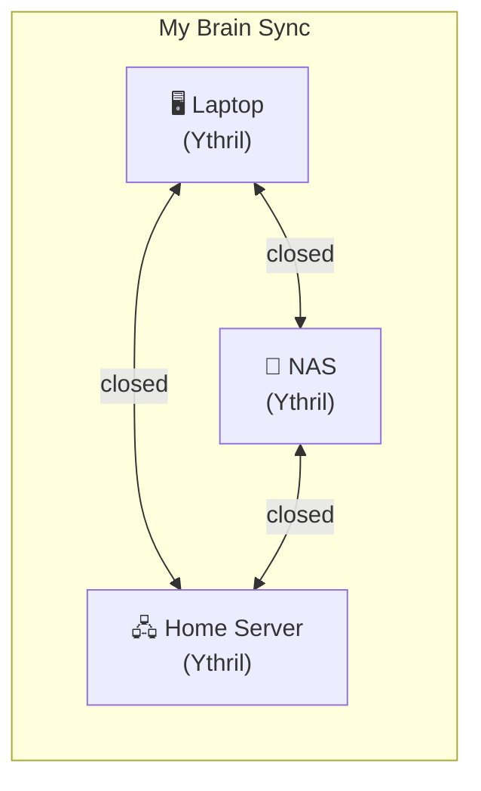
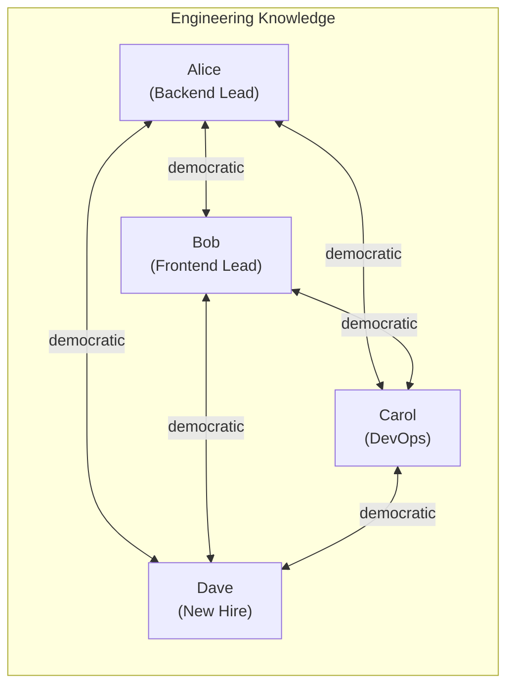
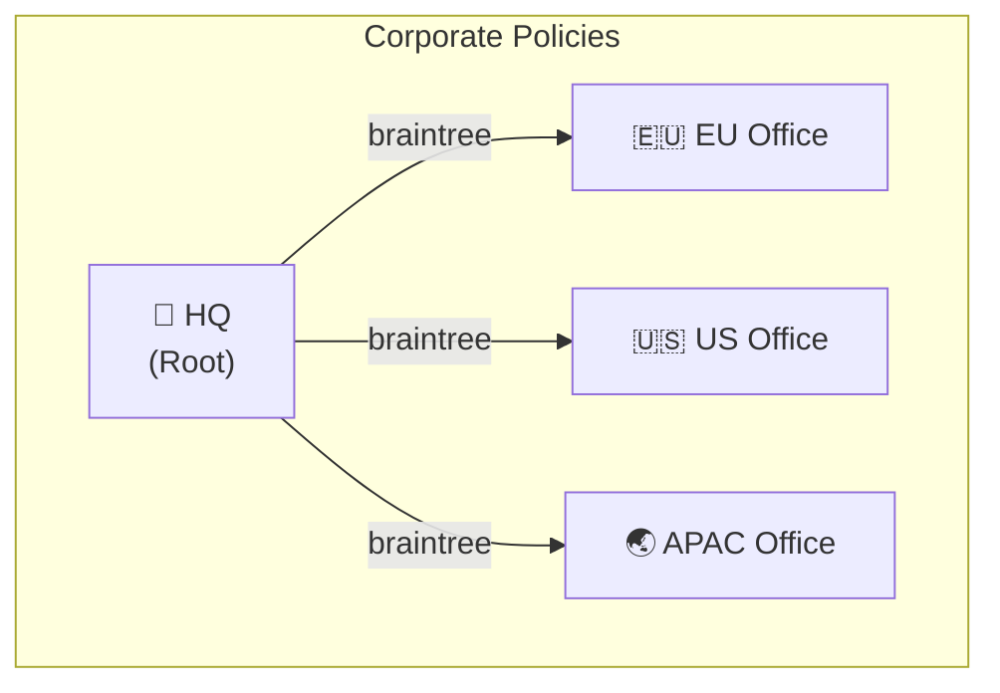
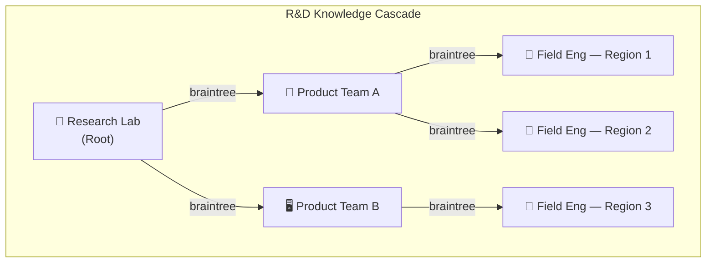
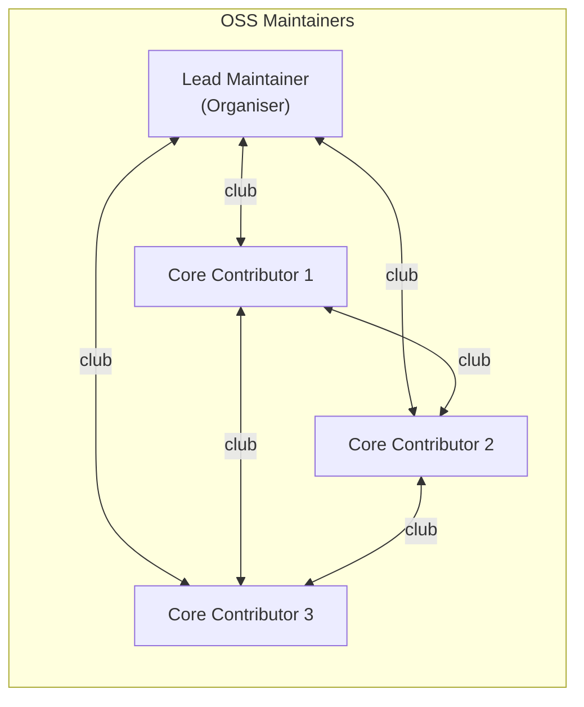
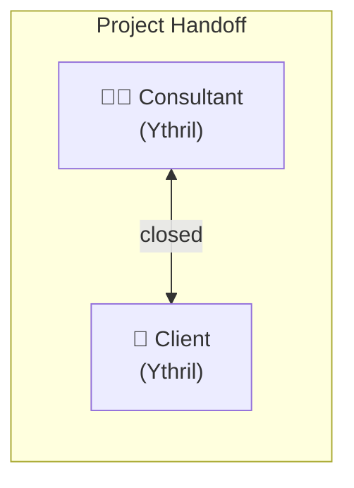
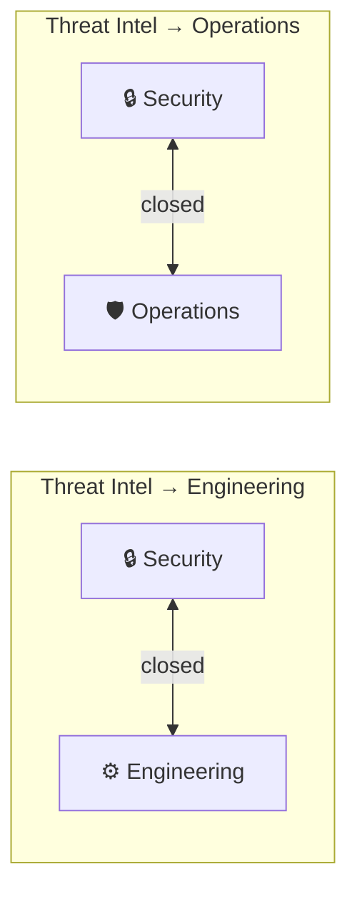
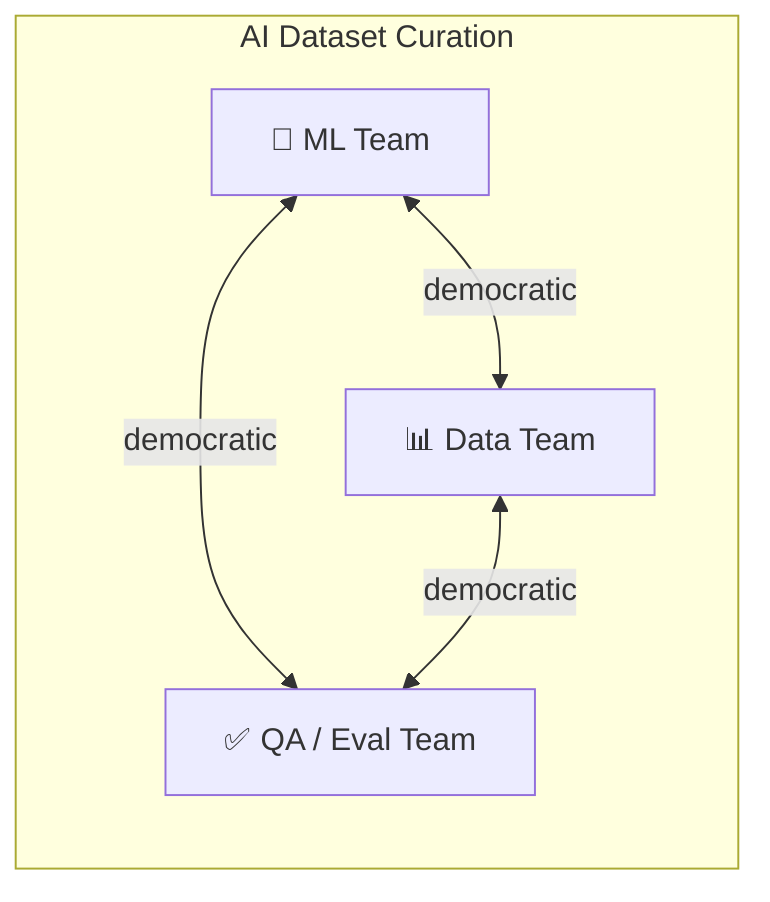
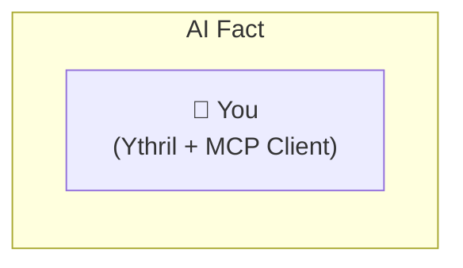

# Sharing & Distribution

> Part of the [Ythril Use Case Examples](../usecase-examples.md).

## Sharing & Distribution

## 1. Personal Multi-Device Sync

**Use Case:** Keep your personal brain in sync across laptop, NAS, and home server.

**Network Topology:**

**Source:** Every device — notes, bookmarks, research captured on whichever device you're using.
**Consumers:** You, on every other device.

> A **closed** network with a single member auto-approves instantly. Add your second device, approve once from the first, and all future sync is automatic. Facts, entities, files, and chrono entries stay consistent everywhere.

---

## 2. Engineering Team Knowledge Base

**Use Case:** Small engineering team shares architecture decisions, runbooks, and incident learnings.

**Network Topology:**

**Source:** All team members contribute — ADRs, post-mortems, how-to guides, dependency notes.
**Consumers:** All team members equally.

> **Democratic** governance means a new joiner (like Dave) needs majority approval. Any member can veto a problematic join. The full-mesh topology ensures everyone has the complete picture — no single point of failure.

**Additional benefits:**

- Conflict resolution via fork-on-concurrent-edit keeps both versions of contested docs.
- The knowledge graph (entities + edges) maps relationships between services, teams, and incidents across everyone's contributions.

---

## 3. Company Policy Distribution

**Use Case:** Corporate HQ publishes compliance policies, security guidelines, and onboarding material to regional offices.

**Network Topology:**

**Source:** HQ — compliance, legal, HR, and security teams author policies centrally.
**Consumers:** Regional offices receive updates automatically.

> A **braintree** network pushes content top-down. Regional offices always have the latest policies without being able to modify the authoritative source. One-directional flow guarantees consistency.

**Additional benefits:**

- Chrono entries for policy effective dates and compliance deadlines sync alongside the documents.
- Files (PDF policies, signed documents) distribute through the same channel.

---

## 4. Multi-Tier R&D Knowledge Cascade

**Use Case:** Research lab publishes findings to product teams, who adapt and cascade relevant knowledge to field engineers.

**Network Topology:**

**Source:** Research lab produces experimental findings, material properties, algorithm innovations.
**Consumers:** Product teams curate for their domain; field engineers receive actionable knowledge.

> Braintree's multi-level hierarchy relays content through intermediate nodes. Product teams receive raw research from the lab and their filtered knowledge cascades further down. If Product Team A goes offline, the lab can reparent field engineers temporarily to maintain the chain.

**Additional benefits:**

- Entity types (`material`, `algorithm`, `finding`) with edges (`validated_by`, `supersedes`) create a structured research graph that flows downstream intact.
- Each tier adds their own facts to their local spaces — only the networked space syncs.

---

## 5. Open Source Project — Maintainer Group

**Use Case:** An open source maintainer invites core contributors to a shared knowledge base for architecture context, release plans, and triage notes.

**Network Topology:**

**Source:** All members contribute — the lead maintainer controls membership.
**Consumers:** All core contributors.

> **Club** governance lets the lead maintainer issue invite keys and approve joins unilaterally — no vote rounds needed. Fast onboarding when a new contributor earns trust, immediate removal if someone steps back.

**Additional benefits:**

- Release milestones as chrono entries (type: `milestone`, `deadline`) keep the team aligned on timelines.
- Files sync design docs and diagrams alongside the knowledge graph.

---

## 6. Consultant ↔ Client Knowledge Handoff

**Use Case:** An external consultant syncs project deliverables and findings to a client's internal Ythril instance.

**Network Topology:**

**Source:** Consultant — research findings, recommendations, architecture reviews, deliverable files.
**Consumers:** Client's internal team.

> A **closed** two-member network requires both parties to approve the link. Once established, deliverables sync bidirectionally — the client can push questions and context back. When the engagement ends, either party leaves the network and sync stops cleanly.

**Additional benefits:**

- Space scoping means only the agreed-upon project space is shared — the consultant's other clients and the company's internal spaces remain private.
- Read-only tokens let the client grant auditors access to the received knowledge without risking edits.

---

## 7. Cross-Department Knowledge Sharing (Multiple Networks)

**Use Case:** The security team shares threat intel with both engineering and operations — but engineering and ops don't share directly with each other.

**Network Topology:**

**Source:** Security team — CVE analysis, threat assessments, remediation playbooks.
**Consumers:** Engineering receives vulnerability details for code fixes; Operations receives incident response procedures.

> The same security space is added to **two separate networks**. Each network is a closed pair. Engineering and Operations never sync with each other, but both stay current with security's output. The security team writes once — both consumers receive.

**Additional benefits:**

- Space-scoped tokens can limit engineering's access to code-relevant findings and ops' access to infrastructure-relevant findings via proxy spaces.

---

## 8. Federated AI Training Dataset Curation

**Use Case:** Multiple teams collaboratively curate training data, evaluation sets, and model benchmarks for shared AI initiatives.

**Network Topology:**

**Source:** Data team curates raw datasets; ML team adds model configs and benchmark results; QA team adds evaluation criteria and test cases.
**Consumers:** All three teams need the complete picture.

> **Democratic** full-mesh ensures all three teams stay aligned. The knowledge graph tracks which datasets (`entity: dataset`) were used in which experiments (`edge: trained_on`), with chrono entries marking evaluation milestones. Fact fork-on-conflict preserves both versions when two teams annotate the same data point differently.

**Additional benefits:**

- Files sync model configs, evaluation scripts, and small dataset samples.
- MCP tool access lets LLM clients query the shared brain for dataset lineage and benchmark history.

---

## 9. LLM With Persistent Fact Across Conversations

**Use Case:** Give your AI assistant a real long-term fact that survives context windows, sessions, and even model switches.

**Network Topology:**

**Source:** Every conversation — your LLM calls `save_fact` to store decisions, preferences, project context, and learnings. It calls `save_entity` and `save_edge` to build a structured knowledge graph as it learns.
**Consumers:** The same LLM (or any future LLM) in every future conversation.

> This is the door-opener. Connect any MCP-compatible LLM client to Ythril and it gains: `recall` for semantic fact search, `filter` for structured retrieval over any collection including `chrono` for time-awareness, and `read_file`/`write_file` for document access. **Switch from Claude to GPT to Llama — the fact stays.** The brain belongs to you, not the model provider. No vendor lock-in on your own knowledge.

**Wow factor:**

- The LLM builds a knowledge graph *about you* over time — entities for your projects, edges for relationships, chrono entries for deadlines — and any future conversation can traverse it.
- `recall` with the `space` parameter omitted searches across *all* your accessible spaces at once: "What do I know about Kubernetes across my work KB, personal notes, and homelab docs?"
- `create_chrono(type: "prediction", confidence: 0.7)` → the LLM can track its own predictions and score itself over time.

---
