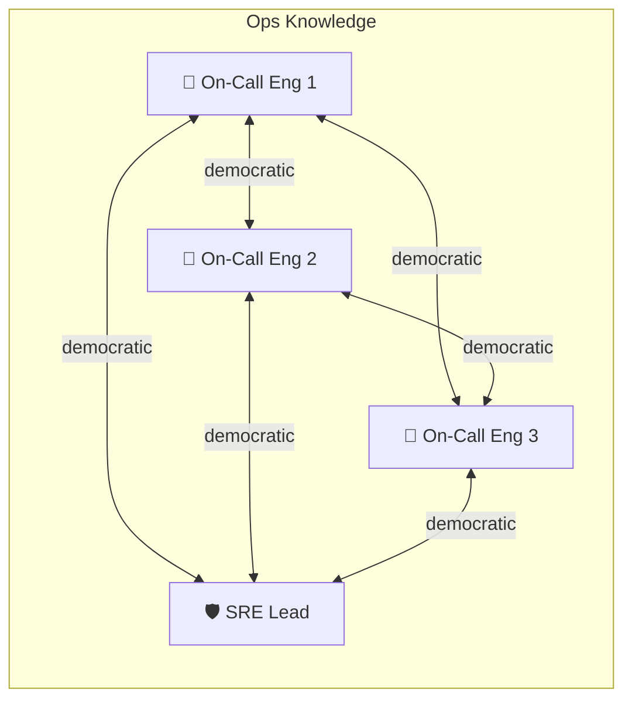
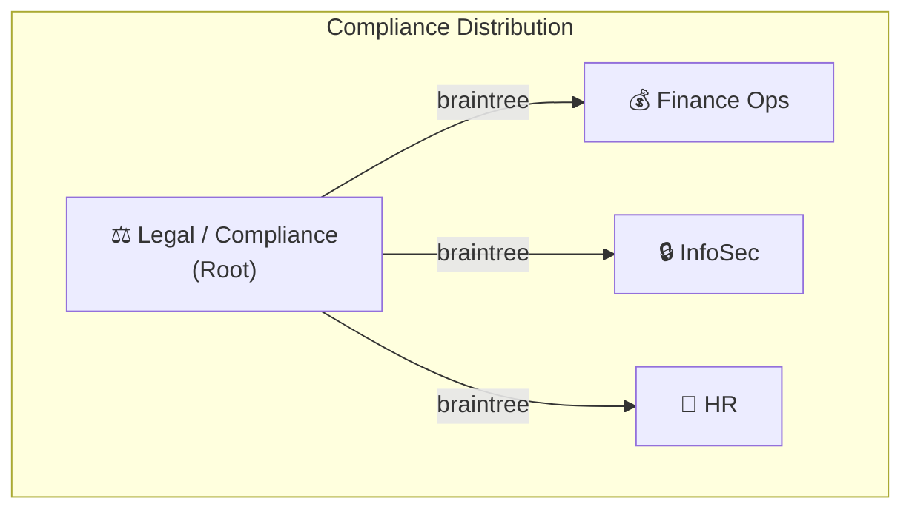
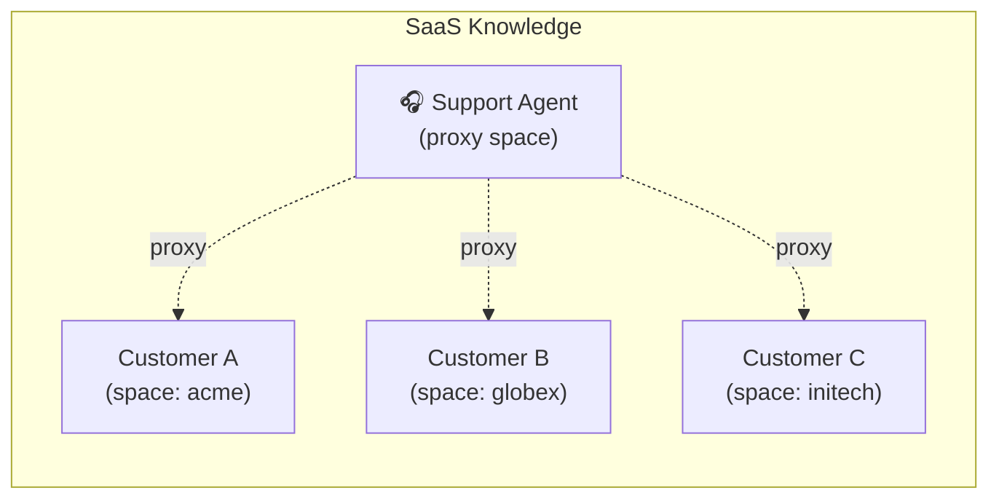
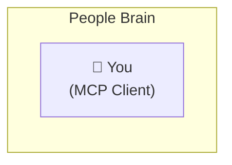
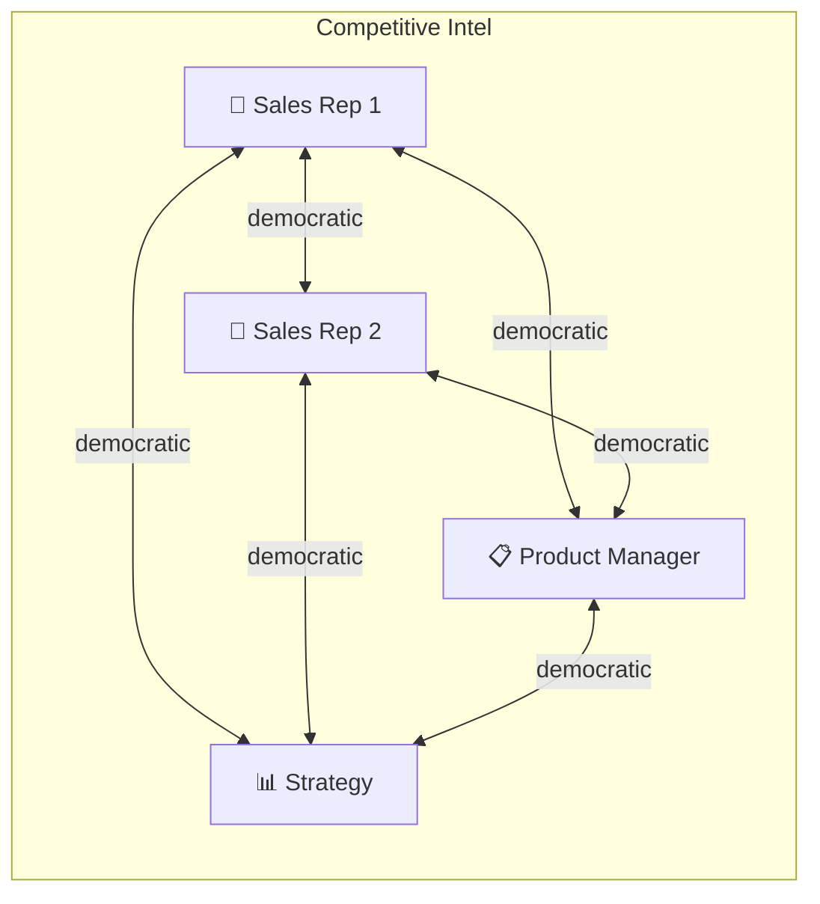
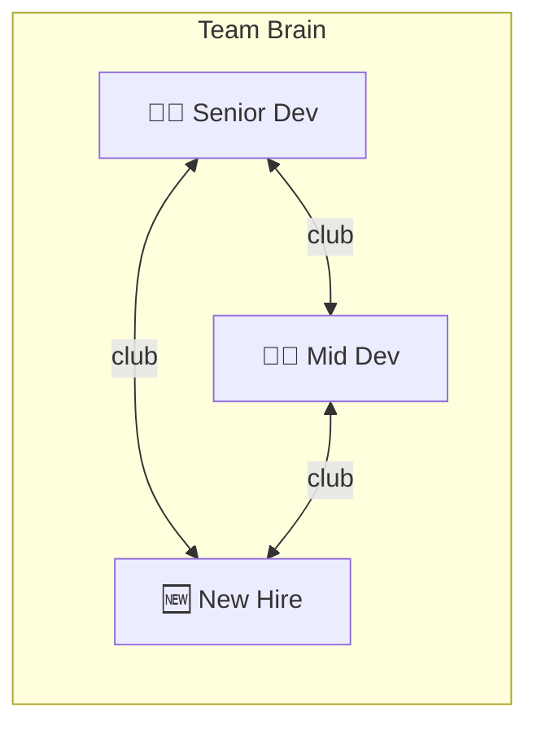
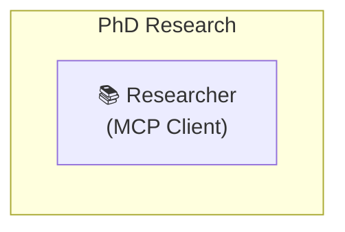

# Operations, Research & Agents

> Part of the [Ythril Use Case Examples](../usecase-examples.md).

## Operations, Research & Agents

## 10. On-Call Runbook That Learns From Incidents

**Use Case:** Incident response runbooks that automatically enrich themselves with every post-mortem.

**Network Topology:**

**Source:** Every on-call engineer documents incidents via their LLM client → `remember("At 3am, payment-service OOMed due to unbounded cache. Fix: set maxItems=10000", entities: ["payment-service", "OOM"], tags: ["incident", "cache"])`.
**Consumers:** The next person on-call. Their LLM runs `recall("payment-service is down")` and gets back every past incident contextually ranked.

**Wow factor:**

- The knowledge graph connects **services → failure modes → fixes**: `upsert_edge("payment-service", "OOM", "fails_with")`, `upsert_edge("OOM", "maxItems=10000", "fixed_by")`. Next incident, the LLM walks the graph: "What has fixed OOM before?" — instant answer without digging through a wiki.
- Chrono entries with `type: "event"` timestamp every incident. `query(chrono, {entityIds: "payment-service", type: "event"})` → "payment-service has had 4 incidents this quarter" — pattern detection for free.
- This syncs across the team. Engineer 1's 3am fix is in Engineer 2's brain by morning.

---

## 11. Legal / Compliance Audit Trail With Temporal Proof

**Use Case:** Track regulatory deadlines, policy changes, and compliance evidence with full temporal awareness.

**Network Topology:**

**Source:** Legal team creates chrono entries for every regulatory deadline and milestone.
**Consumers:** Department heads receive deadline-aware knowledge that their LLM can query.

**Wow factor:**

- `list_chrono({status: "overdue"})` — lists every obligation whose due moment (its `endsAt`, or `startsAt` when it has none) has passed and that isn't `completed`/`cancelled`. `overdue` is **derived on read**, so a passed deadline surfaces automatically — you don't have to mark it.
- `create_chrono({type: "deadline", title: "DORA ICT risk assessment due", startsAt: "2026-06-30", entityIds: ["DORA", "ICT-risk"]})` → departments' LLMs can ask "What compliance deadlines do we have this quarter?" and get structured answers, not just documents.
- Braintree pushes mean the legal team publishes once and all departments receive. Departments **cannot** alter the authoritative deadline — temporal integrity by architecture.
- `query(chrono, {type: "prediction", confidence: {$gte: 0.5}})` → the legal team can even log risk predictions ("60% chance of regulatory change in Q3") and track them.

---

## 12. Multi-Tenant SaaS Knowledge Isolation With MCP

**Use Case:** SaaS platform gives each customer their own Ythril space — customers' LLM clients access only their silo, support agents see all.

**Network Topology:**

**Source:** Each customer's LLM writes to their own space via space-scoped tokens. Support agents use a proxy space.
**Consumers:** Customers see only their data. Support agents search across all customers.

**Wow factor:**

- One Ythril instance, N customers, full isolation via spaces + space-scoped tokens. No separate databases, no tenant ID middleware hell.
- Customer gives their MCP client a space-scoped token → the LLM can `save_fact`, `recall`, `write_file` only within their silo. Zero chance of cross-tenant leakage — it's token-enforced at the API layer, not application-logic.
- Support agent connects with a proxy space → `recall("connection timeout")` with `space` omitted → finds matching incidents across ALL customers, ranked by relevance. "This looks like the same issue Customer B had last week."
- Read-only tokens for customer-facing dashboards — they can query their knowledge but not accidentally corrupt it.

---

## 13. Personal CRM — Your LLM Remembers Every Person You Meet

**Use Case:** Never forget context about a person — your LLM builds and maintains a relationship graph.

**Network Topology:**

**Source:** After every meeting, call, or event: `remember("Met Sarah Chen at KubeCon. She's VP of Platform at Acme Corp. Interested in our sync protocol. Follows up in June.", entities: ["Sarah Chen", "Acme Corp", "KubeCon"], tags: ["contact", "follow-up"])`.
**Consumers:** Future you, before the next meeting with Sarah.

**Wow factor:**

- `recall("Sarah Chen")` → every interaction, semantically ranked. Not a flat contact list — full conversational context.
- `upsert_entity("Sarah Chen", "person", ["contact"], {company: "Acme Corp", role: "VP Platform"})` → structured data queryable with `query(entities, {properties.company: "Acme Corp"})` — "Who do I know at Acme Corp?"
- `upsert_edge("Sarah Chen", "Acme Corp", "works_at")` + `upsert_edge("Sarah Chen", "KubeCon 2026", "met_at")` → graph traversal: "Who did I meet at KubeCon?" → follow edges → full context per person.
- `create_chrono({type: "deadline", title: "Follow up with Sarah Chen re: sync protocol", startsAt: "2026-06-01", entityIds: ["Sarah Chen"]})` → `list_chrono({status: "upcoming"})` → your LLM reminds you before the deadline.
- Sync this space to your phone (closed network) and you have full context before every meeting, offline.

---

## 14. Competitive Intelligence With Source Tracking

**Use Case:** Sales and product teams collaboratively track competitor moves with full attribution and temporal awareness.

**Network Topology:**

**Source:** Sales reps input field intel from calls and demos. PM adds product comparisons. Strategy adds market analysis.
**Consumers:** Everyone — but each role queries differently.

**Wow factor:**

- Sales rep after a call: `remember("Acme Corp switched from Competitor X to Competitor Y because of pricing. Deal was $50k ARR.", entities: ["Acme Corp", "Competitor X", "Competitor Y"], tags: ["churn", "pricing"])`.
- Product manager asks: `recall("Why are customers leaving Competitor X?")` → semantic search surfaces every relevant sales field note — no CRM required.
- `query(edges, {to: "Competitor X", label: "churned_from"})` → structured view: who left Competitor X and why.
- `create_chrono({type: "event", title: "Competitor Y launched enterprise tier", startsAt: "2026-03-15", entityIds: ["Competitor Y"]})` → strategy team later queries: `query(chrono, {entityIds: "Competitor Y"})` → full competitor timeline. Fork-on-conflict preserves conflicting intelligence from different sources.

---

## 15. Dev Environment Bootstrap — New Hire Onboarding in Minutes

**Use Case:** New developer connects their IDE's LLM to the team brain and immediately has full project context.

**Network Topology:**

**Source:** Months of accumulated team knowledge — architecture decisions, "why did we choose X", gotchas, deploy procedures, service relationships.
**Consumers:** The new hire's LLM client, from minute one.

**Wow factor:**

- New hire connects MCP client to Ythril → club organiser approves → full sync completes in seconds.
- New hire's LLM: `recall("how does authentication work in this project")` → gets back ADRs, implementation notes, gotchas, all semantically ranked. No "go read the wiki" that's 6 months stale.
- `query(edges, {label: "depends_on"})` → complete service dependency map. `query(entities, {type: "service"})` → all services with their properties (port, repo, team owner).
- Files sync too — deploy scripts, config templates, architecture diagrams land on the new hire's instance.
- The new hire's questions and learnings (`remember("Gotcha: auth service needs Redis running locally...")`) flow back to the team — onboarding friction improves the knowledge base for the next hire.

---

## 16. Research Paper Writing With Citation Graph

**Use Case:** Researcher builds a structured knowledge graph of papers, findings, and arguments — then uses LLM to draft with full citation awareness.

**Network Topology:**

**Source:** Every paper read, every experiment result, every argument strand.
**Consumers:** The researcher's LLM when drafting, reviewing, or exploring connections.

**Wow factor:**

- Read a paper → `remember("Smith et al. 2025 show that transformer attention degrades above 128k context. Tested on 3 benchmarks.", entities: ["Smith2025", "transformer-attention", "context-window"], tags: ["paper", "limitation"])` + `upsert_edge("Smith2025", "transformer-attention", "studies")` + `upsert_edge("Smith2025", "Jones2024", "contradicts")`.
- Writing a paragraph → `recall("evidence for context window limitations")` → semantically ranked citations with full notes. Ask the LLM: "What papers support this claim?" — it walks the graph for `contradicts`, `supports`, `extends` edges.
- `query(edges, {label: "contradicts"})` → instant map of all contradictions in your literature. `query(entities, {type: "paper", tags: {$in: ["unread"]}})` → reading backlog.
- `create_chrono({type: "deadline", title: "Submit to NeurIPS", startsAt: "2026-05-15"})` → time-aware research planning.
- Sync to a co-author via closed network → both researchers' graphs merge. Fork-on-conflict handles disagreements on interpretation — both views preserved.

---
