# Proxy, Multi-Space & Personal

> Part of the [Ythril Use Case Examples](../usecase-examples.md).

## Proxy, Multi-Space & Personal

## 17. M&A Due Diligence — Multi-Space Deal Rooms With Proxy Oversight

**Use Case:** Each acquisition target gets its own space. A proxy space gives the deal team a single pane of glass across all active deals — without merging any data.

**Network Topology:**

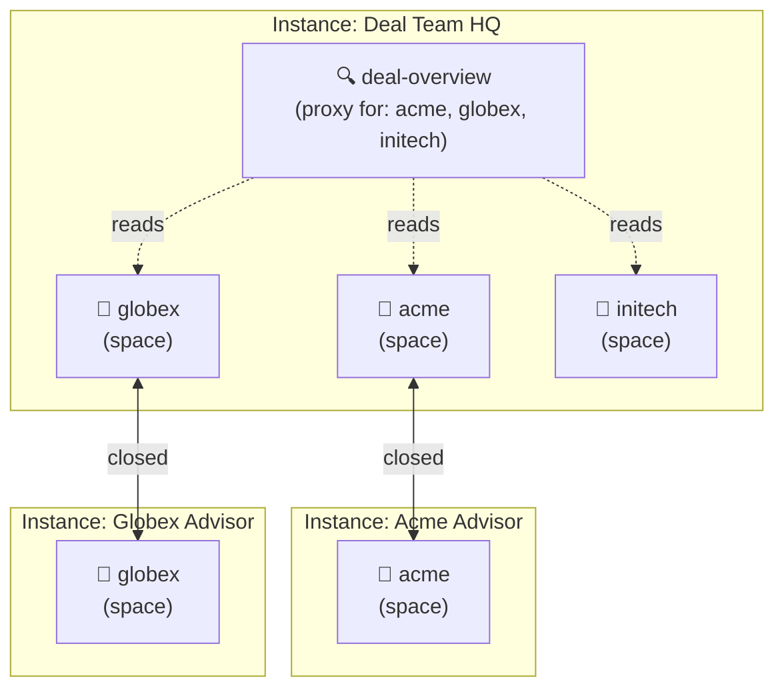

**Source:** Each deal team writes due diligence findings, risks, and documents into their target's space. External advisors sync into the same space via closed networks.
**Consumers:** The M&A lead connects their LLM to the `deal-overview` proxy space.

**Wow factor:**

- `recall("antitrust risk")` on the proxy → semantic search fans out across all three deal spaces in parallel, returns ranked results with `spaceId` attribution. One query, three deals, zero data mixing.
- Each space syncs with its own closed network — Acme's advisor sees only Acme's space, Globex's advisor sees only Globex. The proxy never syncs externally — it's a local read-only aggregation layer.
- `filter(entities, {type: "risk"})` on the proxy → entities from all three deals. `filter(edges, {label: "mitigated_by"})` → which risks have mitigation plans across all targets.
- Write operations on the proxy require `?targetSpace=acme` — the proxy enforces explicit targeting. No accidental cross-contamination between deal rooms.
- Kill a deal? Remove the space from `proxyFor`. The data stays isolated in its own space, the proxy just stops including it.

---

## 18. Global Engineering Org — Same Space in Multiple Networks

**Use Case:** A platform team's space participates in both a democratic team network AND a top-down braintree from the CTO — different governance, same knowledge.

**Network Topology:**

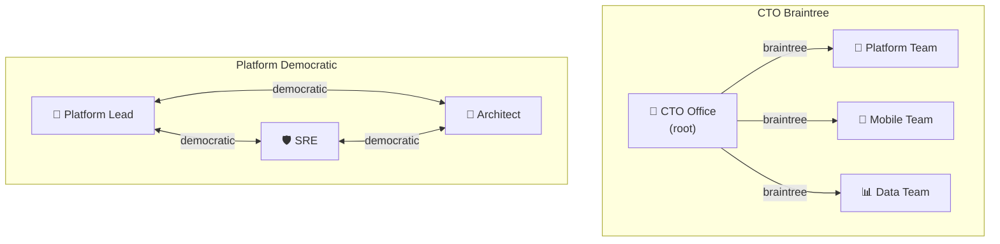

**Source:** The Platform Team's `platform` space is in two networks simultaneously:

1. **Braintree** — CTO pushes org-wide standards, architecture mandates, and compliance policies downward. Platform team receives but cannot push up.
2. **Democratic** — Platform lead, SRE, and architect collaborate as equals. ADRs, runbooks, and incident learnings sync bidirectionally with majority+veto governance.

**Consumers:** The platform team's LLM sees everything — both the top-down mandates and the team's own collaborative knowledge — in one unified `recall`.

**Wow factor:**

- The CTO publishes `save_fact("All services must implement mTLS by Q3 2026", tags: ["mandate", "security"])` → braintree pushes it to Platform, Mobile, and Data. The platform team's space now contains it alongside their own ADRs and runbooks.
- Platform SRE writes `save_fact("mTLS rollout blocked by legacy proxy — need sidecar approach", entities: ["mTLS", "legacy-proxy"], tags: ["blocker"])` → democratic sync shares it with the architect and lead. The CTO's braintree does **not** pull this up (push-only direction). Operational detail stays at the team level.
- `recall("mTLS")` on the platform instance → returns both the CTO mandate AND the team-level blocker, ranked by relevance. Full picture without crossing governance boundaries.
- The same space, two different sync cadences: braintree might sync hourly (policy pushes), democratic every 5 minutes (fast team collaboration). Each network has its own schedule.

---

## 19. Consulting Firm — Client Spaces, Internal Space, Proxy Dashboard

**Use Case:** Consultants maintain separate spaces per client (strict isolation), an internal knowledge base, and a proxy space that lets partners search across everything.

**Network Topology:**

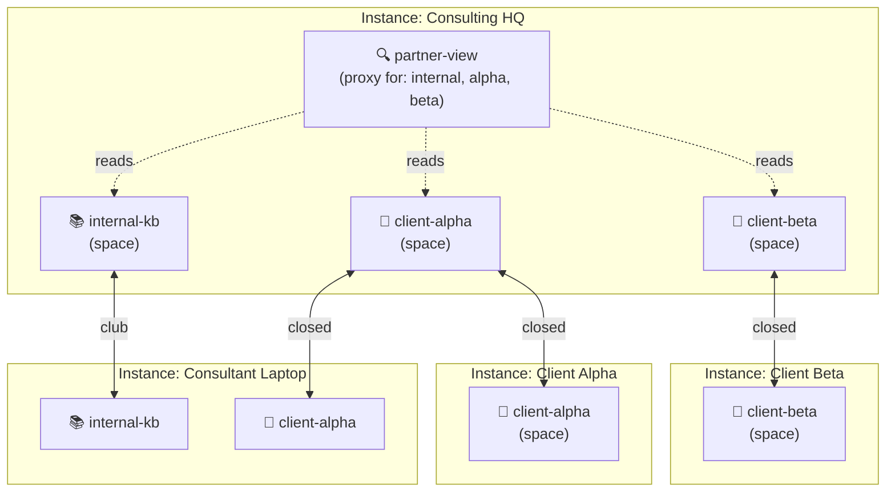

**Source:**

- `internal-kb` (club network): Templates, methodologies, lessons learned. All consultants sync.
- `client-alpha`, `client-beta` (closed networks each): Client-specific findings, deliverables, files. Each client syncs only their own space.
- `partner-view` (proxy, local only): Aggregates all three spaces. Never syncs externally.

**Consumers:** Partners and practice leads connect their LLM to `partner-view`.

**Wow factor:**

- Partner asks: `recall("cloud migration cost overrun")` on the proxy → gets results from internal templates AND both client engagements, ranked by relevance, with `spaceId` showing which client each result came from.
- Consultant on-site with Client Alpha has two spaces syncing to their laptop: `internal-kb` (club) and `client-alpha` (closed). Their LLM uses `recall` with `space` omitted to search both. They get the firm's methodology templates alongside Alpha-specific context in one query.
- Client Alpha's external instance syncs only `client-alpha` — they never see `internal-kb` or `client-beta`. Token-scoped, network-scoped, zero crossover.
- `filter(entities, {type: "deliverable", properties.status: "overdue"})` on the proxy → overdue deliverables across all clients. `filter(chrono, {status: "upcoming", type: "deadline"})` → upcoming deadlines across all engagements.
- New client onboarded? Create space, create closed network, add to `proxyFor` on `partner-view`. The proxy starts including it immediately — no data migration, no restructuring.

---

## 20. Hospital Network — Departmental Spaces With Hierarchical Distribution and Cross-Department Search

**Use Case:** Each hospital department has its own space. Medical director pushes protocols top-down via braintree. Department heads collaborate via democratic network. A proxy space enables cross-department clinical search.

**Network Topology:**

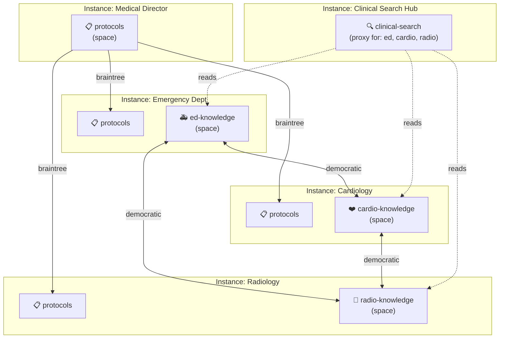

**Three networks, three patterns, one hospital:**

1. **`protocols` braintree** — Medical director pushes updated clinical protocols. Departments receive but cannot modify the authoritative source. `save_chrono({type: "milestone", title: "Sepsis protocol v3 effective", startsAt: "2026-04-01"})` → every department's LLM knows when the new protocol takes effect.

2. **`knowledge` democratic** — Department heads share clinical learnings peer-to-peer. ED learns that a specific drug interaction is common → `save_fact(...)` → cardiology and radiology receive it on next sync. Majority+veto governance prevents a single department from pushing contested clinical claims.

3. **`clinical-search` proxy** — On a dedicated search instance. `recall("drug interaction with warfarin in elderly patients")` → searches ED, cardiology, and radiology knowledge spaces in parallel. Results come back with `spaceId` attribution — the clinician sees which department reported each finding.

**Wow factor:**

- Each department runs its own Ythril instance with two spaces: `protocols` (receive-only from braintree) and their own knowledge space (democratic peer-to-peer). Two different governance models on the same instance, zero conflict.
- The proxy search hub has read-only tokens — it can query but never write. Even if compromised, clinical data integrity is preserved.
- `filter(entities, {type: "drug"})` on the proxy → every drug entity across all departments. `filter(edges, {from: "warfarin", label: "interacts_with"})` → cross-department interaction graph built from real clinical observations.
- A new department joins? Add their knowledge space to the proxy's `proxyFor` and add them to the democratic network. Two config changes, instant integration.
- Protocols push is one-way and authoritative. Knowledge sharing is peer-to-peer and democratic. Clinical search is read-only and aggregated. Three completely different trust models, cleanly separated by network type.

---

## 21. Multi-Account Portfolio Intelligence — Personal Finance Without a Cloud

**Use Case:** Track investments, spending patterns, and financial decisions across multiple brokerage/bank accounts — your LLM becomes a personal CFO that never sends your data to anyone.

**Network Topology:**

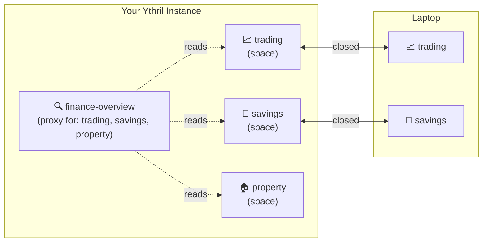

**Source:** You log financial events through your LLM: trades, dividends, property expenses, savings milestones. Each account type stays in its own space.
**Consumers:** Your LLM connected to `finance-overview` proxy.

**Wow factor:**

- `save_fact("Sold 50 NVDA at $180, bought 100 AMD at $165. Thesis: AMD catching up on inference chips.", entities: ["NVDA", "AMD"], tags: ["trade", "semiconductor"])` into `trading` space.
- `save_fact("Roof repair $12k on rental property. Insurance claim filed ref #4821.", entities: ["rental-oak-st", "insurance"], tags: ["expense", "maintenance"])` into `property` space.
- `recall("semiconductor exposure")` on the proxy → pulls trade history from `trading`, any related notes from `savings` (maybe a semiconductor ETF in your 401k), all ranked by relevance with `spaceId` attribution.
- `filter(entities, {type: "stock"})` on the proxy → every position across all accounts. `filter(edges, {label: "thesis_for"})` → your investment thesis graph. "Why did I buy AMD again?" — instant recall.
- `save_chrono({type: "event", title: "NVDA earnings Q1 2026", startsAt: "2026-05-28", linkEntities: ["<id of NVDA>"]})` → `filter(chrono, {status: "upcoming"})` → your LLM reminds you of catalysts tied to positions you actually hold.
- `save_chrono({type: "prediction", title: "AMD will outperform NVDA in inference workloads by Q4", confidence: 0.6, linkEntities: ["<id of AMD>", "<id of NVDA>"]})` → track your own predictions. `filter(chrono, {type: "prediction", status: "completed"})` → "How good were my calls?"
- Everything stays on your hardware. Your brokerage data, trade theses, and spending patterns never touch a third-party API. Closed network sync to your laptop = offline access.

---

## 22. Market Analysis Desk — Analysts + Feeds + Broker Overlay

**Use Case:** Trading desk where multiple analysts contribute research, market data gets ingested as facts, and a proxy space gives the desk head a unified view.

**Network Topology:**

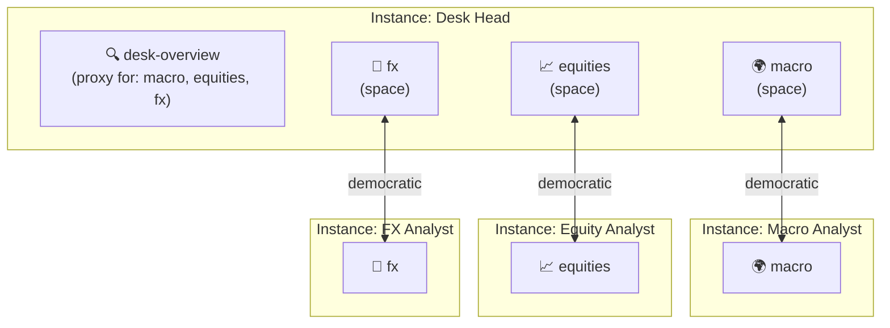

**Source:** Each analyst writes into their domain space. The desk head's proxy reads across all three.
**Consumers:** Desk head's LLM queries the proxy; individual analysts query their own space.

**Wow factor:**

- FX analyst: `save_fact("EUR/USD broke 1.12 support on weak PMI. Next support at 1.095. ECB likely dovish June.", entities: ["EUR/USD", "ECB"], tags: ["technical", "macro"])`. Macro analyst: `save_fact("US PMI miss — manufacturing at 48.2, services at 51.1. Dollar weakening thesis intact.", entities: ["US-PMI", "USD"], tags: ["data", "leading-indicator"])`.
- Desk head on the proxy: `recall("dollar weakening")` → gets the FX technical AND the macro data backing it, cross-correlated by semantic relevance. Two analysts, two spaces, one coherent picture.
- `upsert_edge("EUR/USD", "ECB", "driven_by")` + `upsert_edge("ECB", "US-PMI", "reacts_to")` → the knowledge graph connects the causal chain across desks. `filter(edges, {from: "ECB"})` → every factor the team has linked to ECB decisions.
- `save_chrono({type: "prediction", title: "EUR/USD hits 1.15 by August", confidence: 0.65, linkEntities: ["<id of EUR/USD>"]})` → desk tracks analyst predictions over time. `filter(chrono, {type: "prediction", linkEntities: "EUR/USD"})` → full prediction history with confidence scores.
- Each desk is its own democratic network — analyst departure doesn't nuke the knowledge base. New analyst joins, syncs, instant full context.

---

## 23. Intelligence Collection — Compartmented Sources With Fusion Proxy

**Use Case:** Each intelligence source/method gets its own compartmented space. A fusion proxy lets analysts search across compartments they're cleared for — without merging databases.

**Network Topology:**

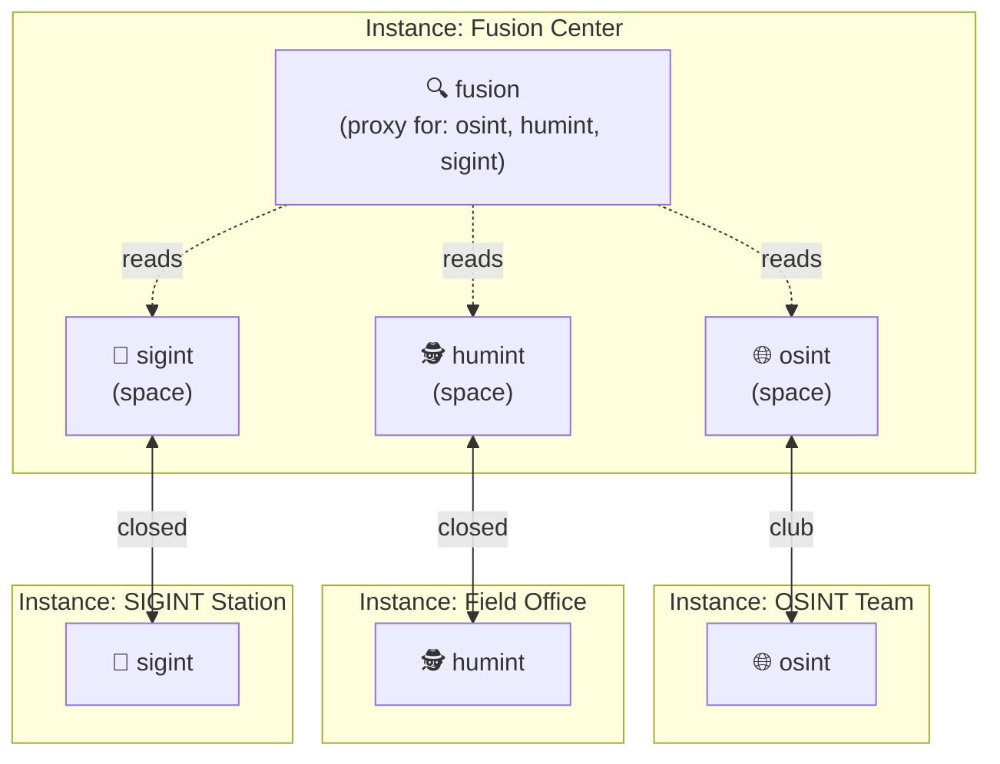

**Source:** Each collection discipline writes to its own space via its own network type — OSINT uses club (easy to add new open-source researchers), HUMINT and SIGINT use closed (strict need-to-know).
**Consumers:** Fusion analysts connect to the proxy. Compartment analysts see only their space.

**Wow factor:**

- HUMINT: `save_fact("Source JADE reports facility X expanded production capacity — 3 new buildings observed.", entities: ["facility-X", "JADE"], tags: ["humint", "production"])`. SIGINT: `save_fact("Intercept confirms increased shipments from facility X to port Y.", entities: ["facility-X", "port-Y"], tags: ["sigint", "logistics"])`. OSINT: `save_fact("Satellite imagery shows construction at facility X coordinates 34.05N 118.25W.", entities: ["facility-X"], tags: ["osint", "imagery"])`.
- Fusion analyst: `recall("facility X activity")` on the proxy → all three sources, correlated by semantic similarity, attributed by `spaceId` (source discipline). The analyst sees HUMINT, SIGINT, and OSINT concur — without any single source team seeing the other disciplines.
- `filter(entities, {name: "facility-X"})` on the proxy → entity exists in all three spaces. `filter(edges, {from: "facility-X"})` → relationships mapped by each discipline independently.
- Different `proxyFor` lists per clearance level: one proxy for all-source, another for OSINT+HUMINT only. Token-scoped access — the proxy itself enforces the compartmentation.
- Each closed network syncs independently. SIGINT station goes dark? OSINT and HUMINT continue unaffected. No single point of failure.

---

## 24. Family Knowledge Hub — Shared Household, Personal Privacy

**Use Case:** Family members share a household space (recipes, maintenance schedules, family events) while each person keeps a private space that never syncs.

**Network Topology:**

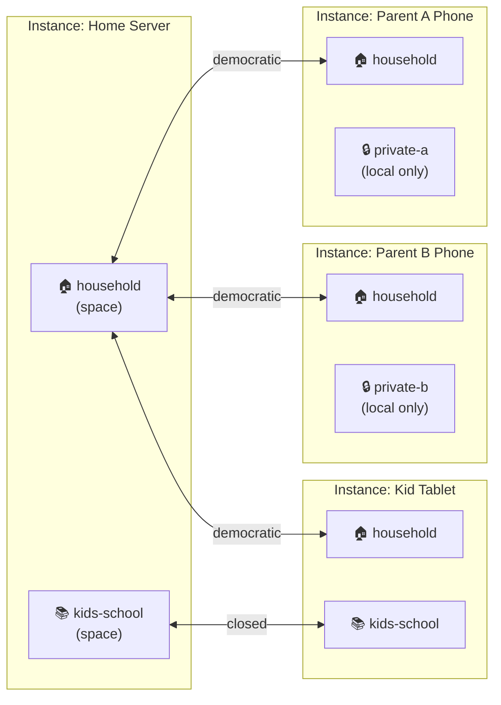

**Source:** Everyone writes to `household` — recipes, DIY notes, vet appointments, family events. Parents write to their private spaces. Kids write school stuff to `kids-school`.
**Consumers:** Everyone's LLM queries their own instance. Shared knowledge syncs; private stays private.

**Wow factor:**

- Parent A: `save_fact("Boiler annual service due in October. Last serviced by PlumbCo, invoice #8812.", entities: ["boiler", "PlumbCo"], tags: ["maintenance"])` → syncs to everyone. Next year, any family member's LLM: `recall("boiler service")` → full history.
- `save_chrono({type: "deadline", title: "Kid soccer tournament registration closes", startsAt: "2026-04-15", linkEntities: ["<id of soccer>"]})` → `filter(chrono, {status: "upcoming"})` → the household LLM surfaces it to whoever asks.
- `save_entity("family-van", "vehicle", ["maintenance"], {mileage: 82000, nextService: "85000km"})` → `filter(entities, {type: "vehicle"})` → "When is the van due for service?" Structured, not buried in a note.
- Parent A's `private-a` space is **not in any network** — it never leaves the phone. Medical notes, financial planning, personal journal — truly private. The LLM on that phone can still `recall` with `space` omitted across both `household` and `private-a` locally.
- Kid's tablet has a space-scoped token for `household` (read/write) and `kids-school` (read/write). No access to parent private spaces — not by policy, by architecture.
- Democratic governance on `household` means the kid's tablet has equal vote weight. Conflict? Fork-on-conflict preserves both versions — no silent data loss.

---

## 25. Smart Home — Device Logs, Automations, and Energy Intelligence

**Use Case:** Your home automation system, energy data, and device maintenance history — all in Ythril spaces. Your LLM can answer "Why was the house cold last Tuesday?" by correlating across spaces.

**Network Topology:**

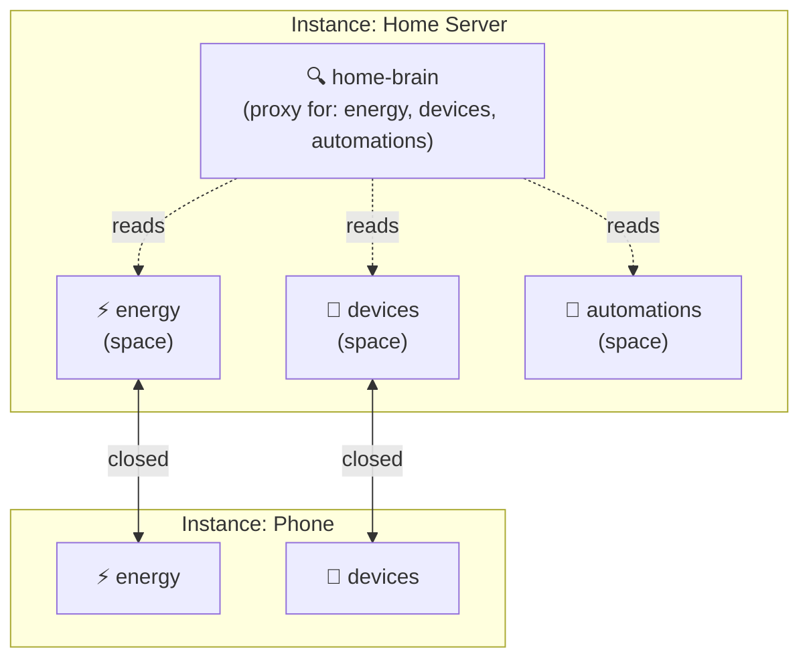

**Source:**

- `energy`: Solar production, grid consumption, battery state, tariff history. Ingested via scripts or manually.
- `devices`: Device inventory, firmware versions, maintenance dates, failure history.
- `automations`: Home Assistant rules, automations rationale, "why I set this up" context.

**Consumers:** Your LLM connected to `home-brain` proxy. Phone syncs energy and devices for on-the-go queries.

**Wow factor:**

- `save_fact("HVAC compressor failed 2026-03-15. Error code E-48. Tech replaced capacitor, $180.", entities: ["hvac-main", "E-48"], tags: ["failure", "repair"])` in `devices`. `save_fact("Energy spike 2026-03-14: 38 kWh consumed (vs 22 kWh avg). HVAC ran continuously.", entities: ["hvac-main"], tags: ["anomaly", "consumption"])` in `energy`.
- `recall("why was energy high last week")` on the proxy → correlates the energy anomaly with the HVAC failure across two different spaces. Your LLM connects the dots: "The HVAC compressor was failing, causing it to run continuously the day before it died."
- `save_entity("hvac-main", "device", ["climate"], {model: "Daikin RXB35", installed: "2022-06", warrantyEnd: "2027-06"})` → `filter(entities, {type: "device", properties.warrantyEnd: {$lte: "2026-12"}})` → "Which devices have warranties expiring this year?"
- `save_chrono({type: "event", title: "Solar panels cleaned", startsAt: "2026-03-20", linkEntities: ["<id of solar-array>"]})` + production data in `energy` space → correlate cleaning dates with production improvements over time.
- `save_fact("Set automation: if solar production > 4kW and battery > 80%, start dishwasher. Reason: minimize grid draw during peak tariff.", tags: ["automation", "solar", "tariff"])` in `automations` → six months later, `recall("why does the dishwasher run midday")` → instant answer with the original reasoning.
- `filter(edges, {label: "controls"})` → which automations control which devices. `filter(edges, {from: "hvac-main"})` → everything linked to the HVAC: energy readings, failure history, automations, warranty info — across all three spaces via the proxy.
- Phone sync means you can check energy production and device status from anywhere. Closed network = your smart home data never touches a cloud.

---

## 26. Dev Project Brain — Per-Dependency Documentation Spaces

**Use Case:** Each library/framework you use gets its own space with ingested docs, examples, and gotchas. A proxy space gives your coding LLM instant cross-library search — like a local, semantic, always-up-to-date devdocs.io.

**Network Topology:**

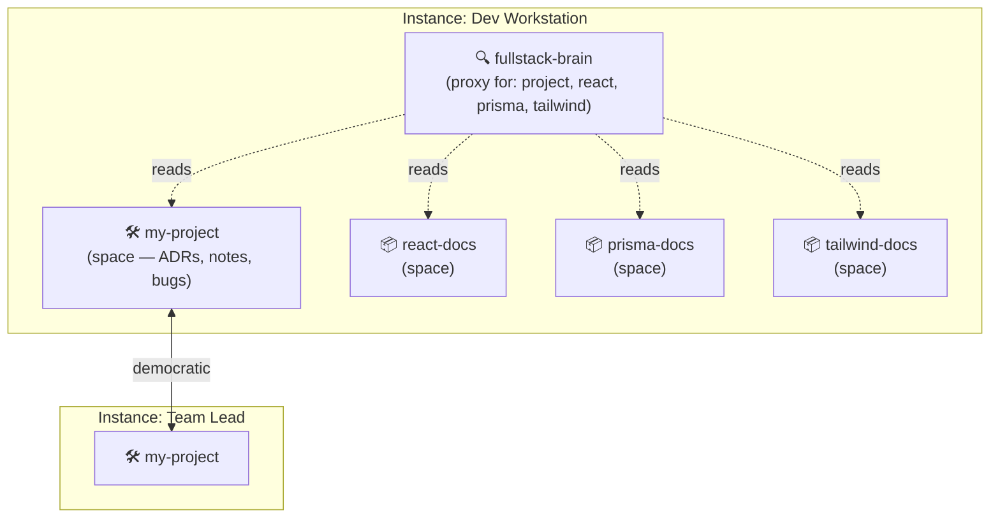

**Source:**

- `my-project` (democratic network): Your team's ADRs, architecture notes, bug postmortems, gotchas. Syncs with the team.
- `react-docs`, `prisma-docs`, `tailwind-docs` (no network — local only): Ingested library documentation. Populate via `write_file` for markdown pages, `save_fact` for key concepts and patterns, `save_entity` + `save_edge` for API relationships.

**Consumers:** Your IDE's LLM connects to `fullstack-brain` proxy.

**Wow factor:**

- Ingest React docs into `react-docs`: `save_fact("useEffect cleanup runs before re-execution and on unmount. Return a function from the effect callback.", entities: ["useEffect"], tags: ["hooks", "lifecycle"])`. Do the same for Prisma: `save_fact("Prisma $transaction sequential mode runs queries in order; interactive mode gives you a tx client.", entities: ["$transaction"], tags: ["orm", "transactions"])`.
- You're coding and ask: `recall("how to handle cleanup in effects")` on the proxy → React docs hit. `recall("nested writes with transactions")` → Prisma docs hit. **Your LLM gets library-specific answers without hallucinating** — the docs are right there in the brain, semantically indexed.
- `save_entity("useEffect", "hook", ["react"], {since: "16.8"})` + `upsert_edge("useEffect", "useState", "commonly_used_with")` → build a relationship graph of the API surface. `filter(edges, {from: "useEffect"})` → "What's commonly used with useEffect?"
- `save_fact("Gotcha: Prisma $transaction has a 5s default timeout. Hit this in the bulk import job — set timeout: 30000.", entities: ["$transaction"], tags: ["gotcha", "timeout"])` in `my-project` → next time anyone on the team hits a transaction timeout, `recall("prisma transaction timeout")` returns the gotcha from your project space AND the official docs from `prisma-docs`.
- Swap projects? Create a new proxy with different `proxyFor`: `["new-project", "vue-docs", "drizzle-docs", "tailwind-docs"]`. Reuse `tailwind-docs` across both — it's just a space reference.
- Version upgrade? Wipe `react-docs` space, re-ingest React 20 docs. Project notes with your real-world gotchas in `my-project` stay untouched — they're in a separate space.
- `write_file` for full markdown pages (migration guides, changelog summaries), `save_fact` for atomic facts, `save_entity`/`save_edge` for API structure. Three ingestion modes, one unified brain.
- Library docs never sync anywhere — they're local-only spaces. Your project notes sync with the team. Different lifecycle, different governance, same proxy.

---

## 27. Public Documentation Hub — Zero-Friction Knowledge Distribution

**Use Case:** An open source project, standards body, or company publishes reference documentation, API specs, and best practices. Anyone interested subscribes — no invite approval needed.

**Network Topology:**

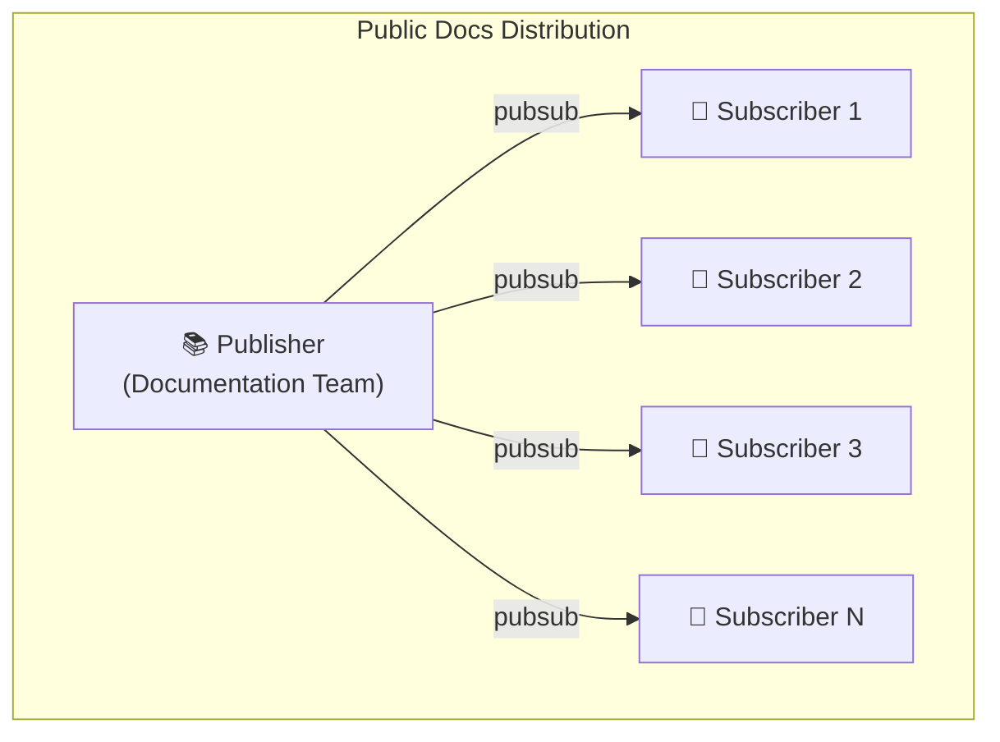

**Source:** The documentation team authors API references, migration guides, architecture overviews, and changelogs into a dedicated space.
**Consumers:** Any developer or team who subscribes. They receive updates automatically — no approval step.

> A **pub/sub** network eliminates the invite-accept friction entirely. The publisher generates an invite link or key, shares it publicly (README, website, Slack channel), and anyone who applies is auto-accepted as a subscriber. Subscribers pull content; the publisher pushes updates. Subscribers **cannot** modify the published content — data flows one way.

**Wow factor:**

- Publisher writes: `save_fact("Breaking change in v3: auth middleware now requires explicit scope parameter", entities: ["auth-middleware", "v3"], tags: ["breaking", "migration"])` → every subscriber's LLM has it on next sync. No "check the changelog" — it's in their brain, semantically searchable.
- `write_file("migration-guide-v3.md", ...)` → full migration doc lands on every subscriber's instance automatically.
- Subscribers run `recall("how does auth work in v3")` locally — zero API calls to the publisher, fully offline once synced.
- Publisher removes a subscriber? Unilateral — no vote round, instant effect. Subscriber leaves? Just as instant.
- Same space can participate in a pub/sub network for public distribution AND a democratic network for the internal authoring team — different governance, same content.
- Scale to hundreds of subscribers without governance overhead. No vote rounds, no approval queues, no bottlenecks.

---

## Entity Merge — Deduplication & Aggregation

**Use Case:** An MCP agent discovers two entities representing the same real-world concept (e.g. two "Docker" entities created by different team members) and consolidates them into a single authoritative entity.

**Workflow:**

1. **Discover duplicates** — agent uses `similar` to find high-similarity entities:

   ```json
   { "space": "<space-id>", "entryId": "<docker-entity-1-uuid>", "entryType": "entity", "minScore": 0.85 }
   ```

2. **Inspect the merge plan** — call `graph_merge` with an empty resolution map:

   ```json
   { "space": "<space-id>", "survivorId": "<docker-entity-1-uuid>", "absorbedId": "<docker-entity-2-uuid>", "resolutions": [] }
   ```

   The MCP `graph_merge` tool returns the plan as a **text response flagged `isError: true`** (so the agent reads it and retries with resolutions); the REST endpoint returns the equivalent `409` with a `MergePlan` body. Either surface shows:
   - Property conflicts (e.g. `score: 80 vs 95`, `active: true vs false`)
   - Absorbed-only properties (auto-added, no resolution needed)
   - Duplicate edge warnings (edges that become identical after relinking)

3. **Resolve conflicts** — agent fills in resolutions (numeric via function, text via LLM judgment):

   ```json
   {
     "space": "<space-id>",
     "survivorId": "<docker-entity-1-uuid>",
     "absorbedId": "<docker-entity-2-uuid>",
     "resolutions": [
       { "key": "score", "resolution": "fn:avg" },
       { "key": "active", "resolution": "fn:or" },
       { "key": "description", "resolution": "custom", "customValue": "Docker container runtime — merged from team entries" }
     ]
   }
   ```

4. **Execute** — the endpoint merges atomically: relinks all edges/facts/chrono to the survivor, applies resolved properties, deletes the absorbed entity.

**Aggregation variant:** Merge two metric entities using `fn:sum` on numeric fields to aggregate counts — same endpoint, same flow. Candidate selection is the caller's responsibility.

**Schema-driven defaults:** When `propertySchemas` includes `mergeFn` (e.g. `"score": { "type": "number", "mergeFn": "avg" }`), the merge plan surfaces it as `suggestedFn` — the agent can accept or override per call.
