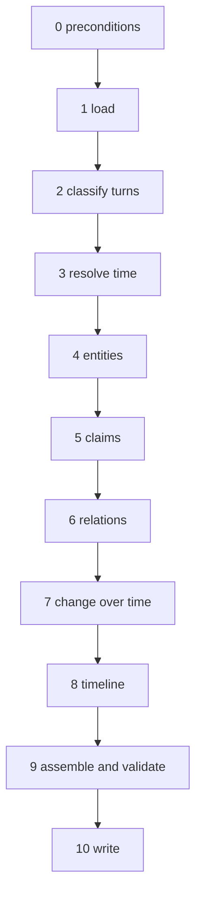

# Conversation extractor — decomposition

Source-faithful decomposition of `benchmarks/prompt/extraction.md` into the steps the `ingest` capability
(`F-31`) runs for `kind: "conversation"`. Every rule in the prompt is traced to its section and assigned
one of three treatments. Nothing is paraphrased away; a rule that becomes impossible by construction says
so rather than disappearing.

| tag | what runs it | what it may return |
|---|---|---|
| **mechanical** | code, no model | anything — it is deterministic and tested |
| **jev** | a bounded DECISION over a domain the code supplies: `choice` (one of N candidates), `score` (a fixed scale) or `noul` (probability a proposition holds) | a typed answer and a confidence. Never a new value |
| **generative** | a model writing open-world text | text only where the value genuinely cannot be enumerated — a name as spoken, a claim's sentence |

**The model judges, software governs.** Every `jev` step has a POLICY beside it, and the policy is code:
what confidence is enough, what happens below it (drop, fall back to a safe default, or flag for review).
The model never decides what happens next.

**Benchmark-independent.** This document describes conversations, not a dataset. The LoCoMo extractions are
test fixtures for it and nothing more; no identifier, vocabulary or rule below comes from a benchmark, and
the extractor has no notion of a question — so the prompt's *"do not use the questions"* is structural here.

Status, kept current per PR:

| phase | state | where |
|---|---|---|
| 1 load | **built** | `load.ts` |
| 2 classify turns | **built**: all six. 2.3 and 2.5 ask through `decide()`; thresholds unmeasured (0.5) | `classify.ts`, `judge-turns.ts` |
| 3 resolve time | **built** except 3.8, 3.9 (asked about events, so they come with phase 5) and weekday RANGES (*"Friday to Sunday"*) in 3.10. 3.4 and 3.12 ask through `decide()` | `time.ts`, `time-lexicon.ts`, `judge-turns.ts` |
| 4 entities | **built**: 4.1 (candidates, via the `doc-nlp` sidecar), 4.3 (the shortlist — names, pronouns, recent turns, the space), 4.12 / 4.2 / 4.4 / 4.6 asked through `decide()` with 4.5, 4.8, 4.9 as policy. 4.10 written once per entity from its own claims, linted, with a first-claim fallback (`describe-entities.ts`). 4.11 in assembly (an entity cites its first turns). Not built: 4.7 (needs claim dates). Thresholds unmeasured (0.5) | `mentions.ts`, `nlp-client.ts`, `shortlist.ts`, `judge-entities.ts` |
| 5 claims | **built**: 5.1 (exchanges, asked per session), 5.2 (written by the assist model from resolved dates and names), 5.3 (lint), 5.7 (coverage), 5.10 (citation check, one rewrite then drop), 5.4 / 5.5 (who originated it, asked only where an assistant speaks; only `origin` is attributed, an unacted-on one dropped). Not built: 5.6, 5.8 (arcs), 5.9 | `claims.ts`, `write-claim.ts`, `origin.ts`, `../generate.ts` |
| 6 relations | **built**: 6.1 (pairs a claim names), 6.2 (only legal labels, re-checked), 6.4 (structural). Not built: 6.3 (`since`/`until`, with the claim's dates in assembly) | `relations.ts` |
| 7 change over time | **built**: 7.1–7.6. 7.2 and 7.4 asked as ONE choice (replaced / ended / unchanged / unclear), so an edge is drawn only for a successor | `change.ts` |
| 8 timeline | **built**: 8.1–8.4 with 3.9 / 3.11 (status, ongoing, multi-day asked per claim). Title is the claim sentence; 8.5's generated title is polish | `timeline.ts` |
| 9 assemble | **built**: 9.1 into the committed format (`existingEntities`, with id and type, the one product addition); 9.2 / 9.3 in the server, the benchmark re-exports it | `assemble.ts`, `../validate-extraction.ts` |
| 10 write | **built**: through the batch door (`bulkWrite`), never the bare writers — entities, claims, chrono, edges, each step split at the door's cap; existing entities linked by id; transcripts per conversation and session via `files/store-file.ts`; `sourceTurns` returned, stored nowhere | `write-extraction.ts` |
| end to end | phases 1–9 run in order with every model injected (`extractConversation`) | `extract.ts` |
| 0 preconditions + the door | **built**: 0.1 the group ships in every library (seeded at start); 0.2 refused with `409` before any model call, naming the missing types and models; `ingest` / `ingest_status` on both doors, runs in memory | `../ingest.ts`, `../ingest-door.ts`, `../ingest-runs.ts`, `../../config/shipped-library-entries.ts` |
| the decision client | **built**: Jev (System One) or the assist model, answers checked by code | `../decide.ts` |
| everything else | decomposed, not built | — |

---

## The flow

Each phase reads the output of the ones before it. The model is called inside phases 2–8 only, and only at
the steps tagged below; phases 0, 1, 9 and 10 are code end to end.

## Tally

| treatment | steps | share |
|---|---|---|
| mechanical | 40 | 60% |
| jev | 23 | 34% |
| generative | 4 | 6% |

Counted from the step tables below, and recounted by
`testing/standalone/the-extractor-decomposition-counts-itself.test.js`, so this table cannot drift from them.
A step that is code in one case and a decision in another (2.3) counts as `jev`; one with any generative
part (5.8) counts as `generative`.

Of the 67 steps, six are new — the three preconditions, the candidate judgement (4.12), the citation check
(5.10) and the bare-weekday direction (3.12); the other 61 are rules the prompt today hands to one model call. The count is the argument
for this design: most of what the model is asked to do is arithmetic, bookkeeping or a rule it can only get
wrong, and one step in sixteen is writing.

---

## 0 · Preconditions — mechanical

The extractor writes a vocabulary, so the space has to hold it before anything runs.

| # | step | tag | notes |
|---|---|---|---|
| 0.1 | The extractor's full schema is `schemas/`: one Schema Library entry per type, all in group `conversation` | mechanical | Already the library's own format (`name`, `knowledgeType`, `typeName`, `schemaGroup`, `schema`), so no second format exists |
| 0.2 | Refuse the ingest unless the target space declares every type of the group, naming the missing ones | mechanical | Checked against the space's `typeSchemas` before a single model call — a run that would be refused at write time must not be paid for first |
| 0.3 | The way a space gets the group is the library's group apply | mechanical | `POST /api/schema-library/groups/:group/apply` and its Settings button, which exist since `#103`. `ingest` never writes schema itself — a write door that silently changes a space's rules is how an operator loses track of them |

## 1 · Load — mechanical

Source: *Inputs*, *When a day holds more than one session*, the session-order paragraphs of *When a later
session makes an earlier fact WRONG*.

| # | step | tag | notes |
|---|---|---|---|
| 1.1 | Parse the source into sessions (date, optional time, optional key) and turns (id, speaker, text) | mechanical | The one input contract. A source that cannot be parsed is refused, never guessed at |
| 1.2 | Order sessions by date, then time, never by position | mechanical | The prompt spends two paragraphs asking a model not to read page order; code simply does not |
| 1.3 | Give every session a key; derive one when two share a day | mechanical | Replaces *"give each one a key"* — the collision is detected, not remembered |
| 1.4 | Assign turn ids where the source has none | mechanical | |
| 1.5 | Keep the verbatim transcript of each session as a file | mechanical | *"The graph is for finding; the transcript is for quoting"* — the writer already does this |

## 2 · Classify turns

Source: *When somebody PASTES something*, *When a turn carries an IMAGE*, *When one of the speakers is an
ASSISTANT*.

| # | step | tag | notes |
|---|---|---|---|
| 2.1 | Split an image caption (`[image: …]` and similar) from the speech around it | mechanical | A pattern, not a judgement |
| 2.2 | Mark a caption as CONTEXT, never a source of claims | mechanical | *"Never write a claim from a caption alone"* becomes a policy: phase 5 is not handed captions as claim text |
| 2.3 | Speaker role: person or assistant | mechanical when the source declares roles; **jev `choice`** {person, assistant, `unclear`} otherwise | Policy: `unclear` or below threshold → treat as person — the safe default, because it never adds an `attributed` claim |
| 2.4 | Candidate pastes: turns far longer than the speaker's median, or with document structure (headings, code fences, log lines) | mechanical | Code proposes; it does not decide |
| 2.5 | For each candidate: is this MATERIAL the speaker brought, not their assertion? | **jev `noul`** | Policy: a paste yields one claim (*"X pasted … and asked …"*) and is excluded from mining |
| 2.6 | Photo-only turns (*"Wow, great photo!"*) carry nothing of their own | mechanical | Short turn + caption + no content words → rides in a neighbour's `sourceTurns` |

## 3 · Resolve time

Source: *Resolve every date, everywhere*, *Keep an approximation approximate*, *An undated "it just
happened"*, *"Last Tuesday" means the most recent Tuesday*, *When something took MORE THAN A DAY*.

This is the section with the most rules and the fewest judgements, and the one a model gets wrong most
quietly: *"a confidently wrong date on a timeline has nothing anywhere to contradict it."*

| # | step | tag | notes |
|---|---|---|---|
| 3.1 | Find temporal expressions: absolute dates, `yesterday`, `last Friday`, `last/this/next weekend`, `three years ago`, `next month`, `in the spring` | mechanical | A rule-based tagger, in code, offline. English first; the lexicon is data |
| 3.2 | Classify each: exact day, weekday reference, weekend reference, offset, approximate offset, vague | mechanical | Follows from 3.1's grammar |
| 3.3 | Resolve a weekday reference: nearest occurrence in the direction the sentence points; the day of speaking does not count | mechanical | The prompt's own rule, now arithmetic |
| 3.4 | …unless the same exchange places it today (*"on my way"*, *"see you in an hour"*) | **jev `noul`** | The only judgement in weekday resolution. Policy: below threshold, apply 3.3 unchanged |
| 3.5 | Resolve weekends: `last weekend` = most recent completed; `this weekend` = in progress when the session is inside one; `next weekend` = after the coming Saturday | mechanical | Three rules, all calendar arithmetic |
| 3.6 | Offsets anchor to the session date; approximations stay approximate (*"about three weeks as of 24 May 2023"*) | mechanical | The approximation flag comes from the lexicon (`about`, `a few`, `nearly`) |
| 3.7 | Vague expressions (`sometime in the spring`) get no day | mechanical | Structural: the resolver has no output for them |
| 3.8 | Is this turn fresh news with NO offset (*"I just got a new car"*)? | **jev `noul`** | Policy: yes → session date, `completed`. The prompt calls this *"the largest single source of missing events"* |
| 3.9 | Did the event genuinely take more than a day — entailed by what it IS (camping, a stay, a festival), not merely likely? | **jev `noul`** | Asked about the event noun, not the date. Policy: only a confident yes makes a span |
| 3.10 | Does the conversation hand BOTH ends? | mechanical | From 3.2: a weekend or an explicit range does; an end inferred from a later session does not — the resolver never looks across sessions for ends |
| 3.11 | Write a span only when 3.9 and 3.10 are both yes; otherwise no chrono entry, the date lives in the claim | mechanical | The whole *"`endsAt` is never uncertainty"* table, as a conjunction |
| 3.12 | A BARE weekday (*"we met Friday"*, *"on Friday"*): does the sentence point back or forward? | **jev `choice`** {past, future, `unclear`} | Found while building 3.3: the direction of an unqualified weekday is the TENSE, and tense is a judgement, not a pattern. Policy: `unclear` → no day, the weekday stays in the claim's text; until this step exists the resolver returns nothing for it rather than a guess |

## 4 · Entities

Source: *How to do it well* (identity, aliases, unnamed hubs, groups, descriptions, minting), *Do not pad
the ENTITIES*.

| # | step | tag | notes |
|---|---|---|---|
| 4.1 | Candidate mentions: named entities and noun phrases with their head nouns, and *"my X"* resolved to the speaker (*"Ada's mom"*) | mechanical | spaCy's transformer pipeline in the `doc-nlp` sidecar, offline — chosen by measurement over wink-nlp, compromise, GLiNER, spaCy's statistical models and hand-written rules (`sidecars/doc-nlp/app.py`). Casing and misspellings are the judge's, not the finder's. **Select instead of generate**: the model is never asked to NAME a mention, only to judge one the code found (4.12) |
| 4.12 | Is this candidate a THING the conversation is about, not a passing noun? | **jev `noul`** | One Noul per candidate, asked together over the same turn. Coverage is checked: a turn that yields no accepted candidate and no claim is reported, because *the model cannot choose an omitted value* |
| 4.2 | Type of each new entity | **jev `choice`** over the schema's entity types + `none` | *"Do not invent a type"* becomes impossible, not forbidden. Policy: `none` → no entity; the mention stays in the claim's text, which is what the prompt says for anything the vocabulary cannot express |
| 4.3 | Shortlist existing entities a mention could be — from THIS run's entities and from the SPACE: same type, exact name or alias, fuzzy name, and `similar` over the mention's context | mechanical | Code supplies the candidates… No full list of people is ever built: one bounded lookup per DISTINCT mention, cached for the run, a handful of candidates each. A second conversation ingested into the same space matches against what the first one wrote |
| 4.4 | Is this mention one of the shortlisted, or new? | **jev `choice`** over the shortlist + `new` | …the model picks a card. *"Identity is the whole job"* — and it is now one bounded question per mention |
| 4.5 | Merge policy: prefer merging when consistent, never when something rules it out | mechanical | Thresholds on 4.4's confidence; a merge ruled out by dates (4.7) wins over a confident merge. The residual risk is a shortlist that MISSED the right entity — a duplicate, not a wrong merge — and the space's existing near-duplicate scanner is the net for that |
| 4.6 | Does the mention name a GROUP (*"the kids"*, *"my parents"*)? | **jev `noul`** | Policy: one entity for the group, typed as its members |
| 4.7 | Rule out a merge when dates contradict (*a "first game" released after a different game*) | mechanical | Dates from phase 3 |
| 4.8 | Mint only what the conversation returns to: ≥2 mentions, or linked by a claim or edge | mechanical | *"Do not pad"* as a count, not an exhortation |
| 4.9 | Aliases: every distinct surface form merged into one entity | mechanical | Falls out of 4.4 |
| 4.10 | Description: what is known about it, from the whole conversation | **generative** | Rewritten once per entity at the end, from its claims — not incrementally |
| 4.11 | `sourceTurns` on an entity: the few turns that introduced it; refuse a set covering most of a transcript | mechanical | The writer already refuses; this sets it |

## 5 · Claims

Source: *The one thing to get right*, *A claim is one RESOLVED FACT*, *Write the ARC*, *Every turn must
appear*, the ASSISTANT section's three rules.

| # | step | tag | notes |
|---|---|---|---|
| 5.1 | Group turns into exchanges about one thing | **jev `choice`** per turn: continues the previous exchange, starts one, or `neither` (a turn about nothing — thanks, greetings) | Bounded; the boundary is the decision, not the text. Policy: `neither` → the turn rides in the adjacent claim's `sourceTurns` (5.7) |
| 5.2 | Write one claim per exchange: subjects named, dates resolved, pronouns replaced | **generative** | Handed the resolved dates from phase 3 and the entity names from phase 4 as inputs, so it has nothing to resolve itself |
| 5.3 | Lint the claim: every resolved date present in the text, no leading pronoun, no turn numbers or session ordinals | mechanical | *"Every claim reads on its own"* and *"do not put the conversation's structure into the graph"*, checked |
| 5.4 | Who ORIGINATED the fact: the person, the assistant restating the person, the assistant as origin, or `unclear` | **jev `choice`** | Policy: `restating` or `unclear` → the person's claim, because it never adds an unearned `attributed`; `origin` → `speaker: "assistant"`, `attributed: true`. Nobody else gets the mark — mechanical |
| 5.5 | Assistant-originated: did the exchange DO something with it (picked, booked, returned to)? | **jev `noul`** | Policy: *"When in doubt, leave it out"* — below threshold, no claim |
| 5.6 | Link the claim to its entities and chrono entries | mechanical | From the mentions in its exchange |
| 5.7 | Every turn in some claim's `sourceTurns`; an uncovered turn joins the nearest claim of its exchange | mechanical | The coverage rule, enforced by construction |
| 5.8 | Arcs: an entity with claims in ≥3 sessions gets an arc claim | mechanical trigger, **generative** text | *"Write the ARC as well as the moments"* |
| 5.9 | A background STATE told many times is written once, later mentions become `sourceTurns` | **jev `noul`** per pair: same state? | Policy: merge the telling, keep contradictions (phase 7) apart |
| 5.10 | Is the written claim SUPPORTED by its own `sourceTurns`? | **jev `noul`** | A citation check on the one generative output that matters most. Policy: below threshold, the claim is rewritten once by the generative step with the failure as input, then dropped and reported — *verify and escalate* |

## 6 · Relations

Source: *Draw an edge when the conversation asserts a relationship*, *An edge does not narrate*.

| # | step | tag | notes |
|---|---|---|---|
| 6.1 | Candidate pairs: entities that co-occur in one claim | mechanical | |
| 6.2 | The label, or none: labels whose allowed endpoint types match the pair, plus `none` | **jev `choice`** | Code filters the vocabulary by the pair's types first, so an illegal edge cannot be proposed. *"Not when merely mentioned together"* is the `none` option |
| 6.3 | `since` / `until` only when the text says so | **jev `noul`**, dates from phase 3 | Policy: absent unless confident |
| 6.4 | Degree, how strongly, how it changed → stays in the claim | mechanical | Structural: the edge record has no field for it |

## 7 · Change over time

Source: *When a later session makes an earlier fact WRONG*, *When the conversation contradicts ITSELF*.

| # | step | tag | notes |
|---|---|---|---|
| 7.1 | Candidate pairs: claims about the same entity, later one by date (between sessions) or position (within one) | mechanical | Ordering is phase 1's, so page order never decides |
| 7.2 | Does the later claim say the situation CHANGED (job ended, address changed, plan abandoned)? | **jev `noul`** | Policy: only a confident yes marks the earlier `superseded`; *"expect very few"* is the prior |
| 7.3 | Is the earlier claim still true of its own period (a habit that stopped, a pet that died)? | **jev `noul`** | A yes vetoes 7.2 — the carve-out as a second question rather than a sentence to remember |
| 7.4 | Retirement with no successor | mechanical | No edge when nothing replaced it |
| 7.5 | Same unchanged world, incompatible tellings? | **jev `noul`** | Policy: date both claims to their telling (*"as of 9 June 2023 X said…"*) — a template, mechanical |
| 7.6 | A count that grew: replaced composition, or a cumulative tally? | **jev `choice`** {replaced, cumulative, `neither`} | Replaced → supersede; cumulative → qualify by date; `neither` → both claims stand unmarked, since *"never retire something the conversation did not retire"* |

## 8 · Timeline

Source: *Every dated thing is an `event`*.

| # | step | tag | notes |
|---|---|---|---|
| 8.1 | Anything with a resolved day from phase 3 becomes an `event` | mechanical | |
| 8.2 | Status: completed, upcoming, cancelled, or `unclear` | **jev `choice`** | `active` and `overdue` are not options, so they cannot be written. Policy: `unclear` → no chrono entry; the event stays a claim |
| 8.3 | Set up and never mentioned again stays `upcoming` | mechanical | No later claim about it → no promotion |
| 8.4 | Merely ongoing (a course, a diet) → an entity, not an event | **jev `noul`**: has a stated start moment? | Policy: no → no chrono entry |
| 8.5 | Title written the same self-contained way | **generative** | Usually the claim's sentence, shortened |

## 9 · Assemble and validate — mechanical

Source: *Before you return it*, *Do not leave a key dangling*.

| # | step | tag | notes |
|---|---|---|---|
| 9.1 | Build the extraction in the committed format | mechanical | `benchmarks/plan/extraction-format.md`, which becomes the extractor's output contract |
| 9.2 | Validate: types and labels in the schema, edge endpoints allowed, dates `YYYY-MM-DD`, keys resolve, claim fields present, `attributed` only on assistant claims, `supersedes` claim→claim with the mark, full turn coverage, every entity described | mechanical | `validate-extraction.mjs` does all of it today; it moves |
| 9.3 | Refuse, never repair, a file that fails | mechanical | A failed step is reported with the step number from this document |

## 10 · Write — mechanical

| # | step | tag | notes |
|---|---|---|---|
| 10.1 | Replay into the space: entities, then claims, then chrono (linked to the claims that dated them), then edges, then transcripts linked to their claims | mechanical | `write-space.mjs`, ported to `write-extraction.ts` over the batch door so every record meets the same validation as any other write |

---

## How every `jev` step is asked

Taken from TypeSafe's own building guide (`typesafe-ai/skills` → `SKILL.md`, and the docs it points at),
because the decomposition above is only as good as the questions it turns into.

- **One narrow judgment per question, with its possible answers stated as criteria.** EVERY `choice` above
  carries a no-match outcome (`none`, `new`, `neither`, `unclear`), and its policy says where that case
  routes — never to a guess. A `noul` needs none, because *no* is already one of its two answers; a condition that several labels can
  satisfy is one `noul` per label, not a `choice` among them.
- **Independent questions over the same state are asked TOGETHER.** Phase 2's and phase 3's per-turn
  questions (2.3, 2.5, 3.4, 3.8, 3.9, 4.12) share one turn as their state, so they go as one request; a
  second request is warranted only when an answer is needed to build the next question's candidates (4.4
  needs 4.3's shortlist).
- **Candidate coverage is the extractor's responsibility, not the model's.** The model can only pick what
  the code offered, so every shortlist (4.3, 6.2, 7.1) is tested for recall against the fixtures before its
  decision is tuned.
- **Raw probabilities are kept, policy is applied after.** Every judgment is stored with the run, so a
  threshold can change without re-running inference. Thresholds are measured per step on the fixtures, never
  copied from an example.
- **Confidence is not correctness.** A `choice` confidence says how concentrated the answer is; a `noul`
  near 0.5 means yes and no are equally likely, not "medium". Policies are written against that, and a
  typed answer is a guarantee of the interface, not of the truth — which is what 5.10 is for.

## What does not carry over, and why

| prompt section | disposition |
|---|---|
| *Two ways to deliver it* | N/A — delivery is the `ingest` call |
| *When the answer is too long for one reply* (parts, carrying entities across seams) | N/A — a pipeline has no reply length. Phase 4 holds every entity for the whole run, so *"identity does not restart at a seam"* is true by construction |
| *Do not ask for the questions* | structural — the extractor has no notion of a question |
| *Written to be model-portable* | kept, and strengthened: a `jev` step's contract is the domain and the typed answer, so swapping the model changes confidences, not the shape of the output |

## Open for the owner

Nothing blocks the next step. Two thresholds are tuning, not design: the confidence each `jev` policy
needs (starts at one value for all, measured per step against the fixtures), and 5.8's session count for
an arc (starts at 3, the smallest number that makes *"across sessions"* mean more than a pair).
